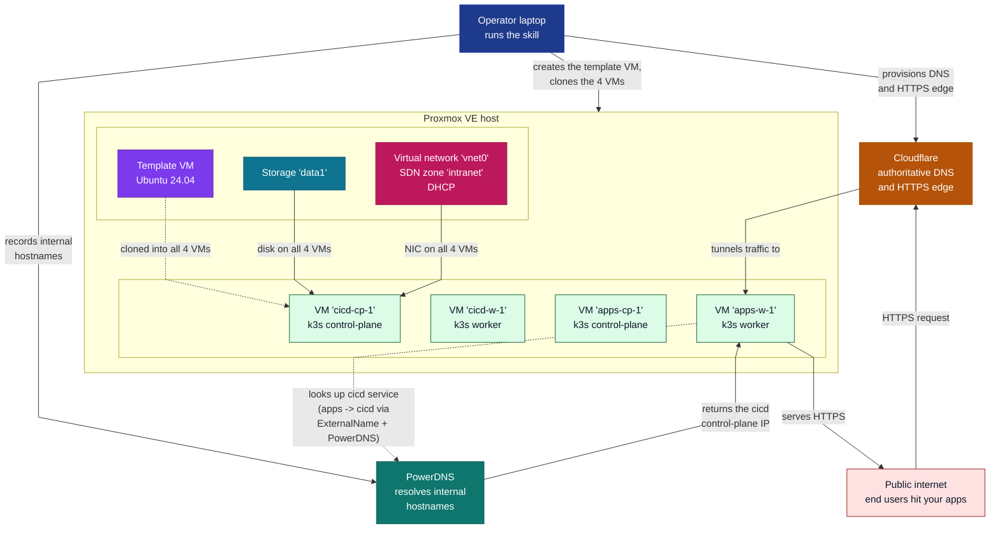

# proxmox-k8s-cicd

**Spin up two production-shaped k3s clusters on a single Proxmox
box in one afternoon — no open ports, no manual yak-shaving, fully
reproducible from a single skill file.**

The pipeline provisions a `cicd` and an `apps` cluster side-by-side
on one Proxmox VE host. Both come up with a real control plane
(Cilium CNI, kube-vip, etcd), `proxmox-ccm` + `proxmox-csi` so
workloads can claim Proxmox storage, public HTTPS via Cloudflare
Tunnel with **zero inbound ports opened**, and cross-cluster Service
consumption so apps workloads reach cicd services by name over
PowerDNS.

Everything is driven by a single
[agentskills.io](https://agentskills.io)-format skill — give it a
Proxmox host, a Cloudflare zone, and a GitLab project for state,
and an Operator (human or AI agent) gets walked through the full
lifecycle: token mint -> golden image -> cluster provisioning ->
baseline -> bootstrap -> verification. Re-running any phase is
idempotent; tearing down and rebuilding a cluster takes a single
`tofu apply`.



The skill at
[`.agents/skills/proxmox-k3s-pipeline/SKILL.md`](.agents/skills/proxmox-k3s-pipeline/SKILL.md)
walks an Operator (human or AI agent) through five top-level
phases — and the bootstrap phase further decomposes into seven
sub-phases (`cloudinit, install_k3s, k3s, helm, kubeconfig,
host_ports, externalname`) — so every step is reproducible and
reviewable.

## What you get after running the skill

After a successful end-to-end run, your Proxmox host has:

- **1 Proxmox template** (VMID 900, `ubuntu-noble-template`) containing
  Ubuntu 24.04 LTS Noble + `qemu-guest-agent` + `openssh-server` +
  `cloud-init`, ready to be cloned.
- **4 cloned k3s nodes** (2 per cluster) — 1 control-plane + 1 worker
  each, with the operator's SSH key authorized and a DHCP-allocated
  SDN IP:
  - `cicd-cp-1`, `cicd-w-1` (vip `10.0.0.30`, pod_cidr `10.42.0.0/16`)
  - `apps-cp-1`,  `apps-w-1`  (vip `10.0.0.40`, pod_cidr `10.44.0.0/16`)
- **A k3s cluster on each side** (CNI: Cilium, VIP: kube-vip) plus
  the standard `proxmox-ccm` + `proxmox-csi` + `traefik` + `cert-manager`
  + `cloudflare-tunnel-ingress-controller` Helm releases.
- **Public HTTPS** for the cicd cluster via Cloudflare Tunnel — no
  inbound port opened on the Proxmox host.
- **Cross-cluster Service consumption** from `apps` -> `cicd` via
  ExternalName Services, so apps workloads can reach
  `gitlab.cicd-system.svc.cluster.local` (which resolves to the
  cicd VIP via PowerDNS).
- **PowerDNS A + PTR records** aligned with the IPs the SDN actually
  assigned (see [`scripts/sync_dns_to_sdn.py`](scripts/sync_dns_to_sdn.py)).
- **Day-to-day operator tooling** to SSH into any cluster VM or
  pull a working kubectl context through the PVE jump host:
  [`tools/ssh_proxy.py`](#operating-the-clusters) and
  [`tools/kubeconfig_puller.py`](#operating-the-clusters) below.

## Repository layout

```
.
├── .agents/skills/proxmox-k3s-pipeline/   # the canonical Agent Skill
│   ├── SKILL.md                            # the playbook (loaded by Claude Code / Cursor)
│   ├── versions.lock.yaml                  # compatibility matrix + cross_check
│   └── CONTEXT.md                          # bounded-context vocabulary
├── docs/
│   ├── architecture.md                     # end-to-end architecture + Mermaid
│   ├── cluster-instances.md                # how to add a 3rd/4th/... cluster
│   ├── verification.md                     # SC-001..SC-007 + NFR-010..NFR-014
│   ├── proxmox-serial-capture.md           # debug-only: serial console recipe
│   └── runbooks/                           # copy-pasteable operator procedures
├── infra/
│   ├── tokens/                             # Phase 0: mint Proxmox + CF scoped tokens
│   ├── modules/proxmox-k3s-cluster/        # Phase 2: clone template + SDN + DNS
│   └── clusters/{cicd,apps}/               # Phase 2: per-cluster root modules
├── scripts/
│   ├── apply_tofu.py                       # one entry-point for `tofu apply`
│   ├── sync_dns_to_sdn.py                  # post-apply PowerDNS A/PTR fix-up
│   ├── capture_serial.py                   # debug-only: VM serial console capture
│   ├── capture_host_ports_baseline.sh      # Phase 3: snapshot host-ports baseline
│   └── gitlab_backend.sh                   # init helper for the GitLab HTTP backend
├── tools/                                  # the Python automation layer
│   ├── build_image/                        # Phase 1: bake the VMID 900 template
│   ├── bootstrap_cluster.py                # Phase 4: 6-sub-phase k3s bootstrap
│   └── lib/                                # shared libraries (pve, helm, secrets, log)
├── specs/001-build-a-kubernetes-k3s-cluster-on-proxmo/  # planning artefacts
├── tools/tests/                            # 92 pytest tests (build, skill, pve, ...)
├── Makefile                                # make build-image / make test / make lint
├── versions.yaml                           # master compatibility matrix
├── spec-bridge.conf                        # spec-bridge workspace config
└── README.md (this file)
```

## Five-phase pipeline (high level)

| Phase | Subsystem | Output | Tool |
|---|---|---|---|
| 0 | Token Provisioning | `infra/tokens/output.json` (mode 0600) + PVE role + CF scoped token | `python scripts/apply_tofu.py tokens` |
| 1 | Image Build | Proxmox template at VMID 900 + `build/image-id.txt` | `python -m tools.build_image` (or `make build-image`) |
| 2 | Cluster Provisioning | 4 cloned VMs (111-114) + PowerDNS A/PTR records | `python scripts/apply_tofu.py cicd && python scripts/apply_tofu.py apps` |
| 3 | Host-ports baseline | `logs/host-ports-baseline.json` snapshot | `bash scripts/capture_host_ports_baseline.sh` |
| 4 | Cluster Bootstrap | working k3s clusters with all Helm releases (7 sub-phases: `cloudinit, install_k3s, k3s, helm, kubeconfig, host_ports, externalname`) | `python -m tools.bootstrap_cluster --cluster {cicd|apps}` |
| 5 | Final verification | SC-001..SC-007 + NFR-010..NFR-014 checks | see [`docs/verification.md`](docs/verification.md) |

The skill ([`.agents/skills/proxmox-k3s-pipeline/SKILL.md`](.agents/skills/proxmox-k3s-pipeline/SKILL.md))
is the authoritative step-by-step; the docs here are summaries.

## Requirements

You need:

- A Proxmox VE 9.x host reachable over SSH on a non-default port
  (the skill defaults to `pve.example.net:6022`).
- A Cloudflare account with a managed DNS zone (e.g. `example.net`)
  and a Cloudflare Tunnel for the cicd cluster's public HTTPS.
- A GitLab personal access token (the tofu state lives in a GitLab
  HTTP backend).
- A PowerDNS authoritative server reachable over an SSH tunnel,
  for the cluster's internal DNS (used by ExternalName Services
  and the post-apply `sync_dns_to_sdn.py` fix-up).
- An SSH public key authorized to log into the PVE host (the build
  uses SSH only; the cluster token is the only PVE API call).

For the full list of `.env` keys, where to mint each token, and the
exact UI clicks to get them, see
[`docs/requirements.md`](docs/requirements.md).

## Quick start (operator-only, live host)

Prerequisites: a Proxmox VE host reachable over SSH (the skill assumes
`pve.example.net:6022` but the same recipe applies to any PVE 9.x host
with a single-node SDN zone).

```bash
# 0. Set env (or ./.env with the same keys)
cat > .env <<'EOF'
PROXMOX_API_URL=https://pve.example.net:8006/api2/json
PROXMOX_API_TOKEN=root@pam!tf-bootstrap=<uuid>
CLOUDFLARE_TOKEN_CREATOR=<cfat_...>
CLOUDFLARE_ACCOUNT_ID=<uuid>
CLOUDFLARE_DOMAIN=example.net
CLOUDFLARE_GLOBAL_API_KEY=<key>
CLOUDFLARE_GLOBAL_API_EMAIL=<email>
CLOUDFLARE_ZONE_ID=<uuid>
GITLAB_PAT=<glpat-...>
POWERDNS_API_KEY=<key>
EOF

# 1. Mint tokens (Phase 0)
python scripts/apply_tofu.py tokens

# 2. Bake the Ubuntu+k3s golden template at VMID 900 (Phase 1)
python -m tools.build_image \
  --pve-endpoint https://pve.example.net:8006/api2/json \
  --pve-node pve \
  --pve-ssh-host pve.example.net --pve-ssh-port 6022 \
  --ssh-pubkey-path ~/.ssh/pve.example.net.pub

# 3. Clone the 4 cluster VMs (Phase 2)
python scripts/apply_tofu.py cicd
python scripts/apply_tofu.py apps

# 4. Sync PowerDNS A/PTR to the IPs the SDN assigned (post-apply fix-up)
python scripts/sync_dns_to_sdn.py \
  --vmid 111 --name cicd-cp-1 --vmid 112 --name cicd-w-1 \
  --vmid 113 --name apps-cp-1 --vmid 114 --name apps-w-1

# 5. Bootstrap the clusters (Phase 4, ~5 min per cluster)
python -m tools.bootstrap_cluster --cluster cicd
python -m tools.bootstrap_cluster --cluster apps
```

After step 5, `~/.kube/config` contains contexts for both clusters and
the cicd cluster is reachable from the public internet via the
Cloudflare Tunnel. Re-running any individual sub-phase (e.g. after
adding a new worker) is idempotent: `python -m tools.bootstrap_cluster
--cluster cicd --phases install_k3s,k3s` will skip everything else.

## Operating the clusters

Two short Python CLIs make day-to-day work against the live
clusters possible from the operator's host — which is on the public
internet, NOT on the SDN. Both tunnel through the PVE jump host
(`root@pve.example.net -p 6022`, configurable in
[`tools/lib/pve_ssh.py`](tools/lib/pve_ssh.py)) into the cluster's
SDN subnet (10.0.0.50-200) using a `ProxyCommand=ssh -W %h:%p`
double-ssh. The cloud image refuses root login, so we land as
`ubuntu` and `sudo -n` for any root-level ops.

### Install the tools with `uv tool install`

```bash
# One-time install from the repo root
uv tool install .

# Or from a clone anywhere on disk
uv tool install /path/to/proxmox-k8s-cicd

# This registers two short commands on PATH:
which ssh-proxy kubeconfig-puller
#   ~/.local/bin/ssh-proxy
#   ~/.local/bin/kubeconfig-puller
```

The package is `proxmox-k8s-cicd-tools`. The wheel only ships the two
CLIs and the `tools/lib/*` modules they depend on (no tests, no
build-image, no bootstrap script). Re-run the same `uv tool install`
after a `git pull` to refresh the installed binaries; pass `--reinstall`
if the version number didn't change.

### SSH into a VM

```bash
# Set once per shell so the tools can find the repo
export PROXMOX_K8S_REPO=/path/to/proxmox-k8s-cicd
export SSH_AUTH_SOCK=~/.bitwarden-ssh-agent.sock   # if you use a keyring agent

# Land on the first control-plane VM of the cicd cluster
ssh-proxy --cluster cicd

# Land on the first worker
ssh-proxy --cluster cicd --role worker

# A specific node by name (overrides --role)
ssh-proxy --cluster apps --name apps-cp-1

# One-off command (non-interactive)
ssh-proxy --cluster cicd -- hostname
```

Pure interactive shells are exec'd via `os.execvp` so the operator's
TTY, resize signals, and `~/.ssh/config` aliases all behave the same
as a plain `ssh user@host`. Without `uv tool install`, the same
commands work as `python -m tools.ssh_proxy --cluster cicd` from
the repo root.

### Pull a kubectl config that talks to a cluster

```bash
# Default: pull /etc/rancher/k3s/k3s.yaml from the first control
# plane, start the apiserver forward as a detached background
# process, rewrite the server: URL to point at the forward, and
# exit. The whole thing is non-blocking -- the tool returns
# immediately and the operator can use the kubeconfig from
# another terminal.
kubeconfig-puller --cluster cicd
# [kubeconfig_puller] tunnel pid=434599; kill it with: kill 434599

# From any other terminal -- kubectl works through the tunnel:
KUBECONFIG=infra/clusters/cicd/kubeconfig.pveproxy kubectl get nodes
KUBECONFIG=infra/clusters/cicd/kubeconfig.pveproxy k9s

# Pass --no-tunnel if you'd rather start the forward yourself
# (e.g. in a script that runs `ssh-proxy --port-forward` later).
# The kubeconfig is still written, with a free port picked for it.
kubeconfig-puller --cluster cicd --no-tunnel
# [kubeconfig_puller] start the tunnel when you need it:
#   ssh-proxy --cluster cicd --port-forward 44493:127.0.0.1:6443
```

The kubeconfig's `server:` URL points at `https://127.0.0.1:<port>`
where `<port>` is the operator's local forwarding target. Stale
kubeconfigs that point at a closed port fail loudly with
`connection refused` rather than silently talking to the wrong
cluster. The tunnel survives `kubeconfig-puller`'s exit so the
operator can run as many kubectl/k9s commands as they want and
`kill <pid>` the tunnel when they're done.

## Development

```bash
make test           # 142 pytest tests
make lint           # ruff + mypy on tools/
make test-infra-tokens    # tofu test for infra/tokens
make test-infra-modules   # tofu test for every module under infra/modules
make test-infra-clusters  # tofu test for every instance under infra/clusters
```

## Status (2026-07-08)

- **Phases 0-2 verified end-to-end** on `kvm.bruj0.net` (PVE 9.2.3,
  kernel 7.0.6-2-pve) with the canonical Proxmox+Ubuntu
  recipe: `virt-customize` bakes `qemu-guest-agent` into the cloud
  image BEFORE the VM is created, Proxmox's native cloud-init drive
  (`--ide2 data1:cloudinit`) replaces the custom NoCloud seed ISO.
  4 cluster VMs (111-114) are cloned, running, and report
  `qm agent ping` OK.
- **Phase 4 (bootstrap) verified end-to-end** on both clusters
  with the 7-sub-phase split:
  `cloudinit -> install_k3s -> k3s -> helm -> kubeconfig -> host_ports -> externalname`.
  The new `install_k3s` sub-phase runs the upstream
  `https://get.k3s.io` installer over the PVE-jump-host SSH proxy
  (with `INSTALL_K3S_VERSION=v1.34.9+k3s1`, `--tls-san=<vip>`,
  `--flannel-backend=none`, agent join via `https://<vip>:6443`).
  Idempotent: re-running sees the systemd unit active and skips.
  See [`docs/install-k3s-plan.md`](docs/install-k3s-plan.md) and
  the `Step 4a` block in
  [`.agents/skills/proxmox-k3s-pipeline/SKILL.md`](.agents/skills/proxmox-k3s-pipeline/SKILL.md)
  for the live-host gotchas (SSH user is `ubuntu`, sudo strips
  caller env, `k3s agent` rejects `--flannel-backend`, use
  `ProxyCommand` not `-W`).
- **Day-to-day operator tooling live-validated:**
  [`tools/ssh_proxy.py`](tools/ssh_proxy.py) lands on any cluster
  VM (all 4 nodes reachable) and
  [`tools/kubeconfig_puller.py`](tools/kubeconfig_puller.py) opens
  the kube-apiserver forward in 0.6s and `kubectl get nodes`
  succeeds through the tunnel. Both share a single
  [`tools/lib/pve_ssh.py`](tools/lib/pve_ssh.py) module that owns
  the PVE-jump-host ProxyCommand pattern (also reused by
  `K3sInstaller`).
- **132 pytest tests pass** (24 new for the operator tooling: 9
  `pve_ssh`, 9 `ssh_proxy`, 7 `kubeconfig_puller`); ruff clean;
  mypy `--strict` clean. The new test for `-L` ordering before the
  destination is a regression guard against a subtle ssh argv bug.
- The pipeline pivoted off Talos Linux on 2026-07-07 because the
  serial-console debug loop on PVE 9.2.3 was unworkable. The
  full pivot history is at the bottom of
  [`.agents/skills/proxmox-k3s-pipeline/SKILL.md`](.agents/skills/proxmox-k3s-pipeline/SKILL.md).

## See also

- [`.agents/skills/proxmox-k3s-pipeline/SKILL.md`](.agents/skills/proxmox-k3s-pipeline/SKILL.md) — the canonical playbook
- [`docs/requirements.md`](docs/requirements.md) — full prerequisites: PVE host, Cloudflare + GitLab + PowerDNS tokens, operator SSH key
- [`docs/architecture.md`](docs/architecture.md) — subsystem boundaries + Mermaid
- [`docs/verification.md`](docs/verification.md) — success criteria + NFRs
- [`docs/runbooks/`](docs/runbooks/) — single-concern operator procedures
- [`specs/001-build-a-kubernetes-k3s-cluster-on-proxmo/`](specs/001-build-a-kubernetes-k3s-cluster-on-proxmo/) — original planning artefacts
- [`AGENTS.md`](AGENTS.md) — for AI agents making changes to this repo
