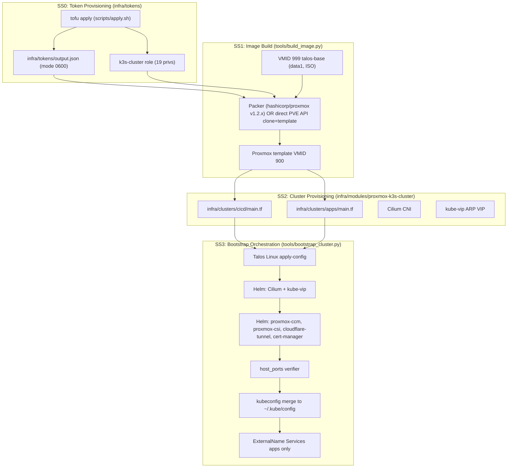
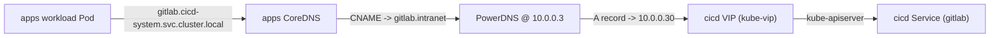

# Architecture

End-to-end architecture for the proxmox-k8s-cicd pipeline. Cross-links:

- Feature spec: [`specs/001-build-a-kubernetes-k3s-cluster-on-proxmo/spec.md`](../specs/001-build-a-kubernetes-k3s-cluster-on-proxmo/spec.md)
- Plan: [`specs/001-build-a-kubernetes-k3s-cluster-on-proxmo/plan.md`](../specs/001-build-a-kubernetes-k3s-cluster-on-proxmo/plan.md)
- Misfit decomposition: [`specs/001-build-a-kubernetes-k3s-cluster-on-proxmo/decomposition.md`](../specs/001-build-a-kubernetes-k3s-cluster-on-proxmo/decomposition.md)
- Research log: [`specs/001-build-a-kubernetes-k3s-cluster-on-proxmo/research.md`](../specs/001-build-a-kubernetes-k3s-cluster-on-proxmo/research.md)
- Cluster instances: [`docs/cluster-instances.md`](cluster-instances.md)
- Verification matrix: [`docs/verification.md`](verification.md)

## Subsystems

> **Live-host note (2026-07-06, BigBertha PVE 9.2.3)**: Phase 1
> surfaced six deployment-environment gotchas captured in
> `.agents/skills/proxmox-k3s-pipeline/SKILL.md` Step 1b:
>
> 1. `talos.pkr.hcl` schema drift (`local-lvm` → `data1`,
>    `clone_from_vm_id` → `clone_vm_id`, `vm_template_name` →
>    `template_name`, dropped invalid `formatdate()` call).
> 2. Packer v1.2.x `token` is the **bare** secret UUID, not the
>    pre-concatenated `<id>=<secret>` value.
> 3. `k3s-cluster` role extends from spec T005's 12 privs to **19**
>    (added `Sys.Audit`, `VM.Audit`, `VM.Clone`, `VM.Migrate`,
>    `VM.Config.CDROM`, `VM.Config.HWType`, `VM.Snapshot.Rollback`)
>    so Packer can clone VMID 999 → 900.
> 4. `output_json.tf` splits bpg/proxmox v0.111.x's
>    `proxmox_user_token.value` on `=` so `proxmox_token_secret`
>    is the 36-char bare UUID (not the full token string).
> 5. Packer `proxmox-clone` v1.2.x blocks on a 5-minute SSH-wait
>    that Talos installer mode can never satisfy. The skill
>    recommends bypassing Packer for Phase 1 entirely on live
>    hosts (use direct `POST /nodes/<node>/qemu/999/clone` +
>    `/qemu/900/template`); the Phase 2 cluster tofu installs
>    Talos to disk on cluster VMs at first-boot via
>    `talosctl apply-config`.
> 6. VMID 999 must be pre-created on the same storage pool
>    (`data1` on BigBertha); the Talos ISO asset on GitHub is
>    `metal-amd64.iso`, not `talos-amd64.iso`.
>
> All six are pinned by `tools/tests/test_agent_skill.py` and
> recorded in `.agents/skills/proxmox-k3s-pipeline/versions.lock.yaml`
> under `live_host_evidence.phase1_*`.

## Cross-cluster wiring (WP06)

The `apps` cluster reaches the `cicd` cluster's primary services via
ExternalName Services rendered into `infra/clusters/apps/manifests/cicd-system/`
and applied by `tools/bootstrap_cluster.py --cluster apps --phases externalname`.

DNS resolution flow when an apps workload reaches `gitlab.cicd-system.svc.cluster.local`:

1. apps CoreDNS sees the `gitlab.cicd-system.svc.cluster.local` query, finds
   the matching ExternalName Service in the `cicd-system` namespace, and
   returns the CNAME `gitlab.intranet`.
2. The apps Pod's resolver follows the CNAME by asking the upstream
   nameserver configured in `/etc/resolv.conf` on the apps node, which
   is `10.0.0.3` (PowerDNS; per FR-034 the apps cluster inherits the
   host's resolv.conf).
3. PowerDNS returns the A record for `gitlab.intranet`, which points at
   the cicd VIP `10.0.0.30` (the kube-vip-managed VIP).
4. The workload connects to the cicd kube-apiserver (and beyond it, to
   the in-cluster gitlab Service).

## Subsystem boundary table

| Subsystem | Owns | Reads from | Writes to |
|-----------|------|------------|-----------|
| SS0 (Tokens) | `infra/tokens/main.tf`, `infra/tokens/proxmox.tf`, `infra/tokens/cloudflare.tf` | `.env` (`PROXMOX_API_TOKEN`, `CLOUDFLARE_GLOBAL_API_KEY`, ...) | `infra/tokens/output.json` (mode 0600), PVE role + user + token, Cloudflare scoped token |
| SS1 (Image Build) | `tools/build_image.py`, `tools/packer/talos.pkr.hcl` | `versions.yaml`, `infra/tokens/output.json`, live PVE `/nodes/<node>/qemu/999` | `build/image-id.txt`, Proxmox template `talos-template` at VMID 900 |
| SS2 (Cluster Module) | `infra/modules/proxmox-k3s-cluster/**`, `infra/clusters/cicd/main.tf`, `infra/clusters/apps/main.tf` | `infra/tokens/output.json`, `build/image-id.txt` | `infra/clusters/<name>/output.json`, `infra/clusters/<name>/manifests/` |
| SS3 (Bootstrap) | `tools/bootstrap_cluster.py`, `tools/lib/*` | `infra/clusters/<name>/output.json`, `infra/clusters/<name>/manifests/`, `infra/tokens/output.json` | `~/.kube/config`, PVE nft prerouting baseline diff |

## Cross-system contracts

- **SS1 -> SS2**: `build/image-id.txt` is a single line containing the
  Proxmox template VMID. SS2 reads it via the `local_file` data source
  in `infra/clusters/<name>/main.tf`.
- **SS2 -> SS3**: `infra/clusters/<name>/output.json` is a JSON document with
  keys `cluster_name`, `vip`, `pod_cidr`, `svc_cidr`, and `nodes[]`
  (each node having `name`, `ip`, `role`). SS3 consumes this via
  `ClusterTopology.from_output_json()`.
- **SS2 -> SS3 (manifests)**: `infra/clusters/<name>/manifests/` contains
  pre-rendered Kubernetes manifests (e.g. the Traefik HelmChartConfig
  for the cicd cluster, the cross-cluster ExternalName kustomization
  for the apps cluster). SS3 applies these via `kubectl apply -f` /
  `kubectl apply -k` after the corresponding Helm phase.