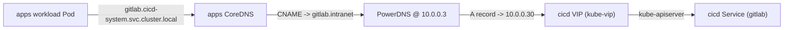

# Architecture

End-to-end architecture for the proxmox-k8s-cicd pipeline. Cross-links:

- Feature spec: [`specs/001-build-a-kubernetes-k3s-cluster-on-proxmo/spec.md`](../specs/001-build-a-kubernetes-k3s-cluster-on-proxmo/spec.md)
- Plan: [`specs/001-build-a-kubernetes-k3s-cluster-on-proxmo/plan.md`](../specs/001-build-a-kubernetes-k3s-cluster-on-proxmo/plan.md)
- Research log: [`specs/001-build-a-kubernetes-k3s-cluster-on-proxmo/research.md`](../specs/001-build-a-kubernetes-k3s-cluster-on-proxmo/research.md)
- Cluster instances: [`docs/cluster-instances.md`](cluster-instances.md)

## Subsystems

```mermaid
flowchart TB
  subgraph SS1["SS1: Image Build (tools/build_image.py)"]
    Packer[Packer + bpg/proxmox]
    Template[Proxmox template VMID 900]
  end

  subgraph SS2["SS2: Cluster Provisioning (modules/proxmox-k3s-cluster)"]
    TofuCicd[clusters/cicd/main.tf]
    TofuApps[clusters/apps/main.tf]
    Cilium[Cilium CNI]
    KubeVip[kube-vip ARP VIP]
  end

  subgraph SS3["SS3: Bootstrap Orchestration (tools/bootstrap_cluster.py)"]
    Talos[Talos Linux apply-config]
    HelmFirstTwo[Helm: Cilium + kube-vip]
    HelmRemaining[Helm: proxmox-ccm, proxmox-csi, cloudflare-tunnel, cert-manager]
    HostPorts[host_ports verifier]
    Kubeconfig[kubeconfig merge to ~/.kube/config]
    ExternalName[ExternalName Services (apps only)]
  end

  Packer --> Template
  Template --> TofuCicd
  Template --> TofuApps
  TofuCicd --> Talos
  TofuApps --> Talos
  Talos --> HelmFirstTwo
  HelmFirstTwo --> HelmRemaining
  HelmRemaining --> HostPorts
  HostPorts --> Kubeconfig
  Kubeconfig --> ExternalName
```

## Cross-cluster wiring (WP06)

The `apps` cluster reaches the `cicd` cluster's primary services via
ExternalName Services rendered into `clusters/apps/manifests/cicd-system/`
and applied by `tools/bootstrap_cluster.py --cluster apps --phases externalname`.



DNS resolution flow when an apps workload reaches `gitlab.cicd-system.svc.cluster.local`:

1. apps CoreDNS sees the `gitlab.cicd-system.svc.cluster.local` query, finds
   the matching ExternalName Service in the `cicd-system` namespace, and
   returns the CNAME `gitlab.intranet`.
2. The apps Pod's resolver follows the CNAME by asking the upstream
   nameserver configured in `/etc/resolv.conf` on the apps node, which
   is `10.0.0.3` (PowerDNS; per FR-034 the apps cluster inherits the
   host's resolv.conf).
3. PowerDNS returns the A record for `gitlab.intranet`, which points at
   the cicd VIP `10.0.0.30` (the kube-vip-managed VIP).
4. The workload connects to the cicd kube-apiserver (and beyond it, to
   the in-cluster gitlab Service).

## Subsystem boundary table

| Subsystem | Owns | Reads from | Writes to |
|-----------|------|------------|-----------|
| SS1 (Image Build) | `tools/build_image.py`, `tools/packer/talos.pkr.hcl` | `versions.yaml`, `infra/tokens/output.json` | `build/image-id.txt` |
| SS2 (Cluster Module) | `modules/proxmox-k3s-cluster/**`, `clusters/cicd/main.tf`, `clusters/apps/main.tf` | `infra/tokens/output.json`, `build/image-id.txt` | `clusters/<name>/output.json`, `clusters/<name>/manifests/` |
| SS3 (Bootstrap) | `tools/bootstrap_cluster.py`, `tools/lib/*` | `clusters/<name>/output.json`, `clusters/<name>/manifests/`, `infra/tokens/output.json` | `~/.kube/config`, PVE nft prerouting baseline diff |

## Cross-system contracts

- **SS1 -> SS2**: `build/image-id.txt` is a single line containing the
  Proxmox template VMID. SS2 reads it via the `local_file` data source
  in `clusters/<name>/main.tf`.
- **SS2 -> SS3**: `clusters/<name>/output.json` is a JSON document with
  keys `cluster_name`, `vip`, `pod_cidr`, `svc_cidr`, and `nodes[]`
  (each node having `name`, `ip`, `role`). SS3 consumes this via
  `ClusterTopology.from_output_json()`.
- **SS2 -> SS3 (manifests)**: `clusters/<name>/manifests/` contains
  pre-rendered Kubernetes manifests (e.g. the Traefik HelmChartConfig
  for the cicd cluster, the cross-cluster ExternalName kustomization
  for the apps cluster). SS3 applies these via `kubectl apply -f` /
  `kubectl apply -k` after the corresponding Helm phase.