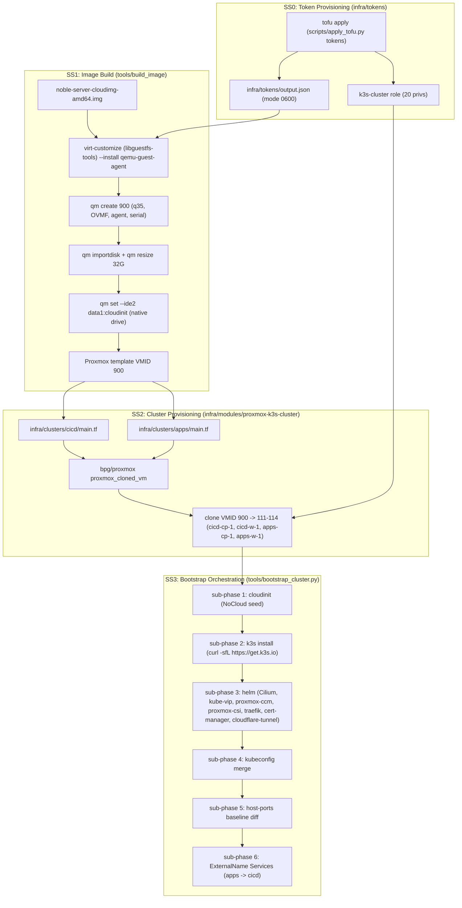
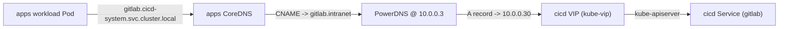

# Architecture

End-to-end architecture for the proxmox-k8s-cicd pipeline. Cross-links:

- Feature spec: [`specs/001-build-a-kubernetes-k3s-cluster-on-proxmo/spec.md`](../specs/001-build-a-kubernetes-k3s-cluster-on-proxmo/spec.md)
- Plan: [`specs/001-build-a-kubernetes-k3s-cluster-on-proxmo/plan.md`](../specs/001-build-a-kubernetes-k3s-cluster-on-proxmo/plan.md)
- Misfit decomposition: [`specs/001-build-a-kubernetes-k3s-cluster-on-proxmo/decomposition.md`](../specs/001-build-a-kubernetes-k3s-cluster-on-proxmo/decomposition.md)
- Research log: [`specs/001-build-a-kubernetes-k3s-cluster-on-proxmo/research.md`](../specs/001-build-a-kubernetes-k3s-cluster-on-proxmo/research.md)
- Agent skill: [`.agents/skills/proxmox-k3s-pipeline/SKILL.md`](../.agents/skills/proxmox-k3s-pipeline/SKILL.md)
- Cluster instances: [`docs/cluster-instances.md`](cluster-instances.md)
- Verification matrix: [`docs/verification.md`](verification.md)
- Serial-capture debug recipe: [`docs/proxmox-serial-capture.md`](proxmox-serial-capture.md)

## Subsystems

> **Live-host note (2026-07-07, BigBertha PVE 9.2.3)**: Phase 1
> was rewritten to the canonical Proxmox+Ubuntu recipe. The
> previous Talos / Sidero Image Factory / Packer / custom NoCloud
> seed ISO flow is gone. The new flow bakes qemu-guest-agent into
> the cloud image with `virt-customize` BEFORE the VM is created,
> so the agent is guaranteed to be up at first boot (no race with
> cloud-init, no SSH-into-VM customize step). Proxmox's native
> cloud-init drive (`--ide2 data1:cloudinit`) replaces the custom
> NoCloud seed ISO. The full live-host state is in
> `.agents/skills/proxmox-k3s-pipeline/versions.lock.yaml` under
> `live_host_evidence.phase1_v2_canonical_recipe` and pinned by
> `tools/tests/test_agent_skill.py`.

## Cross-cluster wiring (WP06)

The `apps` cluster reaches the `cicd` cluster's primary services via
ExternalName Services rendered into `infra/clusters/apps/manifests/cicd-system/`
and applied by `tools/bootstrap_cluster.py --cluster apps --phases externalname`
.

DNS resolution flow when an apps workload reaches `gitlab.cicd-system.svc.cluster.local`:

1. apps CoreDNS sees the `gitlab.cicd-system.svc.cluster.local` query, finds
   the matching ExternalName Service in the `cicd-system` namespace, and
   returns the CNAME `gitlab.intranet`.
2. The apps Pod's resolver follows the CNAME by asking the upstream
   nameserver configured in `/etc/resolv.conf` on the apps node, which
   is `10.0.0.3` (PowerDNS; per FR-034 the apps cluster inherits the
   host's resolv.conf).
3. PowerDNS returns the A record for `gitlab.intranet`, which points at
   the cicd VIP `10.0.0.30` (the kube-vip-managed VIP).
4. The workload connects to the cicd kube-apiserver (and beyond it, to
   the in-cluster gitlab Service).

## Subsystem boundary table

| Subsystem | Owns | Reads from | Writes to |
|-----------|------|------------|-----------|
| SS0 (Tokens) | `infra/tokens/main.tf`, `infra/tokens/proxmox.tf`, `infra/tokens/cloudflare.tf` | `.env` (`PROXMOX_API_TOKEN`, `CLOUDFLARE_GLOBAL_API_KEY`, ...) | `infra/tokens/output.json` (mode 0600), PVE role + user + token, Cloudflare scoped token |
| SS1 (Image Build) | `tools/build_image/__init__.py`, `tools/lib/pve_client.py` | `versions.yaml`, live PVE over SSH | `build/image-id.txt`, Proxmox template `ubuntu-noble-template` at VMID 900 |
| SS2 (Cluster Module) | `infra/modules/proxmox-k3s-cluster/**`, `infra/clusters/cicd/main.tf`, `infra/clusters/apps/main.tf` | `infra/tokens/output.json`, `build/image-id.txt` | `infra/clusters/<name>/output.json`, `infra/clusters/<name>/manifests/`, Proxmox VMs 111-114 |
| SS3 (Bootstrap) | `tools/bootstrap_cluster.py`, `tools/lib/*` | `infra/clusters/<name>/output.json`, `infra/clusters/<name>/manifests/`, `infra/tokens/output.json` | `~/.kube/config`, k3s systemd units on each node, PVE nft prerouting baseline diff |

## Cross-system contracts

- **SS1 -> SS2**: `build/image-id.txt` is a single line containing the
  Proxmox template VMID. SS2 reads it via the `local_file` data source
  in `infra/clusters/<name>/main.tf`.
- **SS2 -> SS3**: `infra/clusters/<name>/output.json` is a JSON document with
  keys `cluster_name`, `vip`, `pod_cidr`, `svc_cidr`, and `nodes[]`
  (each node having `name`, `ip`, `role`). SS3 consumes this via
  `ClusterTopology.from_output_json()`.
- **SS2 -> SS3 (manifests)**: `infra/clusters/<name>/manifests/` contains
  pre-rendered Kubernetes manifests (e.g. the Traefik HelmChartConfig
  for the cicd cluster, the cross-cluster ExternalName kustomization
  for the apps cluster). SS3 applies these via `kubectl apply -f` /
  `kubectl apply -k` after the corresponding Helm phase.
