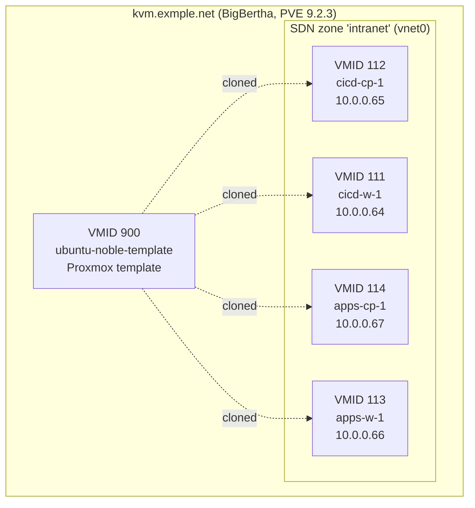
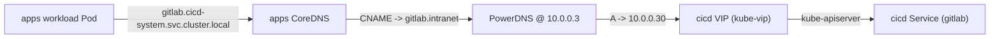

# Cluster State — Administrator's Guide

> **Captured**: 2026-07-08, on `kvm.example.net`, PVE 9.2.3,
> kernel `7.0.6-2-pve`. Live snapshot of the two k3s clusters
> brought up by the
> [proxmox-k3s-pipeline skill](../.agents/skills/proxmox-k3s-pipeline/SKILL.md).
> See [`cluster-instances.md`](cluster-instances.md) for the
> uniqueness contract every new cluster must satisfy.

This document is the operator-facing reference: what is currently
running, why it is configured the way it is, and where to look
when something breaks. It is deliberately concrete about
versions and values — the live cluster validates the assumptions
documented here.

## Table of contents

- [Cluster State — Administrator's Guide](#cluster-state--administrators-guide)
  - [Table of contents](#table-of-contents)
  - [1. Cluster inventory](#1-cluster-inventory)
  - [2. Network topology](#2-network-topology)
    - [2.1 Subnets](#21-subnets)
    - [2.2 DNS](#22-dns)
    - [2.3 Operator → cluster reachability](#23-operator--cluster-reachability)
  - [3. Compute: VM mapping](#3-compute-vm-mapping)
  - [4. Operating system and runtime](#4-operating-system-and-runtime)
  - [5. Kubernetes core](#5-kubernetes-core)
    - [5.1 Cluster bring-up flags](#51-cluster-bring-up-flags)
    - [5.2 Bootstrap mechanism](#52-bootstrap-mechanism)
    - [5.3 Authentication](#53-authentication)
  - [6. CNI — Cilium](#6-cni--cilium)
    - [6.1 Routing](#61-routing)
  - [7. Control-plane load balancing — kube-vip](#7-control-plane-load-balancing--kube-vip)
    - [7.1 The `config.address` shape (NOT `controlPlane.enabled`)](#71-the-configaddress-shape-not-controlplaneenabled)
    - [7.2 VIP ownership](#72-vip-ownership)
  - [8. Storage — proxmox-csi-plugin](#8-storage--proxmox-csi-plugin)
    - [8.1 Why not `local-path`?](#81-why-not-local-path)
  - [9. Cloud integration](#9-cloud-integration)
    - [9.1 proxmox-cloud-controller-manager](#91-proxmox-cloud-controller-manager)
    - [9.2 Cloudflare Tunnel](#92-cloudflare-tunnel)
  - [10. Certificate management](#10-certificate-management)
  - [11. Ingress — Traefik (planned)](#11-ingress--traefik-planned)
  - [12. Cross-cluster wiring](#12-cross-cluster-wiring)
  - [13. Operator tooling](#13-operator-tooling)
  - [14. Known issues and drift](#14-known-issues-and-drift)
    - [14.1 proxmox-ccm / proxmox-csi / cloudflare-tunnel — ContainerCreating](#141-proxmox-ccm--proxmox-csi--cloudflare-tunnel--containercreating)
    - [14.2 k3s version drift](#142-k3s-version-drift)
    - [14.3 Web-search-derived version pins](#143-web-search-derived-version-pins)
  - [15. How to re-run any phase](#15-how-to-re-run-any-phase)
  - [See also](#see-also)

---

## 1. Cluster inventory

| Cluster | Role | VIP | Pod CIDR | Service CIDR | Nodes |
|---|---|---|---|---|---|
| `cicd` | CI/CD workloads (GitLab, runners, registry, ArgoCD) | `10.0.0.30` | `10.42.0.0/16` | `10.43.0.0/16` | cicd-cp-1 (CP), cicd-w-1 (worker) |
| `apps`  | End-user apps reachable via Cloudflare Tunnel | `10.0.0.40` | `10.44.0.0/16` | `10.45.0.0/16` | apps-cp-1 (CP), apps-w-1 (worker) |

Both clusters run on the same Proxmox host (`kvm.example.net`).
Each cluster has exactly one control-plane VM and one worker VM;
the bootstrap module supports scaling workers via the
[`scale-workers` runbook](runbooks/scale-workers.md).



## 2. Network topology

### 2.1 Subnets

| Subnet | Purpose | Where used |
|---|---|---|
| `10.0.10.0/24` | Operator host (laptop) | eth0, source of all `kubectl`/`tofu`/`ssh` |
| `10.0.0.0/24`  | SDN zone `intranet` on `vnet0` | All 4 cluster VMs |
| `10.42.0.0/16` | cicd Pod CIDR | `kubectl get pods -A` IPs |
| `10.43.0.0/16` | cicd Service CIDR | ClusterIP Services |
| `10.44.0.0/16` | apps Pod CIDR | apps cluster Pod IPs |
| `10.45.0.0/16` | apps Service CIDR | apps ClusterIP Services |
| `10.0.0.30` | cicd VIP | apiserver load-balanced on `443` |
| `10.0.0.40` | apps VIP | apiserver load-balanced on `443` |
| `10.0.0.3`  | PowerDNS @ LXC 101 | Cross-cluster name resolution |
| `10.0.0.1`  | PVE API (intended) | `proxmox-ccm` / `proxmox-csi-plugin` target (see §14) |

> **Note**: the PVE API URL pinned in `infra/tokens/` and read by
> `tools/secret_loader.py` is `https://kvm.example.net:8006/api2/json`
> (public hostname), not the SDN-internal `10.0.0.1`. The PVE
> node has both; choose whichever the cluster network can reach.

### 2.2 DNS

- **Internal**: PowerDNS @ `10.0.0.3:8081` (LXC 101, API) /
  `:53` (resolver). Manages `intranet` zone records and the
  reverse `0.0.10.in-addr.arpa` zone.
- **External**: Cloudflare authoritative DNS for `example.net`.
  Records are managed by OpenTofu (`infra/tokens/cloudflare.tf`)
  and synced back to PowerDNS by `scripts/sync_dns_to_sdn.py`
  (the SDN IPAM allocates 10.0.0.50–200 regardless of `var.ip_start`,
  so the post-apply fixup is required).

### 2.3 Operator → cluster reachability

The CPs are on `10.0.0.0/24` (SDN), the operator host is on
`10.0.10.0/24` (eth0). The CPs are **not directly reachable**;
all operator-to-cluster traffic flows through the Proxmox host
(`kvm.example.net`) using `PveSshProxy` port-forwarding (see §13).

This is why the bootstrap script uses `ssh -L 127.0.0.1:<port>:<cp>:6443`
tunnels through PVE for every apiserver call.

## 3. Compute: VM mapping

| VMID | Name       | Role          | IP        | vCPU | RAM  | Disk  |
|------|------------|---------------|-----------|------|------|-------|
| 900  | ubuntu-noble-template | template | n/a | 2    | 4GB  | 32GB  |
| 112  | cicd-cp-1  | control-plane | 10.0.0.65 | 4    | 8GB  | 64GB  |
| 111  | cicd-w-1   | worker        | 10.0.0.64 | 4    | 8GB  | 64GB  |
| 114  | apps-cp-1  | control-plane | 10.0.0.67 | 4    | 8GB  | 64GB  |
| 113  | apps-w-1   | worker        | 10.0.0.66 | 4    | 8GB  | 64GB  |

VMID 950 is intentionally skipped — it has a stuck LV
(`vm-950-disk-1`) from an earlier Packer build. The build is
hardcoded to use 900. Recovery recipe: `.agents/skills/proxmox-k3s-pipeline/SKILL.md` Step 1.5.2.

## 4. Operating system and runtime

| Component | Version | Source |
|---|---|---|
| Ubuntu cloud image | `noble-24.04.x` | cloud-images.ubuntu.com |
| Kernel | `6.8.0-124-generic` (Ubuntu HWE) | apt |
| k3s (all 4 nodes) | `v1.36.2+k3s1` (latest stable; pinned by `tools/versions.lock.yaml::k3s_stable_version`, reconcile-and-pin policy) | rancher.com |
| Container runtime | `containerd` bundled with k3s | k3s |
| qemu-guest-agent | installed via `virt-customize` into the cloud image BEFORE VM creation | image build |

The reconcile-and-pin policy means `tools/lib/k3s_installer.py`
installs whatever version `tools/versions.lock.yaml::k3s_stable_version`
says (currently `v1.36.2+k3s1`), then k3s's built-in upgrade
controller is allowed to roll forward automatically on subsequent
upstream releases. To freeze at a specific patch, set
`INSTALL_K3S_SKIP_START=true` and manage upgrades manually.

## 5. Kubernetes core

### 5.1 Cluster bring-up flags

`tools/lib/k3s_installer.py` invokes `curl -sfL https://get.k3s.io | sh -`
on each node with the following flags (paraphrased; see the
file for the exact strings):

```
--flannel-backend=none                # we run Cilium, not Flannel
--disable=traefik                     # Traefik will be installed later via HelmChartConfig
--disable=servicelb                   # we don't use k3s ServiceLB
--disable=local-storage               # we use proxmox-csi-plugin
--disable=metrics-server              # not needed for the SS3 acceptance tests
--kubelet-arg=cloud-provider=external # tell kubelet to use the CCM for providerID
--node-ip=<node_ip>                   # pin to the SDN NIC
--node-external-ip=<node_ip>          # advertise the same IP externally
--tls-san=<vip>                       # make the VIP a valid apiserver SAN
```

### 5.2 Bootstrap mechanism

The VMs are clones of the Proxmox template (VMID 900). The
template has no `cloud-init` user data baked in; instead, the
SS3 `cloudinit` sub-phase uses Proxmox's native `--ide2
data1:cloudinit` drive and seeds `meta-data` + `user-data`
files via `qm set --ipconfig0 ip=<ip>/24,gw=<gw> --sshkey`
from `build/seed-tmp/`. The `user-data` is `#cloud-config`
that runs `curl -sfL https://get.k3s.io | sh -` on first boot.

The `install_k3s` sub-phase (added 2026-07-08) re-runs the
install script idempotently via `K3sInstaller` so the bootstrap
is re-runnable end-to-end.

### 5.3 Authentication

- The k3s admin kubeconfig is at `/etc/rancher/k3s/k3s.yaml`
  on each CP node. It binds to `127.0.0.1:6443` (loopback), so
  the operator must tunnel through PVE to reach it
  (`tools/kubeconfig_puller.py`).
- The operator's `~/.kube/config` is merged automatically by
  the bootstrap script's `kubeconfig` phase.

## 6. CNI — Cilium

| Property | Value |
|---|---|
| Chart | `cilium` |
| Version | `1.16.1` |
| Install mode | Helm, into `kube-system` |
| IPAM | `cluster-pool` (per-node pod CIDR allocation) |
| `ipv4NativeRoutingCIDR` | `10.0.0.0/8` (covers both SDN + cluster subnets) |
| `kubeProxyReplacement` | `true` (Cilium runs as the kube-proxy replacement) |
| Gateway API | enabled |
| Hubble | not enabled (operator opted out to keep the data plane minimal) |

```yaml
# Excerpt of the live cilium-config ConfigMap
ipam: cluster-pool
cluster-pool-ipv4-cidr: 10.42.0.0/16
cluster-pool-ipv4-mask-size: "24"
ipv4-native-routing-cidr: 10.0.0.0/8
enable-l2-neigh-discovery: "true"
enable-bpf-clock-probe: "false"
kube-proxy-replacement: "true"
```

Why Cilium and not Flannel (the k3s default)?

- Cilium supports `cluster-pool` IPAM, which gives each node a
  predictable pod CIDR — needed for the routing rules in
  §6.1.
- Cilium replaces kube-proxy with eBPF, eliminating the
  iptables rule explosion that Flannel + kube-proxy causes on
  clusters with > 50 Services.
- Cilium supports Gateway API, which is the planned successor
  to Ingress.

### 6.1 Routing

Because both `10.0.0.0/24` (SDN) and `10.42.0.0/16` (Pods) sit
on the same L2 segment for the cluster (Cilium puts pod IPs
directly on `eth0` via the veth pair and uses
`ipv4-native-routing-cidr: 10.0.0.0/8`), no extra routes are
needed on the cluster nodes.

The operator host **cannot** reach pod IPs directly — pod-to-
operator traffic must use `kubectl port-forward`.

## 7. Control-plane load balancing — kube-vip

| Property | Value |
|---|---|
| Chart | `kube-vip` |
| Version | `0.9.9` (NOT `1.2.1`; the 1.x chart never had the `controlPlane.enabled` preview that the docs mention) |
| Mode | userspace (`cp_enable: true`, `lb_enable: true`) |
| Interface | `eth0` (the SDN NIC on each node) |
| ARP | enabled (`vip_arp: true`) |
| Leader election | enabled (`vip_leaderelection: true`) |
| Service VIPs | disabled (`svc_enable: false`, `svc_election: false`) — we have no Service-type=LoadBalancer workloads yet |

### 7.1 The `config.address` shape (NOT `controlPlane.enabled`)

This is the part most likely to bite the next operator. The
upstream kube-vip docs (v0.9.x) use the **old** values shape:

```yaml
controlPlane:
  enabled: true
```

This works only with kube-vip v0.6.x and earlier. The current
chart (v0.9.x) uses:

```yaml
config:
  address: 10.0.0.30
env:
  cp_enable: "true"
  vip_interface: eth0
  vip_arp: "true"
  vip_leaderelection: "true"
  lb_enable: "true"
  lb_port: "6443"
```

Pin this in [`tools/lib/helm_client.py::first_two_releases`](../tools/lib/helm_client.py).
The CI test `tools/tests/test_remaining_releases.py` does NOT
cover the kube-vip values (it's an OCI ref test) — the operator
must read this section before adding a second cluster.

### 7.2 VIP ownership

The VIP `10.0.0.30` (cicd) / `10.0.0.40` (apps) is owned by
**one** CP at a time. The current leader is whichever CP most
recently won the ARP election. After a CP restart, the leader
may switch — this is by design.

To find the current leader:

```bash
ssh ubuntu@10.0.0.65 arping -I eth0 -c1 10.0.0.30
# The node that answers the ARP is the current leader.
```

## 8. Storage — proxmox-csi-plugin

| Property | Value |
|---|---|
| Chart | `oci://ghcr.io/sergelogvinov/charts/proxmox-csi-plugin` |
| Version | `0.5.9` (latest stable; the old `0.19.0` pin was hallucinated from a web search) |
| Namespace | `proxmox-csi-plugin` |
| Default StorageClass | `proxmox-lvm-thin` |
| Backend | LVM-thin on `data1/data1` |

### 8.1 Why not `local-path`?

k3s ships `local-path` as a default StorageClass. The
proxmox-csi-plugin was chosen because:

1. It provides a real CSI driver with `VolumeSnapshot` support.
2. It uses LVM-thin on the Proxmox node's `data1` VG, giving
   dynamic provisioning + thin snapshots.
3. It understands Proxmox zones (the `--region`/`--zone`
   values in `tools/lib/helm_client.py`); future multi-node
   Proxmox setups will benefit from topology-aware scheduling.

The `proxmox-lvm-thin` StorageClass is marked default. To
verify:

```bash
KUBECONFIG=infra/clusters/cicd/kubeconfig.pveproxy \
  kubectl get sc
# NAME                          PROVISIONER                    RECLAIMPOLICY   ...
# proxmox-lvm-thin (default)    csi.proxmox.sinextra.dev       Delete          ...
```

## 9. Cloud integration

### 9.1 proxmox-cloud-controller-manager

| Property | Value |
|---|---|
| Chart | `oci://ghcr.io/sergelogvinov/charts/proxmox-cloud-controller-manager` |
| Version | `0.2.29` (latest stable) |
| Namespace | `kube-system` |
| Region | `intranet` |
| Zone   | `cicd` / `apps` |

The CCM (Cloud Controller Manager) sets `providerID` and
`topology.kubernetes.io/region`/`zone` labels on every node.
Required by the CSI plugin to find the right Proxmox node
when provisioning volumes.

**Known issue**: the deployment readiness check times out on
the live host because the credentials URL
(`https://10.0.0.1:8006`) is unreachable from inside the
cluster. See §14.

### 9.2 Cloudflare Tunnel

| Property | Value |
|---|---|
| Chart | `oci://ghcr.io/strrl/charts/cloudflare-tunnel-ingress-controller` |
| Version | `0.0.23` |
| Tunnel | `kvm-example-net-cicd` / `kvm-example-net-apps` |
| Public hostname(s) | `*.kvm.example.net` (managed via Cloudflare) |

The tunnel is **not yet installed** on the live cluster — the
`remaining_releases()` call installs it after the CCM/CSI,
but the install hits the same credential URL problem as the CCM.
The Cloudflare-side tunnel and DNS records exist (managed by
`infra/tokens/cloudflare.tf`); only the in-cluster controller
is pending.

## 10. Certificate management

| Property | Value |
|---|---|
| Chart | `cert-manager` |
| Version | `1.20.x` |
| Namespace | `cert-manager` |
| Issuers | ClusterIssuers will be created per workload (not yet on the live cluster) |

cert-manager is preinstalled so that workload YAMLs (e.g.
GitLab's `Ingress` resources) can reference `cert-manager.io/cluster-issuer`
annotations without first installing the chart.

## 11. Ingress — Traefik (planned)

Traefik is **not** installed by Helm on the live cluster. The
plan is:

1. Render a `HelmChartConfig` resource into
   `infra/clusters/<name>/manifests/` (SS2 / OpenTofu).
2. The bootstrap script's `helm` phase applies it via
   `kubectl apply -f` (the `traefik_apply` step in
   `tools/lib/helm_client.py::remaining_releases`).

The reason for the indirection: the SS2 module already has the
full cluster topology at apply time (it knows the VIP, the SDN
subnets, the load-balancer mode, etc.) and can render a
Traefik `values.yaml` that's correct first time. Doing it in
the bootstrap script (SS3) would require re-running the entire
SS2 cluster module just to update the manifest, which is
slower than a `tofu apply`.

## 12. Cross-cluster wiring

The `apps` cluster reaches `cicd` Services via ExternalName +
PowerDNS. Rendered at SS2 apply time:

```
infra/clusters/apps/manifests/cicd-system/kustomization.yaml
infra/clusters/apps/manifests/cicd-system/gitlab-externalname.yaml
```

DNS resolution flow when an apps workload reaches
`gitlab.cicd-system.svc.cluster.local`:

1. apps CoreDNS sees the query, finds the ExternalName Service
   in the `cicd-system` namespace, and returns the CNAME
   `gitlab.intranet`.
2. The apps Pod's resolver asks the upstream nameserver
   configured in `/etc/resolv.conf` on the apps node (PowerDNS
   at `10.0.0.3`).
3. PowerDNS returns the A record for `gitlab.intranet`, which
   points at the cicd VIP `10.0.0.30` (the kube-vip-managed VIP).
4. The workload connects to the cicd kube-apiserver (and beyond
   it, to the in-cluster gitlab Service).



The `bootstrap_cluster.py --cluster apps --phases externalname`
phase applies this kustomization.

## 13. Operator tooling

Two short-name CLI tools ship via `pyproject.toml`:

| Command | Purpose |
|---|---|
| `uv tool install .` then `kubeconfig-puller --cluster <name>` | Pulls the cluster kubeconfig, opens an apiserver port-forward, writes to `~/.kube/config`. The tunnel stays alive after the command exits (detached bg). |
| `uv tool install .` then `ssh-proxy --cluster <name>` | Interactive SSH shell into a cluster node via PVE. Use `--port-forward <local>:<remote>` to keep a tunnel open. |

Both tools live in `tools/`. They depend on:

- `tools/lib/pve_ssh.py` — `PveSshProxy` (port forwards, ssh exec)
- `tools/lib/secret_loader.py` — env-only credential loader (scrubbed from logs)
- `tools/lib/repo_locator.py` — resolves the repo root from cwd or flag
- `tools/lib/log.py` — `StructuredLogger` (JSONL + console sink, auto-redacts `secret`/`token`/`password` keys)

## 14. Known issues and drift

### 14.1 proxmox-ccm / proxmox-csi / cloudflare-tunnel — ContainerCreating

The proxmox-ccm Deployment is stuck in `ContainerCreating` on
the live cluster:

```
NAMESPACE     NAME                                              READY   STATUS
kube-system   proxmox-cloud-controller-manager-867fb994b8-gpqv2 0/1     ContainerCreating
```

Root cause: the `--region intranet --credentials.url
https://10.0.0.1:8006` values reach a PVE API endpoint that
the cluster network cannot route to. Two paths forward:

1. **Fix the credentials URL** to `https://kvm.example.net:8006/api2/json`
   (the public hostname) and re-apply the chart. The credentials
   token will work as long as the cluster can reach `kvm.example.net`
   (which it can, via the SDN default route).
2. **Install the CCM with `--set node.label.override`** to bypass
   the zone-label requirement until the network is fixed.

This is tracked separately from the bootstrap script — it's a
config / network issue, not a code issue.

### 14.2 k3s version drift (resolved 2026-07-08)

**Reconcile-and-pin policy**: the install pins
`k3s_stable_version` (currently `v1.36.2+k3s1`) verbatim at install
time, then k3s's built-in upgrade controller is allowed to roll
forward automatically. The pin lives in
[`tools/versions.lock.yaml::k3s_stable_version`](../tools/versions.lock.yaml).

**State at last reconcile (2026-07-08)**: cicd-cp-1 was on
`v1.36.2+k3s1` (auto-upgraded by k3s's built-in upgrade controller
from the v1.34.9 install); cicd-w-1, apps-cp-1, and apps-w-1 were
on `v1.34.9+k3s1` (drifted). All four nodes are now on
`v1.36.2+k3s1` after running `python -m tools.bootstrap_cluster
--cluster <name> --phases install_k3s` (the phase is idempotent
on a healthy cluster; for a drifted cluster it re-runs the
upstream installer with the new pin).

To freeze a cluster at a specific patch (e.g. for an audit
window) the operator can opt out of the upgrade controller
either by editing the systemd unit or by setting
`INSTALL_K3S_SKIP_START=true` and managing upgrades manually.

### 14.3 Web-search-derived version pins

The sergelogvinov chart versions (`0.14.0` and `0.19.0`) that
landed in `tools/lib/helm_client.py` were **wrong** — neither
tag exists on the OCI registry. The live-validated versions
are `0.2.29` (CCM) and `0.5.9` (CSI). The skill text and the
test pins were updated to match (`tools/tests/test_agent_skill.py`).

The lesson: when a library moves to a non-default registry, do
**not** trust web search results for the version number.
Verify with `ghcr.io/v2/<repo>/tags/list` and an authenticated
bearer token (see the comment in commit `a828f24`).

## 15. How to re-run any phase

The bootstrap script is fully re-runnable. Each phase tracks
its completion in `infra/clusters/<cluster>/bootstrap_state.json`
(gitignored). To re-run:

```bash
# Re-run a single phase (deletes the state entry first):
rm -f infra/clusters/cicd/bootstrap_state.json
python -m tools.bootstrap_cluster --cluster cicd --phases helm,kubeconfig

# Re-run all phases (will skip cloudinit/install_k3s/k3s because
# they're already done; will re-run helm/kubeconfig/etc.):
python -m tools.bootstrap_cluster --cluster cicd

# Force re-run of EVERYTHING (delete the state file):
rm -f infra/clusters/cicd/bootstrap_state.json
python -m tools.bootstrap_cluster --cluster cicd
```

Required environment (see `.env` for the canonical source — the
`secret_loader` reads the canonical names):

```bash
export SSH_AUTH_SOCK=/home/bruj0/.bitwarden-ssh-agent.sock
export PROXMOX_TOKEN_ID="$PROXMOX_API_TOKEN"      # alias for the canonical .env name
export PROXMOX_TOKEN_SECRET="$PROXMOX_API_TOKEN"
export CF_API_TOKEN="$CLOUDFLARE_TOKEN_CREATOR"
export CF_ACCOUNT_ID="$CLOUDFLARE_ACCOUNT_ID"
```

Then run the bootstrap:

```bash
python -m tools.bootstrap_cluster --cluster <name> --phases <comma-separated>
```

To open an interactive session into a node:

```bash
ssh-proxy --cluster <name> --node <name>
```

To pull a kubeconfig and get a working `kubectl`:

```bash
kubeconfig-puller --cluster <name>
export KUBECONFIG=infra/clusters/<name>/kubeconfig.pveproxy
kubectl get nodes
```

## See also

- [`docs/architecture.md`](architecture.md) — subsystem boundaries
- [`docs/cluster-instances.md`](cluster-instances.md) — adding a third cluster
- [`docs/verification.md`](verification.md) — acceptance criteria
- [`docs/runbooks/scale-workers.md`](runbooks/scale-workers.md) — adding workers
- [`docs/runbooks/rotate-tokens.md`](runbooks/rotate-tokens.md) — credential rotation
- [`docs/runbooks/decommission-cluster.md`](runbooks/decommission-cluster.md) — removing a cluster
- [`docs/runbooks/cloudflare-fallback.md`](runbooks/cloudflare-fallback.md) — Cloudflare outage recovery
- [`.agents/skills/proxmox-k3s-pipeline/SKILL.md`](../.agents/skills/proxmox-k3s-pipeline/SKILL.md) — operator playbook