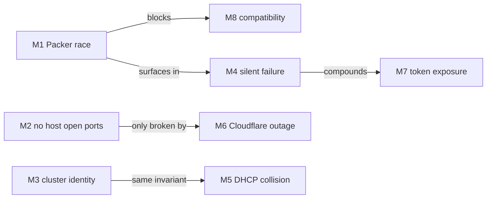
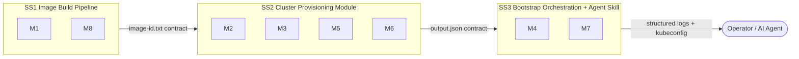
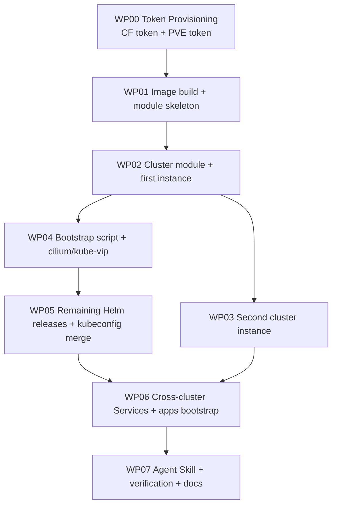

# Implementation Plan: 001 — Proxmox k3s Cluster Module + Image Builder + Bootstrapper

**Branch**: `001-build-a-kubernetes-k3s-cluster-on-proxmo` | **Date**: 2026-07-05 | **Spec**: [spec.md](spec.md) | **Decomposition**: [decomposition.md](decomposition.md) | **Research**: [research.md](research.md)

---

## Summary

Build a reusable artifact pipeline that provisions two HA-capable-but-minimal k3s clusters (cicd + apps) on a single Proxmox host (BigBertha). The pipeline has three deliverables: a Packer-driven image builder (`tools/build_image.py`), an OpenTofu cluster module (`modules/proxmox-k3s-cluster`), and a Python bootstrap script (`tools/bootstrap_cluster.py`). The whole pipeline is driven by an Agent Skill (`.agents/skills/proxmox-k3s-pipeline/SKILL.md`) so any agent that loads the skill can run it end-to-end. Public HTTPS is Cloudflare Tunnel only — zero host open ports.

---

## Technical Context

**Language/Version**:
- Python ≥3.11 for `tools/build_image.py` and `tools/bootstrap_cluster.py`
- HCL2 / OpenTofu ≥1.6 for `modules/proxmox-k3s-cluster/`
- YAML for Talos machineconfig and Helm values rendering

**Primary Dependencies** (version-pinned, all verified via `context7-auto-research` during research):
- `bpg/proxmox` (OpenTofu provider) ≥0.111.1
- `hashicorp/proxmox` (Packer plugin) ≥1.2.3
- `STRRL/cloudflare-tunnel-ingress-controller` Helm chart ≥0.0.23
- Cilium ≥1.16.x (Helm chart)
- `sergelogvinov/proxmox-cloud-controller-manager` ≥v0.14.0
- `sergelogvinov/proxmox-csi-plugin` v0.19.1 (chart 0.5.9)
- kube-vip ≥v1.2.1
- Talos Linux ≥1.10.x (image source)
- k3s ≥v1.34.x (embedded etcd)
- Traefik ≥v3.x (bundled with k3s, demoted to internal)
- cert-manager ≥v1.16.x (in-cluster CA only)
- External: `talosctl`, `helm`, `kubectl`, `ssh`, `jq` on operator workstation

**Storage**:
- Proxmox `data1` lvmthin pool for VM disks
- Proxmox `data2` lvmthin pool (unused in spec 001, available for future)
- `~/.kube/config` on operator workstation (per-cluster contexts)
- `~/.spec-bridge-skill-tool/<session_id>/audit.log` for structured logs

**Testing**:
- pytest ≥7.4 with `pytest-mock` for the two Python scripts; coverage target ≥80% of non-I/O branches
- OpenTofu: `tofu validate`, `tofu plan -refresh-only`, and a mocked-provider unit test for the module's input-validation logic
- Shell smoke tests for `tofu apply` and `bootstrap_cluster.py` against a real cluster (manual, gated on PVE access)

**Target Platform**:
- Operator workstation: Linux (Debian/Ubuntu or RHEL-family), macOS via Docker for tofu/helm/talosctl
- Cluster VMs: Talos Linux on Proxmox VE 9.2.3 (kernel 7.0.6-2-pve)
- Proxmox host: BigBertha at 10.0.0.1, SSH port 6022

**Project Type**: Single-repo tooling (OpenTofu module + two Python CLIs + one Agent Skill + runbooks)

**Performance Goals**:
- `build_image.py`: Packer build ≤10 min; re-run idempotent ≤30 s
- `tofu apply` for one cluster (default 1 CP + 1 worker): ≤20 min
- `bootstrap_cluster.py`: all Helm releases Ready ≤15 min
- Add-worker (`worker_count` bump + `tofu apply`): each new worker Ready ≤5 min
- End-to-end (clean room, both clusters): ≤60 min (SC-001)

**Constraints**:
- No host open ports (FR-013). No DNAT, no nft, no iptables additions to the PVE host.
- PowerDNS at 10.0.0.3 is read-only for spec 001 (FR-028, FR-029, FR-034). All `*.intranet` writes are out of scope.
- All secrets (`pve_token_secret`, `cf_api_token`, Talos machine secrets, SSH keys) read from env at runtime (FR-019, FR-007 / NFR-007).
- Default cluster shape: 1 control-plane + 1 worker (FR-031). `control_plane.count` must be 1 or 3 (FR-030).
- Workers are dynamic via `tofu apply` (FR-032, FR-033).
- Apps cluster consumes cicd services via ExternalName (FR-034-037).

**Scale/Scope**:
- 2 cluster instances from one module
- 8 WPs (7 core + 1 optional cleanup)
- ~30 source files (module + scripts + skill + manifests + runbooks)
- ~10 dependencies (5 OpenTofu + Helm providers, 2 Packer plugins, 1 Python, ~5 system binaries)

---

## Constitution Check

*GATE: Must pass before Phase 0 research. Re-check after Phase 1 design.*

| Gate | Status | Notes |
|------|--------|-------|
| Python 3.11+ | ✅ | `tools/build_image.py` and `tools/bootstrap_cluster.py` require 3.11+; will use 3.12 in CI |
| pytest + 80%+ coverage | ✅ | target ≥80% of non-I/O branches per NFR-006 |
| mypy --strict | ✅ | both scripts will run under mypy --strict |
| Google-style docstrings | ✅ | follows CLAUDE.md comment contract |
| TDD mandatory | ✅ | red-green-refactor per WP |
| SOLID (SRP/OCP/LSP/ISP/DIP) | ✅ | modules, scripts, and skill each have a single responsibility; abstractions are explicit (Packer, bpg/proxmox, helm, talosctl all sit behind narrow interfaces) |
| `context7-auto-research` before external libs | ✅ | already used in research sessions 1-7; will be required step in WP01 |
| Agent Skill conforms to `agentskills.io` | ✅ | codified in NFR-010 |

---

## Project Structure

```
.
├── modules/
│   └── proxmox-k3s-cluster/
│       ├── main.tf
│       ├── variables.tf
│       ├── outputs.tf
│       ├── versions.tf
│       ├── versions.yaml                  # compatibility matrix
│       ├── dnsmasq.tf                     # ethers reservation
│       ├── talos.tf                       # machineconfig renderer
│       ├── traefik-chartconfig.yaml.tftpl
│       ├── cloudflare-tunnel.tf           # Helm release for STRRL controller
│       └── README.md
├── tools/
│   ├── build_image.py
│   ├── bootstrap_cluster.py
│   ├── lib/
│   │   ├── pve_client.py                  # wraps proxmox API + dnsmasq
│   │   ├── helm_client.py
│   │   ├── talos_client.py
│   │   ├── secret_loader.py               # env-only, never logs
│   │   └── log.py                         # dual console + JSON structured logs
│   └── tests/
│       ├── test_build_image.py
│       ├── test_bootstrap_cluster.py
│       ├── test_pve_client.py
│       └── test_log.py
├── clusters/
│   ├── cicd/
│   │   ├── main.tf                        # root module calling proxmox-k3s-cluster
│   │   ├── variables.tf
│   │   ├── terraform.tfvars.example
│   │   ├── talos/                         # rendered machineconfigs (gitignored)
│   │   └── output.json                    # produced by tofu apply (gitignored)
│   ├── apps/
│   │   ├── main.tf
│   │   ├── variables.tf
│   │   ├── terraform.tfvars.example
│   │   ├── talos/
│   │   ├── output.json
│   │   └── manifests/
│   │       └── cicd-system/
│   │           ├── externalname.yaml      # the cross-cluster wiring
│   │           └── kustomization.yaml
├── build/
│   └── image-id.txt                       # produced by build_image.py (gitignored)
├── infra/
│   └── tokens/                            # WP00: Cloudflare + Proxmox scoped tokens
│       ├── main.tf
│       ├── variables.tf
│       ├── outputs.tf
│       ├── terraform.tfvars.example
│       ├── output.json                    # produced by tofu apply (gitignored)
│       └── tests/
├── docs/
│   ├── runbooks/
│   │   ├── cloudflare-fallback.md
│   │   ├── scale-workers.md
│   │   └── decommission-cluster.md
│   └── architecture.md                    # links to research.md, spec.md
├── .agents/
│   └── skills/
│       └── proxmox-k3s-pipeline/
│           └── SKILL.md                   # Agent Skill (NFR-010)
├── specs/
│   └── 001-build-a-kubernetes-k3s-cluster-on-proxmo/
│       ├── spec.md
│       ├── decomposition.md
│       ├── plan.md                        # this file
│       ├── research.md
│       ├── research-log-v1.json .. v7.json
│       └── meta.json
├── Makefile                               # `make build-image`, `make up`, etc.
└── README.md
```

---

## Phase 0: Research

Research is complete (research.md Sessions 1-7 + Final Recommendation). Key resolved unknowns:

| Unknown | Resolution | Source |
|---|---|---|
| Best CNI for kernel 7.0 + k3s | Cilium 1.16.x, kubeProxyReplacement=true | research Session 4 |
| Service LB mechanism | kube-vip ARP (no BGP, no metallb) | research Session 4 |
| Public ingress with no host open ports | STRRL/cloudflare-tunnel-ingress-controller v0.0.23 | research Session 5 |
| Inter-cluster Service consumption | ExternalName over vnet0 + PowerDNS | research Sessions 6, 7 |
| Cluster shape under single-host tolerance | 1 CP + 1 worker default, dynamic | spec FR-031 |
| Image build tool | Packer hashicorp/proxmox v1.2.3, proxmox-clone builder | research Session 1 |
| Provisioning tool | OpenTofu + bpg/proxmox v0.111.1 | research Session 1 |
| Cluster OS | Talos Linux 1.10.x | research Session 1 |
| k8s distribution | k3s embedded etcd v1.34.x | research Session 1 |

API verification of the version-pinned libraries will be re-confirmed in WP01 (per Step 3b in the skill) before any code is written.

---

## Decomposition *(mandatory)*

### Misfit Interaction Graph

From decomposition.md and spec.md `### Misfit Interaction Notes`:

| Misfit | Linked To | Reason |
|--------|-----------|--------|
| M1 (Packer race) | M4 (silent Helm failure) | Race + silent failure compound; both need structured error logs |
| M1 | M8 (Talos+k3s mismatch) | A bad image silently fails every subsequent step |
| M2 (no host open ports) | M6 (Cloudflare outage) | B is the design intent; F is the only sanctioned way to break it |
| M3 (cluster identity overlap) | M5 (DHCP collision) | Both are "two clusters overlap" problems; same module-level invariant |
| M4 (silent Helm failure) | M7 (token exposure) | If secrets leak, the operator may not notice until much later |
| M7 (token exposure) | M4 | same as above |
| M8 (compatibility) | M1 | bad image blocks Packer race resolution |

Non-edges:
- M2 and M3 are independent
- M6 only links to M2
- M8 only links to M1



### Subsystem Boundaries

Grouped into 3 subsystems, justified by the strongly linked groups above.



1. **SS1 -- Image Build Pipeline** [Misfits: M1, M8]
   - **Boundary justification**: Image production is upstream of cluster provisioning and is what M1 and M8 directly attack. The image is reused across both cluster instances; changing the image version requires changing every cluster. The contract to SS2 is a static file (`build/image-id.txt`); no real-time coupling.
   - **External interactions**: Reads Talos ISO from upstream; writes template VMID to `build/image-id.txt`; nothing else.

2. **SS2 -- Cluster Provisioning Module** [Misfits: M2, M3, M5, M6]
   - **Boundary justification**: Cluster identity (M3) and DHCP safety (M5) are both enforced by the same module-level inputs (VIP, VMID range, IP range, Talos cert prefix) that the module validates at plan time. No-host-ports (M2) and the Cloudflare fallback (M6) are both enforced by the same Traefik HelmChartConfig plus the explicit-fallback-flip mechanism. M2, M3, M5, M6 are all module invariants.
   - **External interactions**: Reads `build/image-id.txt` from SS1; writes `output.json` + Talos machineconfig files for SS3.

3. **SS3 -- Bootstrap Orchestration + Agent Skill** [Misfits: M4, M7]
   - **Boundary justification**: This subsystem is the runtime layer that applies the modules' outputs to a live cluster. It is where M4 manifests and where M7 is enforced (secrets read at runtime from env, never logged). It wraps the pipeline in an Agent Skill so any agent can drive it.
   - **External interactions**: Reads `output.json` + Talos machineconfig from SS2; invokes `talosctl`, `helm`, `kubectl`, `ssh` against the live cluster; updates `~/.kube/config` for the operator.

---

## Abstract Components *(mandatory)*

### SS1 -- Image Build Pipeline

**Components:**
- **`build_image.py` CLI**: Owns the end-to-end image build. Validates Talos version against `versions.yaml`, invokes Packer with idempotency check, cleans up half-baked VMs on failure.
- **`PackerTemplate` (HCL2)**: The Packer configuration that drives `hashicorp/proxmox` v1.2.3 to clone from Talos ISO, install Talos to disk, halt, and convert to template.
- **`versions.yaml`**: Compatibility matrix (Talos ↔ PVE kernel ↔ k3s ↔ Cilium). Validated at script start; mismatch = exit non-zero.

**Entities:**
- **`ImageTemplate`**: VMID, talos_version, created_at, source_iso_url.

**Internal coupling**: `build_image.py` reads `versions.yaml`, invokes `PackerTemplate`, writes `ImageTemplate` to `build/image-id.txt`.

### SS2 -- Cluster Provisioning Module

**Components:**
- **`proxmox-k3s-cluster` module**: The reusable Terraform module. Validates inputs (count, VIP, VMID range, IP range uniqueness), clones N VMs from the template, reserves the VIP in dnsmasq ethers, renders Talos machineconfig per VM, renders the demoted-Traefik HelmChartConfig.
- **`dnsmasq.tf`**: Adds the cluster VIP to the vnet0 ethers file via PVE `/etc/pve/sdn/firewall` API or via a direct `qm` call. Idempotent.
- **`talos.tf`**: For each VM, renders `clusters/<name>/talos/<hostname>.yaml` from a template using the cluster inputs + Packer-baked Talos image.
- **`traefik-chartconfig.yaml.tftpl`**: Template for the demoted-Traefik HelmChartConfig that sets `service.type=ClusterIP` and `ingressClass.name=traefik-internal`.
- **`cloudflare-tunnel.tf`**: Helm release for the STRRL/cloudflare-tunnel-ingress-controller with `cf_api_token`, `cf_account_id`, `cf_tunnel_name` from variables.
- **`cluster-output` data source**: A `terraform_data` trigger that emits a JSON file at `clusters/<name>/output.json` with the nodes map.

**Entities:**
- **`Cluster`**: cluster_name, vip, vmid_range, ip_range, pod_cidr, svc_cidr, control_plane.count, workers.count, image_id.
- **`TalosNode`**: role (control_plane | worker), vmid, ip, mac, talos_hostname.

**Internal coupling**: module calls `dnsmasq.tf` before any VM clone; renders `talos.tf` per VM; renders Traefik + Cloudflare HelmChartConfigs. `cluster-output` consumes the rendered data.

### SS3 -- Bootstrap Orchestration + Agent Skill

**Components:**
- **`bootstrap_cluster.py` CLI**: Reads `output.json` + Talos configs from SS2; applies machineconfig via `talosctl apply-config`; installs k3s + the six Helm releases in order; merges kubeconfig. Aborts on any failure with a structured error JSON.
- **`PveClient`**: Wrapper around `qm`, `pct`, `pvesh` calls for dnsmasq reservation and ethers cleanup.
- **`HelmClient`**: Wrapper around `helm install`/`upgrade` with timeout + structured error capture.
- **`TalosClient`**: Wrapper around `talosctl apply-config`, `talosctl health`.
- **`KubeconfigMerger`**: Reads an existing `~/.kube/config`, backs it up, merges a new context, writes atomically.
- **`SecretLoader`**: Reads `PVE_TOKEN`, `CF_API_TOKEN`, `CF_ACCOUNT_ID`, `SSH_KEY_PATH` from env; raises on missing; never logs the value.
- **`StructuredLogger`**: Dual human-readable console + JSON file at `~/.spec-bridge-skill-tool/<session_id>/audit.log`. Trace IDs at operation / session / step levels.
- **`Agent Skill (.agents/skills/proxmox-k3s-pipeline/SKILL.md)`**: The codified interface. Instructs the agent on the 5-phase pipeline, the version pins, and the failure handling.

**Entities:**
- **`BootstrapRun`**: cluster_name, started_at, helm_results (per release), final_status.
- **`HelmRelease`**: name, namespace, chart, version, status (pending | deployed | failed).
- **`KubeconfigContext`**: name, cluster_url, ca_cert_path, user_token_path.

**Internal coupling**: `bootstrap_cluster.py` orchestrates the four clients (`PveClient`, `HelmClient`, `TalosClient`, `KubeconfigMerger`) in a fixed order. All clients log through `StructuredLogger`. All read secrets through `SecretLoader`. The Agent Skill is the user-facing entry point.

---

## Inter-System Contracts *(mandatory)*

### Contract: SS1 → SS2

- **Producer**: `build_image.py` writes `build/image-id.txt` containing the template VMID (single integer per line).
- **Consumer**: `modules/proxmox-k3s-cluster/variables.tf` declares `image_id` as a required string variable. The module's `main.tf` calls `coalesce(var.image_id, fileexists(...) ? ...)` — actually it just validates non-empty.
- **Failure mode**: `image_id` is empty or whitespace. Module aborts plan with `Error: image_id is empty; run tools/build_image.py first`.
- **Implementation method**: Plain text file. File deleted = safe (module fails closed). File written by SS1 = consumed by SS2.

### Contract: SS2 → SS3

- **Producer**: Module's `cluster-output` data source writes `clusters/<name>/output.json` containing:
  ```json
  {
    "cluster_name": "cicd",
    "vip": "10.0.0.30",
    "vnet_bridge": "vnet0",
    "control_plane_count": 1,
    "worker_count": 1,
    "talos_dir": "clusters/cicd/talos",
    "nodes": [
      {"role":"control_plane","name":"cicd-cp-1","vmid":200,"ip":"10.0.0.201","mac":"...","talos_hostname":"cicd-cp-1"},
      {"role":"worker","name":"cicd-w-1","vmid":201,"ip":"10.0.0.202","mac":"...","talos_hostname":"cicd-w-1"}
    ],
    "helm_releases": [
      {"name":"cilium","namespace":"kube-system","chart":"cilium","version":"1.16.x"},
      ...
    ]
  }
  ```
- **Consumer**: `bootstrap_cluster.py` reads the JSON and iterates the nodes array to apply Talos configs.
- **Failure mode**: file missing or `nodes[]` empty. Bootstrap script exits non-zero with `Error: <name>/output.json not found or empty; run tofu apply first`.
- **Implementation method**: JSON file. Deletion safe; bootstrap fails closed.

### Contract: SS3 → Operator (via Agent Skill)

- **Producer**: `bootstrap_cluster.py` exits 0 (success) or non-zero (failure with structured JSON).
- **Consumer**: Agent Skill instructs the agent to invoke the script and act on its exit code. On success, the agent reports the new kubeconfig context. On failure, the agent halts and surfaces the structured error to the operator.
- **Failure mode**: Any script failure produces a structured error JSON: `{"step":"<step_name>","error":"<reason>","trace_id":"<uuid>","resolution":"<hint>","jq_filter":"... | select(.trace_id==...)"}`.
- **Implementation method**: Process exit code + stdout/stderr; the structured error is the last line of stderr.

---

## Phase 1: Design & Contracts

Key design decisions already made in research + spec:

1. **Module input contract** (variable shape):
   ```hcl
   variable "cluster_name"   { type = string }                            # required, unique
   variable "vip"            { type = string }                            # required, must be in vnet0 range
   variable "vmid_start"     { type = number }                            # required, must not overlap existing VMs
   variable "ip_start"       { type = string }                            # required, must be in vnet0 range, not in DHCP range
   variable "image_id"       { type = string }                            # required, non-empty (SS1 contract)
   variable "control_plane"  { type = object({count=number, cpu=number, ram_mb=number, disk_gb=number}) }
   variable "workers"        { type = object({count=number, cpu=number, ram_mb=number, disk_gb=number}) }
   variable "pod_cidr"       { type = string, default = "10.42.0.0/16" } # cicd; apps uses 10.44.0.0/16
   variable "svc_cidr"       { type = string, default = "10.43.0.0/16" } # cicd; apps uses 10.45.0.0/16
   variable "cf_api_token"   { type = string, sensitive = true }
   variable "cf_account_id"  { type = string, sensitive = true }
   variable "cf_tunnel_name" { type = string, default = "k3s-prod" }
   variable "cf_ingress_class" { type = string, default = "cloudflare-tunnel" }
   variable "cf_publish_traefik_publicly" { type = bool, default = false } # NFR-007 default
   ```

2. **Module output contract** (the `output.json` shape — see SS2 → SS3 contract above).

3. **Bootstrap script contract** (CLI):
   ```
   tools/bootstrap_cluster.py --cluster <name> [--phase all|talos|k3s|helm|kubeconfig] [--verbose] [--dry-run]
   tools/build_image.py --talos-version <version> [--pve-endpoint <ip:port>] [--pve-token-id <id>] [--pve-token-secret <secret>] [--verbose] [--dry-run]
   ```

4. **Agent Skill interface** (5-phase pipeline as documented in spec.md):
   - Phase 1: build_image.py
   - Phase 2: tofu apply (one or more cluster roots)
   - Phase 3: bootstrap_cluster.py
   - Phase 4: verify (kubectl get, helm list, ingress smoke test)
   - Phase 5: loop for second cluster

5. **Talos machineconfig shape** (per VM):
   ```yaml
   # Rendered by talos.tf per VM, applied by bootstrap_cluster.py via talosctl
   cluster:
     name: cicd
     controlPlane:
       endpoint: https://10.0.0.30:6443
   machine:
     network:
       interfaces:
         - interface: eth0
           addresses: [10.0.0.201/8]
           routes:
             - network: 0.0.0.0/0
               gateway: 10.0.0.1
   ```

---

## Implementation Phases and WP Candidates



| Phase | WPs | Subsystem | Depends on | Can parallelise |
|-------|-----|-----------|------------|-----------------|
| Phase 0: Token Provisioning | WP00 | SS0 (new) -- cross-cutting infrastructure | -- | No |
| Phase 1: Foundations | WP01 | SS1 | WP00 | No |
| Phase 2: Cluster module | WP02, WP03 | SS2 | WP01 | WP02 first, WP03 after WP02 |
| Phase 3: Bootstrap | WP04, WP05 | SS3 | WP02 (for first cluster) | No (sequential per cluster) |
| Phase 4: Cross-cluster | WP06 | SS3 + SS2 (ExternalName manifest) | WP03 + WP05 | No |
| Phase 5: Skill + docs | WP07 | SS3 | WP06 | No |

**WP details:**

- **WP00 (SS0 -- Token Provisioning)**: A standalone OpenTofu root at `infra/tokens/` that creates both the Cloudflare API token and the Proxmox role/user/token with the exact permissions the rest of the pipeline needs. Idempotent. Outputs are written to `infra/tokens/output.json` (gitignored) so later WPs can read them. Validates FR-019, NFR-007; resolves M7 (token exposure) by sourcing the existing admin Cloudflare token from env, generating the **scoped** Cloudflare token from it, and storing the new Proxmox token with limited ACL. Detail below.
- **WP01 (SS1)**: Packer HCL2 template; `tools/build_image.py` (CLI + lib); `versions.yaml`; pytest fixtures with mocked `pvesh` calls; Makefile targets `build-image` and `clean-image`. Output: `build/image-id.txt` populated.
- **WP02 (SS2)**: `modules/proxmox-k3s-cluster/{main,variables,outputs,dnsmasq,talos,cloudflare-tunnel}.tf`; `traefik-chartconfig.yaml.tftpl`; `clusters/cicd/{main,variables}.tf` + `terraform.tfvars.example`. Validates all FRs in spec that touch module inputs (FR-004 through FR-007, FR-013, FR-016, FR-018, FR-019, FR-021, FR-022, FR-030, FR-031, FR-032).
- **WP03 (SS2)**: `clusters/apps/{main,variables}.tf` + `terraform.tfvars.example`. Re-uses the module unchanged; only root config differs. Validates M3 (identity uniqueness across instances).
- **WP04 (SS3)**: `tools/bootstrap_cluster.py` (CLI + lib); `tools/lib/{pve_client,talos_client,helm_client,secret_loader,log}.py`; `tools/tests/`. Validates FR-008, FR-009, FR-010, FR-011, FR-012, FR-020, M4.
- **WP05 (SS3)**: Add CCM, CSI, demoted Traefik, Cloudflare Tunnel controller, cert-manager Helm releases to the script; kubeconfig merge step; PVE firewall assertion (no DNAT added). Validates FR-014, FR-015, NFR-007.
- **WP06 (SS3 + SS2)**: `clusters/apps/manifests/cicd-system/externalname.yaml` + kustomization; bootstrap_cluster.py applies this when `--cluster apps`; verify apps → cicd reachability. Validates FR-034, FR-035, FR-036, FR-037.
- **WP07 (SS3)**: `.agents/skills/proxmox-k3s-pipeline/SKILL.md`; `docs/runbooks/{cloudflare-fallback,scale-workers,decommission-cluster}.md`; `docs/architecture.md`; final SC verifications. Validates FR-024 through FR-029, NFR-009 through NFR-012.

#### WP00 detail: Token Provisioning

**Goal**: declarative, idempotent creation of the two least-privilege API tokens the rest of the pipeline needs. Both tokens live behind tofu state; tofu state is the single source of truth. Outputs are written to a JSON file (gitignored) for downstream consumption.

**Components**:

- **`infra/tokens/main.tf`** -- OpenTofu root module. Two responsibilities:
  1. Create a Cloudflare API token scoped to the three permissions the cluster controller needs (`Zone:Zone:Read`, `Zone:DNS:Edit`, `Account:Cloudflare Tunnel:Edit`).
  2. Create a Proxmox role with the exact permissions bpg/proxmox + the CSI plugin's `docs/install.md` snippet need, plus a user, plus a token bound to that user+role.
- **`infra/tokens/variables.tf`** -- inputs:
  - `cloudflare_account_id` (sensitive; sourced from env `TF_VAR_cloudflare_account_id`)
  - `cloudflare_admin_api_token` (sensitive; sourced from env `TF_VAR_cloudflare_admin_api_token`) -- a **break-glass** admin token the operator generates once in the Cloudflare dashboard; tofu uses it only to mint the scoped token, never stores it long-term
  - `cloudflare_zone_id` (the zone the cluster's public hostnames will live in)
  - `cloudflare_scoped_token_ttl_seconds` (default 0 = never expire; or set a rotation window)
  - `pve_endpoint` (default `https://10.0.0.1:8006`)
  - `pve_ssh_user` (default `root@pam`)
  - `pve_ssh_password` (sensitive; one-shot input for the initial user creation; sourced from env `TF_VAR_pve_ssh_password`)
  - `proxmox_role_name` (default `k3s-cluster`)
  - `proxmox_user_name` (default `k3s-terraform@pam`)
  - `proxmox_token_name` (default `k3s-terraform-token`)
- **`infra/tokens/outputs.tf`** -- exposes `cloudflare_scoped_token`, `cloudflare_account_id`, `proxmox_token_id`, `proxmox_token_secret`. These are written via a `local_file` resource to `infra/tokens/output.json` with `sensitive = true` so they don't print in apply output. The file is added to `.gitignore`.
- **`infra/tokens/tests/`** -- mocked-provider unit tests for the permission-set declarations (assert the Cloudflare scope array contains exactly the three permissions; assert the Proxmox role's privilege list matches the bpg + CSI required minimums).

**Providers used**:

- `cloudflare/cloudflare` >=4.x for the Cloudflare side (uses `cloudflare_api_token` provider attribute sourced from the admin token env var).
- `bpg/proxmox` >=0.111.1 for the Proxmox side (uses `proxmox_virtual_environment_role`, `proxmox_virtual_environment_user`, `proxmox_virtual_environment_token`).

**Cloudflare scoped token** -- exact permission set (matches NFR-007):

```
permissions:
  - effect: allow
    resources:
      - com.cloudflare.api.account.zone.<zone_id>
    actions:
      - zone:read
  - effect: allow
    resources:
      - com.cloudflare.api.account.zone.<zone_id>
    actions:
      - dns:edit
  - effect: allow
    resources:
      - com.cloudflare.api.account.<account_id>
    actions:
      - account:cloudflare-tunnel:edit
```

**Proxmox role** -- exact privilege set (matches bpg/provider + CSI plugin `docs/install.md`):

```
role "k3s-cluster" privileges:
  - VM.Allocate
  - VM.Config.CPU
  - VM.Config.Disk
  - VM.Config.Memory
  - VM.Config.Network
  - VM.Config.Options
  - VM.Console
  - VM.PowerMgmt
  - VM.Snapshot
  - Datastore.AllocateSpace
  - Datastore.Audit
  - SDN.Use
  - Pool.Allocate    # only if clusters are pooled; otherwise drop
  - User.Modify      # for token minting itself
  - Permissions.Modify  # only for self; tofu uses a one-shot admin to bootstrap this role
```

The role is created **once** by an admin (the operator's `root@pam` user); the scoped token then operates against that role. The Proxmox user is created with `comment = "k3s cluster provisioning"` and the role attached.

**Why this is its own subsystem (SS0)**:

- It is not part of any cluster instance (not "per cluster"). It is one-time infrastructure.
- It does not depend on any cluster existing.
- All downstream WPs depend on its outputs being present.
- It enforces M7 (token exposure) at the source by minting a **scoped** token rather than reusing an admin token; if the cluster's token leaks, blast radius is limited to the three specific permissions.
- It enforces NFR-007 (least privilege) at the source.

**Failure modes**:

- If `cloudflare_admin_api_token` is missing from env, tofu aborts with `Error: provider "cloudflare" requires CLOUDFLARE_API_TOKEN env var`. WP00 is unreachable.
- If the zone does not exist in Cloudflare, the scoped token creation fails with a Cloudflare API error and a structured `cloudflare_api_error` JSON is logged.
- If the Proxmox role already exists with conflicting privileges, tofu's `lifecycle.create_before_destroy` re-creates the role after the user is detached.

**Independent test**:

- `cd infra/tokens && tofu init && tofu apply -auto-approve` exits 0.
- `cat infra/tokens/output.json | jq -r '.cloudflare_scoped_token | length'` returns a non-zero length (token is a non-empty string).
- The Cloudflare dashboard shows the new token with exactly three permissions.
- The Proxmox dashboard shows a new user `k3s-terraform@pam` with role `k3s-cluster`.
- Re-running `tofu apply` is a no-op ("No changes") in under 30 seconds (idempotent).

**Cleanup**: `tofu destroy` removes the scoped Cloudflare token and the Proxmox user/token (the Proxmox role is left in place -- it is idempotent on re-create and removing it would break subsequent `tofu apply` runs).

**Files added under WP00**:

- `infra/tokens/main.tf`
- `infra/tokens/variables.tf`
- `infra/tokens/outputs.tf`
- `infra/tokens/terraform.tfvars.example`
- `infra/tokens/tests/tokens_test.go` (or `tokens_test.py` if using the Python tofu testing framework)
- `.gitignore` entry: `infra/tokens/output.json` and `infra/tokens/.terraform/`

---

## Key Design Decisions

1. **Minimal cluster shape (1 CP + 1 worker) is the default, not 3 CP + 2 worker** — research Session 7 quantified ClusterMesh overhead at 50% of CP CPU on the minimal profile; this also keeps total resource use within 16 vCPU / 24 GiB (NFR-013). Rationale: single-host tolerance — the cluster is on one host, so HA on the host doesn't help. Reversibility: operators can bump `worker_count` and (separately) `control_plane.count` to 3 later if needed.
2. **Cloudflare Tunnel is the only public ingress path** — research Session 5. Rationale: zero host open ports, no DNAT, no public A record, no cert-manager in the public path. Reversibility: a documented fallback (NFR-009) flips Traefik to hostPorts and adds one nft rule.
3. **ExternalName over ClusterMesh for cross-cluster Service consumption** — research Sessions 6, 7. Rationale: minimal cost, no new controllers, fails closed. Reversibility: ClusterMesh can be added on top without removing ExternalName.
4. **Talos Linux as the node OS** — research Session 1. Rationale: immutable, k3s-native shim, no SSH after bootstrap (talosctl only).
5. **Module does NOT install k3s or Helm releases** — those are the bootstrap script's job. Rationale: clear contract between SS2 and SS3; module is idempotent at the declarative layer; bootstrap is the single point that knows runtime state. Reversibility: `tofu destroy` rolls back infra; bootstrap is idempotent on re-run.
6. **No commit without explicit human permission** — CLAUDE.md rule 1. Both scripts leave their output state on disk (gitignored); commits happen only on operator instruction.
7. **WP00 mints scoped tokens, not admin tokens** — rationale: NFR-007 (least privilege) and M7 (token exposure). If the cluster's Cloudflare or Proxmox token leaks, blast radius is limited to exactly the three Cloudflare permissions + the documented Proxmox privileges. The admin Cloudflare token is read once from env during WP00 and used only to mint the scoped token; tofu state for WP00 stores only the scoped token. The Proxmox role is created once and survives `tofu destroy`; only the user and the token are removed.

---

## Risk Register

| Risk | Likelihood | Impact | Mitigation |
|------|-----------|--------|------------|
| PVE kernel upgrade breaks Cilium eBPF | Low | High | `versions.yaml` checks kernel version; reject build if mismatch |
| Cloudflare account outage | Low | High | Documented fallback path (NFR-009, WP07); Traefik demoted by default keeps in-cluster traffic working |
| Talos upgrade breaks k3s shim | Medium | High | Pin Talos + k3s versions in `versions.yaml`; pre-flight check in WP01 |
| Two operators run build_image.py simultaneously (M1) | Medium | Medium | Script locks the template VMID during build; second run waits or aborts |
| Operator commits secrets accidentally | Medium | High | All secrets read from env at runtime; `tools/lib/secret_loader.py` raises if a secret appears in any committed file at startup |
| Apps cluster cannot reach cicd cluster after PowerDNS change | Medium | Medium | Short TTL (60s) on `*.intranet` records; documented in downstream DNS spec; FR-036 bounds error time |
| Control-plane VM dies (no HA) | Medium | High | Operator rebuilds via `tofu apply`; documented in `docs/runbooks/decommission-cluster.md` |
| `tofu apply` slow due to PVE latency | Low | Low | `parallel = false` by default; documented in operator runbook |
---

## Open Questions

- [x] Resolved: Cluster shape decision (Session 7 + spec FR-031): 1 CP + 1 worker default, 3 allowed. ExternalName stays for cross-cluster; ClusterMesh deferred.
- [x] Resolved: Public ingress decision (Session 5 + spec FR-013): Cloudflare Tunnel only.
- [x] Resolved: Cross-cluster comms (Sessions 6, 7 + spec FR-034-037): ExternalName over vnet0 + PowerDNS.
- [ ] Verify before WP generation: `STRRL/cloudflare-tunnel-ingress-controller` v0.0.23 Helm chart values schema (exact keys: `cloudflare.apiToken`, `cloudflare.accountId`, `cloudflare.tunnelName`, `ingressClass.name`, `ingressClass.controller`). The WP01 step will run `context7-auto-research` to confirm before any Helm release code is written.
- [ ] Verify before WP generation: `bpg/proxmox` v0.111.1 `proxmox_virtual_environment_vm` and `proxmox_virtual_environment_cluster_sdn` resource schemas. The WP02 step will verify.
- [ ] Verify before WP generation: `talosctl apply-config --talos-version=1.10` flag set. The WP04 step will verify.
- [ ] Verify before WP generation: `k3s server --cluster-init --tls-san` exact flag set and behaviour with 1-node etcd. The WP04 step will verify.
- [ ] Verify before WP generation: how STRRL controller behaves when `cloudflare.tunnelName` already exists (i.e. adoption vs. create-new). The WP05 step will verify.