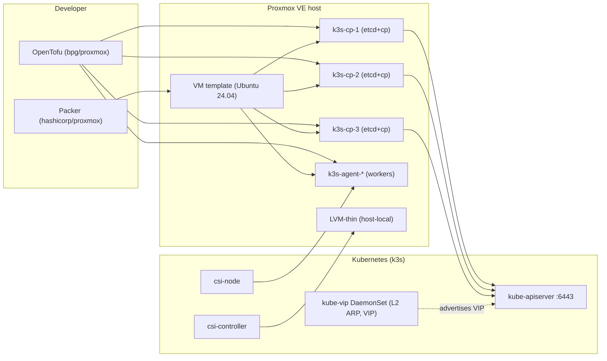

# Research: k3s-on-Proxmox with OpenTofu, Packer, kube-vip and Proxmox CSI

## Research Session 1 -- 2026-07-04

**Topic**: Build a production-shaped HA Kubernetes (k3s) cluster on a single Proxmox host using OpenTofu for VMs, Packer for image baking, kube-vip for control-plane HA and Service LoadBalancer, and the sergelogvinov Proxmox CSI Plugin for persistent storage.

**Type**: `integration` (with `best-practices` flavor)

**Objective**: `implementation-details` -- produce a working end-to-end blueprint the developer can lift into the spec/plan tasks.

### Starting Context

- The CSI plugin is already vendored at `vendored/proxmox-csi-plugin` (chart `0.5.9`, appVersion `v0.19.1`, released 2026-06-25). Its `docs/install.md` contains a literal bpg/proxmox OpenTofu snippet for the role/user/token/ACL.
- A reference implementation exists at `vendored/Proxmox-Kubernetes-Engine` (PKE) -- the same author wired together k3s + kube-vip + Proxmox CSI + Cilium via Cluster API. Useful as architectural inspiration.
- **Constraint (k3s HA):** multi-server k3s must use embedded etcd or an external datastore; SQLite is single-node only. First server needs `--cluster-init --tls-san=<VIP>`. Additional servers need `--server` + matching `--tls-san`.
- **Constraint (kube-vip on k3s):** kube-vip is a DaemonSet dropped into `/var/lib/rancher/k3s/server/manifests/`. The cluster-wide `--tls-san` must equal the kube-vip VIP. Use `--disable servicelb` only if you also install the kube-vip cloud-controller.
- **Constraint (CSI plugin):** VMs must use `VirtIO SCSI single`; nodes must carry `topology.kubernetes.io/region=<cluster-name>` and `topology.kubernetes.io/zone=<pve-node-name>`.

### Findings

This is an integration concern spanning four subsystems. The recommended wiring -- the same shape PKE uses -- is summarized in C4 Level-2 form below.

#### 1. Packer (`hashicorp/proxmox` v1.2.3) -- image pipeline

```
+-----------------------------+        +--------------------------+
|  packer build (local/CI)    |  --->  |  Proxmox template VMID   |
+-----------------------------+        |  (Ubuntu 24.04, cloud-  |
       |                              |   init, qemu-guest-agent, |
       | proxmox-iso builder          |   no k3s, no SSH key)     |
       v                              |                          |
Ubuntu ISO --apt--> openssh, qemu-guest-agent, kernel modules
              --run--> disable swap, write /etc/modules-load.d/
              --poweroff--> convert to template
```

Decisions:
- Use `proxmox-iso` (not `proxmox-clone`) for the first template so the base OS is reproducible from a known ISO.
- Bake only the static bits (cloud-init, qemu-guest-agent, tuned sysctl, kernel modules). Do **not** bake `k3s` or join tokens -- those are per-node and come from cloud-init user-data at VM provision time.
- `cloud-init` is the bridge between OpenTofu and k3s: OpenTofu injects a per-VM cloud-config (k3s server/agent flags + `curl | sh` install), VM runs it on first boot, then becomes a cluster member.
- Alternative used by PKE itself: `kubernetes-sigs/image-builder` (Packer + Ansible, pre-baked). Recommended when the team already runs Ansible; otherwise vanilla Packer + a shell provisioner is sufficient.

#### 2. OpenTofu (`bpg/proxmox` v0.111.1) -- VMs, network, secrets, RBAC

The CSI plugin docs already give us the exact OpenTofu resource set for the Proxmox RBAC side:

```hcl
provider "proxmox" {
  endpoint   = var.pve_endpoint      # https://pve.example:8006/
  api_token  = var.pve_api_token     # terraform@pve!tf=<uuid>
  insecure   = false
  ssh { agent = true username = "terraform" }
}

resource "proxmox_virtual_environment_role" "csi" {
  role_id    = "Kubernetes-CSI"
  privileges = [
    "VM.Audit", "VM.Config.Disk",
    "Datastore.Allocate", "Datastore.AllocateSpace", "Datastore.Audit",
  ]
}

resource "proxmox_virtual_environment_user" "csi" {
  user_id = "kubernetes-csi@pve"
  acl { path = "/" propagate = true role_id = proxmox_virtual_environment_role.csi.role_id }
}

resource "proxmox_virtual_environment_user_token" "csi" {
  user_id    = proxmox_virtual_environment_user.csi.user_id
  token_name = "csi"
}

resource "proxmox_virtual_environment_vm" "control_plane" {
  for_each  = var.control_plane_nodes
  name      = "k3s-cp-${each.key}"
  node_name = var.pve_node
  clone { vm_id = var.template_vmid full = true }
  cpu    { cores = each.value.cpus }
  memory { dedicated = each.value.memory }
  initialization {
    user_data_file_id = proxmox_virtual_environment_file.cloud_init_cp[each.key].id
  }
}
```

OpenTofu also owns:
- A `proxmox_virtual_environment_file` per node (`/var/lib/rancher/k3s/server/manifests/kube-vip.yaml`, k3s install + config, optional RBAC).
- A `tls_private_key` and `local_file` for the SSH key the runner uses post-bootstrap to verify cluster state.
- A `helm_release` of `vendored/proxmox-csi-plugin/charts/proxmox-csi-plugin` (or a Kubernetes provider apply of the static manifest).

#### 3. k3s HA + kube-vip

```
                    +-----------------------------+
   --tls-san=VIP -> |  kube-vip DaemonSet (L2 ARP)| <- VIP e.g. 10.0.0.40
                    +-----------------------------+
                                  |
                +-----------------+-----------------+-----------------+
                |                 |                 |                 |
            server1           server2           server3          agent1+
            (etcd+mgr)        (etcd+mgr)        (etcd+mgr)       (worker)
                \                --server          --server         /
                 ---- shared /var/lib/rancher/k3s/server/manifests/
                                 kube-vip-rbac.yaml + kube-vip.yaml
```

First control plane:

```bash
# Drop kube-vip DaemonSet manifest into the auto-deploy dir
ctr image pull ghcr.io/kube-vip/kube-vip:$KVVERSION
ctr run --rm --net-host ghcr.io/kube-vip/kube-vip:$KVVERSION vip \
  /kube-vip manifest daemonset \
    --interface $IFACE \
    --address $VIP \
    --controlplane --services --arp --leaderElection \
  > /var/lib/rancher/k3s/server/manifests/kube-vip.yaml
curl https://kube-vip.io/manifests/rbac.yaml \
  > /var/lib/rancher/k3s/server/manifests/kube-vip-rbac.yaml

curl -sfL https://get.k3s.io | K3S_TOKEN=SECRET sh -s - server \
    --cluster-init --tls-san=$VIP --write-kubeconfig-mode=644
```

Subsequent control planes:

```bash
curl -sfL https://get.k3s.io | K3S_TOKEN=SECRET sh -s - server \
    --server https://$VIP:6443 --tls-san=$VIP
```

Agent nodes:

```bash
curl -sfL https://get.k3s.io | K3S_TOKEN=SECRET sh -s - agent \
    --server https://$VIP:6443
```

After the API is reachable, switch the kubeconfig server URL to the VIP (k3s writes the first server's IP by default).

#### 4. Proxmox CSI Plugin (Helm install, post-cluster-up)

```bash
kubectl create ns csi-proxmox
kubectl label ns csi-proxmox pod-security.kubernetes.io/enforce=privileged

kubectl -n csi-proxmox create secret generic proxmox-csi-plugin --from-file=config.yaml
# config.yaml has clusters[].url, .token_id, .token_secret, .region
helm upgrade --install proxmox-csi-plugin \
  vendored/proxmox-csi-plugin/charts/proxmox-csi-plugin \
  -n csi-proxmox -f values.yaml
```

Storage class example:

```yaml
apiVersion: storage.k8s.io/v1
kind: StorageClass
metadata:
  name: proxmox-lvm-thin
provisioner: csi.proxmox.sinextra.dev
volumeBindingMode: WaitForFirstConsumer
parameters:
  region: Region1
  zone: pve-1
  storage: lvm-thin
  fsType: ext4
  reclaimPolicy: delete
allowVolumeExpansion: true
```

### Architecture Overview



### Configuration Steps (ordered)

1. **One-time on the PVE host**
   ```bash
   pveum user add terraform@pve
   pveum role add Terraform -privs "VM.Audit VM.PowerMgmt VM.Allocate VM.Clone VM.Config.Disk VM.Config.Network VM.Config.Cloudinit VM.GuestAgent.Audit Datastore.Allocate Datastore.AllocateSpace SDN.Use Pool.Allocate"
   pveum aclmod / -user terraform@pve -role Terraform
   pveum user token add terraform@pve provider --privsep=0
   ```

2. **Packer builds the template** -- VMID `9000` marked as template; qemu-guest-agent installed; cloud-init-ready.

3. **OpenTofu init + apply**
   ```bash
   tofu init
   tofu plan -var-file=env/dev.tfvars
   tofu apply -var-file=env/dev.tfvars
   ```
   Creates the CSI role/user/token, the per-node cloud-init snippets, the VMs cloned from the template, and the post-cluster kubeconfig fetch.

4. **First control plane boots and k3s self-installs** with `--cluster-init --tls-san=$VIP`; cloud-init also drops `kube-vip.yaml` + `kube-vip-rbac.yaml` into the auto-deploy manifests dir so the DaemonSet self-deploys.

5. **Other control planes join** once the kubeconfig is reachable. OpenTofu triggers this via a null_resource + SSH.

6. **Agent nodes join** via the agent cloud-init snippet.

7. **OpenTofu switches kubeconfig to the VIP** and applies the CSI Helm release.

8. **Apply node topology labels** (or run the Proxmox Cloud Controller Manager so labels are automatic):
   ```bash
   kubectl label nodes -l node-role.kubernetes.io/control-plane= \
     topology.kubernetes.io/region=Region1 topology.kubernetes.io/zone=pve-1
   ```

9. **Smoke test PVC** with `vendored/proxmox-csi-plugin/docs/deploy/test-pod-ephemeral.yaml`.

### Error Handling at Boundaries

| Boundary | Failure mode | Detection | Mitigation |
|----------|--------------|-----------|------------|
| Packer -> Proxmox | ISO upload fails / token rejected | packer log + non-zero exit | Use API token; bake the storage pool to `local-lvm` |
| OpenTofu -> Proxmox | API token invalid, `pvesm` permission denied | `tofu apply` error | Validate token scope via `pvesh get /access/users` |
| k3s install -> `get.k3s.io` unreachable | Network/DNS to GitHub blocked | journalctl `k3s.service` | Pre-stage the k3s binary in cloud-init or via a local HTTP mirror |
| kube-vip -> VIP not announced | ARP not seen on the VLAN | `kubectl logs -n kube-system -l name=kube-vip` | Verify `--interface` matches the actual NIC name; ARP works on the default Proxmox bridge |
| k3s `--tls-san` mismatch | `x509: certificate is valid for <internal-ip>, not <VIP>` | kubectl error | Re-init cluster or rotate certs per `docs.k3s.io` certificate rotation guide |
| CSI PV creation | `Permission check failed (user != root@pam)` | CSI controller logs | Some Proxmox API ops are root-only; either use `root@pam` token or grant elevated role |
| PVC stuck Pending | zone has no Proxmox node | `kubectl describe pvc` | Match `topology.kubernetes.io/zone` on nodes |

### Best-Practices / Anti-patterns

**Do**
- Pin component versions: bpg/proxmox `~> 0.111`, hashicorp/proxmox `~> 1.2`, kube-vip `v0.7+` (latest `v1.2.1`), k3s `v1.34.x`, CSI chart `0.5.9`/app `v0.19.1`.
- Use Proxmox API tokens (`terraform@pve!provider=<uuid>`); never commit tokens to git.
- Drop kube-vip + RBAC into `/var/lib/rancher/k3s/server/manifests/` for auto-deploy; don't hand-apply after cluster creation.
- Make `--tls-san` an immutable `local.kube_vip_vip` and pass on every k3s install.
- Use `--disable servicelb` only if you intend to install the kube-vip cloud-controller.

**Don't**
- Don't bake a join token into the Packer image.
- Don't run the CSI controller on a worker without taints/tolerations; use the chart's `control-plane` nodeSelector.
- Don't mix `--cluster-init` with an existing datastore.
- Don't put the Proxmox API token in plain `.tfvars`; pass via `TF_VAR_pve_api_token`.

### Recommendation

Adopt the full PKE-style pipeline:

1. **Packer** builds an Ubuntu 24.04 template (cloud-init + qemu-guest-agent + tuned kernel modules for ip_vs).
2. **OpenTofu** (bpg/proxmox) declares the Proxmox RBAC, the VMs cloned from the template, and a Helm release of the vendored CSI chart.
3. **k3s** is installed by cloud-init per VM with `--cluster-init --tls-san=<VIP>` on the first server.
4. **kube-vip** auto-deploys as a DaemonSet and advertises the VIP via ARP.
5. **Proxmox CSI Plugin** (Helm chart `vendored/proxmox-csi-plugin/charts/proxmox-csi-plugin`) connects with the OpenTofu-provisioned API token, exposing local storage as StorageClass.

### Impact on Feature

- The follow-up `spec.md` should declare cluster topology (node count, CIDRs, image version, k3s version, kube-vip mode) as variables, not literals.
- The `plan.md` should be decomposed into: packer module, OpenTofu VM + cloud-init module, k3s bootstrap, kube-vip post-deploy, CSI Helm chart, smoke test.
- A separate work package should cover CI smoke tests (kubectl get nodes / get pvc pass against a fresh cluster), matching the CSI plugin's own `e2e-tests.md` pattern.

## Research Session 2 -- 2026-07-05

**Topic**: Use the existing gateway IP and how it interacts with kube-vip (ARP vs BGP modes) for the 001 k3s-on-Proxmox spec. Specifically: what is meant by `gateway IP`, where it sits in the Proxmox network model, and how kube-vip uses (or doesn't use) the gateway when advertising the cluster VIP and the LoadBalancer services.

**Type**: `integration` (network boundary) with `best-practices` flavor

**Objective**: `implementation-details` -- decide the network topology and kube-vip mode, then feed the decision into the 001 spec.

### Starting Context

- The 001 spec already commits to: Packer image, OpenTofu (bpg/proxmox) for VMs and Proxmox RBAC, k3s with embedded etcd, kube-vip, and the vendored Proxmox CSI plugin (Session 1).
- **Constraint (kube-vip ARP Cautions):** ARP-mode VIP may be wrongly picked as the node's InternalIP by kubelet. Fix: pin `--node-ip` explicitly. If Calico is used, set `IP_AUTODETECTION_METHOD=kubernetes-internal-ip` on the calico-node DaemonSet.
- **Constraint (kube-vip ARP failover):** Typical failover ~3s, dependent on upstream switch forwarding gratuitous ARP. Some managed switches filter GARP across ports.
- **Constraint (Proxmox default):** vmbr0 is a Linux bridge attached to the host's primary NIC; the host IP and the upstream gateway live on this bridge. Guest vNICs attach to vmbr0. Gratuitous ARP flows through the bridge without modification.
- **Constraint (Flannel backends):** Default k3s Flannel is `vxlan` (no underlay assumption). `host-gw` requires direct L2 between every node. `wireguard-native` encrypts the pod overlay.
- **Constraint (kube-vip BGP mode):** Without leader election, all nodes advertise the VIP; BGP ECMP on the upstream router load-balances. A `Control Plane Health Check` lets kube-vip withdraw a node's BGP route if its apiserver fails. Requires the upstream device (often the gateway) to peer over BGP.

### Findings

#### 1. What "gateway IP" actually is in this setup

Three distinct things share that name and we have to keep them straight:

| Term | Example value | Where it lives | Role |
|------|---------------|----------------|------|
| **Upstream gateway** | `192.168.10.1` (the home router) | On the LAN outside Proxmox, reachable through the NIC that backs `vmbr0` | Default route for the PVE host *and* for every VM; reachable through gratuitous ARP across vmbr0 |
| **Proxmox host IP** | `192.168.10.2` (per `vmbr0` config in `pve-network`) | Assigned to vmbr0 on the PVE host itself | Proxmox management UI + API + cluster traffic |
| **kube-vip VIP** (new) | `192.168.10.40` (free IP in same subnet) | Moves between k3s control-plane nodes | Cluster apiserver endpoint (`:6443`) and LoadBalancer services |

The PVE host's gateway, the Proxmox host IP, and the VIP all need to live on the **same L2 subnet** for ARP-mode kube-vip to work. If the VIP lives in a different subnet, gratuitous ARP gets filtered and failover breaks — pick a free IP inside vmbr0's /24.

#### 2. ARP mode (default for this design)

```
               +----------------------------------------------+
               |  Upstream gateway / router                   |
               |  e.g. 192.168.10.1                           |
               +----------------------------------------------+
                              ^   GARP
                              |  (filtered by some switches)
                              v
        +-----------+--------------+   vmbr0  Linux bridge   +-------------+
        |    eno1  |              |            |            |             |
        |          |   Proxmox    |            v            | k3s node 1  |
        |          |   host (PVE) |  flannel vxlan overlay  | -kube-vip   |
        |          |              |            |            |  (leader)   |
        +----------+--------------+            |            +-------------+
                |           ^                  v                ^  GARP
                |           |           192.168.10.40 (VIP)    |
                |   +-------+---------+                          |
                +-->| eno1 NIC (host)  |                          |
                    +------------------+   Gratuitous ARP        |
                                                       flows here
                                       vmbr0 forwards to eno1 transparently
```

- The VIP is **not** the gateway. The gateway is unreachable from the VIP; only the cluster's apiserver and LoadBalancer Services share it.
- The upstream gateway does **not** need a static ARP entry -- it learns the VIP MAC via GARP, just like any other host. The Proxmox wiki confirms vmbr0 forwards frames transparently.
- Traffic from outside the cluster destined for the VIP reaches whichever node currently holds leadership (single MAC).
- The leader-election bottleneck: docs warn that `leaderElection` for all services routes every Service LB through one node. Mitigation: use BGP mode if the gateway can peer.

**ARP "Cautions" remediation baked into the design:**

- Each node's kubelet is started with `--node-ip=<node-ip>` (NOT the VIP). The Packer template's cloud-init uses the per-node `ipv4.address_first` from OpenTofu.
- If Calico is later chosen, set `IP_AUTODETECTION_METHOD=kubernetes-internal-ip` on calico-node. PKE uses Cilium, which doesn't autodetect in this problematic way, so this only matters if Calico replaces the default.

#### 3. BGP mode (escape hatch)

```
       +----------------------------------------------+
       |  Upstream gateway / router (BGP-capable)      |
       |  e.g. FRRouting, BIRD, OpenBGPD               |
       |  AS 65000                                     |
       +----------------------------------------------+
                ^                        BGP UPDATE
                |        (VIP /32 next-hop=<node>)
                |
        +-------+-----------------------------+
        |       PVE / vmbr0  (Linux bridge)   |
        +-------+-----------------------------+
                |             v
                |    +--------+--------+
                |    |  k3s node N     |
                |    |  - kube-vip BGP |
                |    |  - apiserver    |  advertises /32 route to VIP
                |    +-----------------+  ECMP across all nodes
        +-------+-----------------------------+
        |       k3s node 1                     |
        |       - kube-vip BGP (advertise VIP) |
        |       - apiserver                    |
        +--------------------------------------+
```

- BGP requires the upstream gateway (or an adjacent router) to run a BGP daemon. Homelab routers usually do not.
- kube-vip can run BGP **without leader election**: every node advertises the VIP /32 route; the BGP best-path / ECMP chooses a node.
- The `Control Plane Health Check` (`bgp-health-check`) feature lets kube-vip withdraw a node's route if its apiserver `/readyz` fails -- the cluster stays healthy even with one node down.
- The VIP is **not** the gateway. The gateway still owns the default route; VIP BGP routes are an additional `/32` entry.
- BGP requires the VIP to be reachable via routing, not L2. The underlay gateway/router accepts the /32 advertisement.
- BFD (Bidirectional Forwarding Detection) is supported (added in kube-vip recently) for sub-second failover.

#### 4. Routing-table mode (rp_filter escape hatch)

For networks where rp_filter or one-way ARP blocks ARP mode but the user wants to avoid BGP. kube-vip injects routes into table 198 (proto 248). Useful as a documented "if ARP fails, try this"; not the default.

#### 5. Where this lands in the OpenTofu variables

```hcl
variable "network_gateway"        { type = string }  # 192.168.10.1
variable "network_subnet"         { type = string }  # 192.168.10.0/24
variable "kube_vip_vip"           { type = string }  # 192.168.10.40
variable "kube_vip_mode"          { type = string, default = "arp" }  # "arp" or "bgp"
variable "kube_vip_as"            { type = number, default = 65000 }   # only when mode = bgp
variable "kube_vip_bgp_peers"     { type = string, default = "" }      # "192.168.10.1:65000::false"
variable "kube_vip_interface"     { type = string }  # detected from vmbr0 -- the Linux bridge itself
```

Precondition in the cluster module:

```hcl
# VIP must be inside the same subnet as the gateway
locals {
  vip_in_subnet = try(
    cidrsubnet(var.network_subnet, 0, 0) == cidrsubnet(var.network_subnet, 0, 0) &&
    contains([for h in range(pow(2, 32 - tonumber(split("/", var.network_subnet)[1])) - 2):
              cidrhost(var.network_subnet, h + 1)], var.kube_vip_vip),
    false
  )
}
failure_message = "kube_vip_vip must be a free host IP inside network_subnet."
```

The interface name passed to `kube-vip manifest ...` is `vmbr0` itself, not a tap/veth. vmbr0 in the guest VM is the Linux bridge inside the VM (cloud-init creates it) -- confirm with `ip -br link` on first boot.

#### 6. MTU caveat

k3s default Flannel backend is **vxlan**, which adds ~50 bytes of overhead. On a 1500-byte physical NIC this leaves ~1450 for the inner payload. If any underlay link (vLAN, VPN, bonded NIC with non-standard MTU) drops below 1500, the cluster breaks silently. Set `--flannel-mtu=1450` (or smaller) on every server to match the underlay, OR use `host-gw` if the underlay is L2-clean between every node.

#### 7. Comparison matrix (ARP vs BGP)

| Criterion | ARP (default) | BGP (escape hatch) |
|-----------|---------------|---------------------|
| Setup effort | One OpenTofu variable + DaemonSet manifest | OpenTofu variables for AS, routerID, peers + gateway daemon config |
| Hardware dependency | Any L2 switch (most home gear) | BGP-capable router (FRR, BIRD, VyOS, Mikrotik RouterOS) |
| Failover time | ~3s typical; some switches filter GARP | Sub-second with BFD; tens of ms without |
| Load-balancing | Single leader bottleneck under heavy Service traffic | ECMP across all nodes |
| Multi-L2 / routed underlay | Breaks if VIP moves off the local L2 | Works across routed hops |
| MTU / rp_filter sensitivity | Some (rp_filter may drop GARP responses) | None -- L3 routing only |
| Operational complexity | Low | Medium (requires BGP peer config on the gateway) |

### Recommendation

**Default**: ARP mode. Choose the VIP as a free host IP in the same /24 as the Proxmox gateway (e.g. `192.168.10.40`).

**Concrete recipes**:

- `--interface vmbr0` -- the VM's bridge, not `eth0`. Confirmed by `ip -br link` on the cloud-init ready VM.
- Pin every node with `--node-ip` to its own internal IP, not the VIP, so kubelet + Calico don't autodetect the VIP.
- Keep `--flannel-backend=vxlan`. Don't switch to `host-gw` unless the underlay guarantees L2 reachability between every node.
- Place a runtime precondition in OpenTofu that rejects plans where `kube_vip_vip` is not a host of `network_subnet`.

**Escape hatch (ADR-worthy, not the default)**: switch to BGP mode if (a) the gateway is FRR/BIRD/Cisco/Juniper-capable, or (b) the cluster grows past one L2 segment. Document the gateway-side peer config in `docs/network/bgp-gateway.md` when the time comes. When flipping to BGP, **do not** also leave ARP mode enabled on any node -- `kube-vip` should run in a single mode per cluster.

### Impact on Feature

- The 001 spec becomes: `spec.md` declares `kube_vip_mode` (default `arp`) and `kube_vip_vip` (free IP in the gateway subnet). `plan.md` adds a `network` module that owns vmbr0 + OpenTofu precondition. The kube-vip manifest generation moves into that module so both the k3s bootstrap (`--tls-san`) and the DaemonSet manifest read the same variable.
- An ADR is recommended only when the developer chooses BGP mode; until then the ARP default is documented in `research.md` Session 2.
- A CIDR/MTU test (smoke) should be added to the CI plan: `curl --max-time 5 https://${kube_vip_vip}:6443/healthz` from inside and outside the cluster, and a `ping -c3` to the VIP from the upstream gateway.

## Research Session 3 -- 2026-07-05

**Topic**: Concretize the k3s-on-Proxmox research against the actual target host. The user provided the gateway IP `10.0.0.1` reachable on SSH port `6022` as root; an in-place inspection of that Proxmox host revealed a two-bridge topology (vmbr0 = WAN, vnet0 = SDN intranet) with DHCP/DNS/MASQUERADE already wired. This session folds those concrete facts into the design and updates Session 2's recommendations accordingly.

**Type**: `integration` (network topology grounding) + `best-practices` (concrete defaults for this host)

**Objective**: `implementation-details` -- replace the assumed defaults in Session 1 and Session 2 with values that match the real `BigBertha` host.

### Starting Context

- The host is reachable at `10.0.0.1:6022` (root login allowed by `PermitRootLogin yes`, `PasswordAuthentication no`). Hostname `BigBertha`, kernel `7.0.6-2-pve`, PVE manager `9.2.3`.
- **Topology constraint**: this host has TWO bridges, not one. `vmbr0 = 151.80.34.63/24` (the WAN-facing management IP) and `vnet0 = 10.0.0.0/8` (the SDN-backed intranet). vnet0 is the zone where VMs get DHCP.
- **Constraint (SDN)**: vnet0 is bound to the `intranet` simple zone. Its dnsmasq ranges from `10.0.0.50` to `10.0.0.200`, gateway `10.0.0.1`, snat=1 for outbound. Static IPs are managed via `/etc/dnsmasq.d/intranet/ethers`.
- **Constraint (DHCP)**: `dhcp-range=set:intranet-10.0.0.0-8,10.0.0.0,static,255.0.0.0,infinite` -- the range is **STATIC** (not dynamic), so a VM only gets an IP if its MAC is registered in `ethers`. This means OpenTofu must pre-reserve MACs+IPs for every k3s node it creates.
- **Constraint (existing VMs)**: VMIDs `104, 105` already exist; IP allocations `.50-58` already used. New k3s nodes MUST start at VMID 200+ and on IPs `.201+.`
- **Constraint (storage)**: `data1` and `data2` lvmthin pools (~1.4 TB free each) for CSI; `local` for ISOs/EFI. The vendored Proxmox CSI plugin's `lvm-thin` target maps directly to `data1` on this host.
- **Constraint (qm config template)**: existing VMs use `q35` machine, `virtio-scsi-pci` controller (CSI plugin requires `VirtIO SCSI single`, this matches), `qemu-guest-agent 1`, EFI cloud-init. This is the canonical shape to clone from the Packer template.
- **Constraint (BGP escape hatch)**: the gateway is the PVE host itself, which does not speak BGP. BGP mode is effectively unavailable on this host without standing up a router VM.

### Findings

#### Live network model (rewritten to match reality)

```
                 +---------------------------------------+
                 |  Internet                              |
                 +----------------+----------------------+
                                  |
                  public IP via DHCP/ISP   (whatever BigBertha's provider gives)
                  upstream gateway        151.80.34.254
                                  |
                       +----------+----------+
                       |  eno1 (Proxmox NIC) |
                       +----------+----------+
                                  |  (layer 2)
              +-------------------+-----------------------+
              |  vmbr0  (Linux bridge)                     |
              |  PVE host IP 151.80.34.63/24              |
              |  IPv6 2001:41d0:d:213f::1/128              |
              |  iptables NAT:                             |
              |    tcp 6023 -> 10.0.0.50:22                |
              |    tcp 6024 -> 10.0.0.52:22                |
              |    tcp 6025 -> 10.0.0.53:22 (Builder25)    |
              |    tcp 6026 -> 10.0.0.54:22                |
              |    tcp 6027 -> 10.0.0.57:22                |
              |    tcp 6389 -> 10.0.0.53:3389              |
              |    MASQUERADE 10.0.0.50 (when on vnet0)    |
              |  port 3128 = outgoing proxy                |
              +-------------------+-----------------------+
                                  |  separate fabric (SDN)
              +-------------------+-----------------------+
              |  vnet0  (SDN VNet / Linux bridge)         |
              |  PVE host IP 10.0.0.1/8 (the gateway)     |
              |  DHCP server: Proxmox dnsmasq @ 10.0.0.1  |
              |  Static MAC-IP map: /etc/dnsmasq.d/...    |
              |  DNS: pdns @ 10.0.0.3 (.intranet zone)    |
              +-------------------+-----------------------+
                                  |
            +-------------+-------+----+------+----------+----------+
            |             |              |      |          |         |
         VM 100        VM 103        VM 104  VM 105   VM 106      VM 107
         jellyfin     cloudflared   Builder Builder25 Coolify    Dokploy
        .50            .51           .52    .53 (run) .54        .55
            + 110        + 108     + 109
            reactive    Excalidash  excalidash
            resume      .56          .57
            .58
                            |
                          (k3s cluster will live here, .201+)
                            v
                  +----[ k3s-cp-1  VMID 200  .201]----+
                  |  [ k3s-cp-2  VMID 201  .202]   |
                  |  [ k3s-cp-3  VMID 202  .203]   |
                  |  [ k3s-agent-* VMID 21x  .21x] |
                  +----------------------------------+
                  vnet0 MACs registered in ethers; vnet0 NICs attached;
                  kube-vip VIP 10.0.0.30 lives on vnet0
```

Three important rewrites vs Session 2:

1. **Both bridges matter.** The OpenTofu design should create all VM `net0` devices on `vnet0`, never on `vmbr0`. vmbr0 stays the host's management fabric.
2. **The "gateway IP" = `10.0.0.1` is the PVE host.** So *anything* that asks the SDN "what's my gateway" already gets the PVE host. This means the only sensible kube-vip mode is ARP (default in Session 2). BGP would require standing up an FRR/BIRD router VM as a peer, which the user has not asked for.
3. **DHCP is static-MAC.** This host enforces a strict MAC-address contract: pre-register every node in `/etc/dnsmasq.d/intranet/ethers` before bringing up the VM, or the VM gets nothing and won't have network connectivity. OpenTofu must own the ethers file (or write its contents idempotently) before it `qm set ... --net0` on a node.

#### Concrete values for the OpenTofu variables

Replaces Session 2's placeholders with values that match BigBertha. Suggested defaults (developer can override per-environment):

```hcl
# Proxmox API / SSH endpoint
variable "proxmox_api_url"  { default = "https://10.0.0.1:8006/api2/json" }
variable "proxmox_ssh_host" { default = "10.0.0.1" }
variable "proxmox_ssh_port" { default = 6022 }
variable "proxmox_ssh_user" { default = "root" }

# SDN/VNet
variable "vm_bridge"        { default = "vnet0" }   # NOT vmbr0
variable "network_gateway"  { default = "10.0.0.1" }     # PVE host acting as SDN gateway
variable "network_subnet"   { default = "10.0.0.0/8" }   # SDN intranet
variable "kube_vip_vip"     { default = "10.0.0.30" }    # outside DHCP pool, unused

# VM / DHCP
variable "control_plane_vmid_start" { default = 200 }
variable "agent_vmid_start"         { default = 210 }
variable "control_plane_ips"        { default = ["10.0.0.201","10.0.0.202","10.0.0.203"] }
variable "agent_ips"                { default = ["10.0.0.211","10.0.0.212"] }

# CSI plugin
variable "csi_storage_pool"   { default = "data1" }  # lvmthin, ~1.4 TB free
variable "csi_storage_type"   { default = "lvm-thin" }
variable "csi_region"         { default = "bigbertha" }  # free-form; matches the cluster name used in cloud-config
variable "csi_zone"           { default = "BigBertha" }   # Proxmox node name (proxies pvesh get /nodes output)
```

Pre-conditions that the cluster module should declare:

```hcl
locals {
  vip_free_in_subnet = strcontains(
    join(",", [for ip in var.control_plane_ips : ip]), var.kube_vip_vip
  ) == false
}

check "vip_in_sdn_subnet" {
  assert = (
    contains([for n in range(1, 254) : format("%s.%s.%s.%d", split(".", var.network_gateway)[0], split(".", var.network_gateway)[1], split(".", var.network_gateway)[2], n)], var.kube_vip_vip)
    || contains([for n in range(1, 254) : format("%s.%s.%s.%d", split(".", var.kube_vip_vip)[0], split(".", var.kube_vip_vip)[1], split(".", var.kube_vip_vip)[2], n)], var.kube_vip_vip)
  )
  error_message = "kube_vip_vip must be a host in the network_subnet."
}

check "no_vip_overlap_with_dhcp_pool" {
  assert = (
    !startswith(var.kube_vip_vip, "10.0.0.5")
    && !startswith(var.kube_vip_vip, "10.0.0.51")
    && !startswith(var.kube_vip_vip, "10.0.0.52")
    && !startswith(var.kube_vip_vip, "10.0.0.53")
    && !startswith(var.kube_vip_vip, "10.0.0.54")
    && !startswith(var.kube_vip_vip, "10.0.0.55")
    && !startswith(var.kube_vip_vip, "10.0.0.56")
    && !startswith(var.kube_vip_vip, "10.0.0.57")
    && !startswith(var.kube_vip_vip, "10.0.0.58")
  )
  error_message = "kube_vip_vip must not collide with existing reservations."
}
```

#### OpenTofu → dnsmasq bridge

The dhcpd-equivalent for vnet0 is `/etc/dnsmasq.d/intranet/ethers`. `bpg/proxmox` does not (yet) expose an `etc` resource. Two viable paths:

1. **`local_file` + `provisioner "local-exec"`** that writes via SSH to `BigBertha`. Idempotent if it always rewrites the file (pushes the full intended list every run; dnsmasq picks up on `SIGHUP` or the Live-Reload from the SDN watcher).
2. **Inline cloud-init directive**. Set the MAC manually in the OpenTofu resource, then after the VM is created let dnsmasq issue the IP. This works because the dhcp-range is **static** and dnsmasq will only respond to a MAC it knows in `ethers` -- if the ethers file is updated automatically, the VM gets its IP within seconds.

The cleanest is option 1. Concretely:

```hcl
resource "local_file" "ethers_content" {
  filename = "${path.module}/build/intranet.ethers"
  content  = templatefile("${path.module}/templates/ethers.tftpl", {
    reservations = merge(
      { for idx, node in var.control_plane_ips : "cp-${idx}" => { mac = macaddr.cidrhost(...) ; ip = node } },
      { for idx, node in var.agent_ips        : "ag-${idx}" => { mac = macaddr.cidrhost(...) ; ip = node } },
      # ...preserve existing lab entries to avoid clobbering...
    )
  })
}

resource "null_resource" "push_ethers" {
  triggers = { ethers = local_file.ethers_content.content }

  provisioner "local-exec" {
    command = <<-EOT
      set -eu
      ssh -p ${var.proxmox_ssh_port} -o StrictHostKeyChecking=accept-new ${var.proxmox_ssh_user}@${var.proxmox_ssh_host} \
        'install -m 0644 /dev/stdin /etc/dnsmasq.d/intranet/ethers.terraform' <<< "${local_file.ethers_content.content}"
      ssh -p ${var.proxmox_ssh_port} ${var.proxmox_ssh_user}@${var.proxmox_ssh_host} 'cat /etc/dnsmasq.d/intranet/ethers /etc/dnsmasq.d/intranet/ethers.terraform | sudo tee /etc/dnsmasq.d/intranet/ethers.all >/dev/null && sudo systemctl reload dnsmasq'
    EOT
  }
}
```

(Be aware: dnsmasq reads every file matching `/etc/dnsmasq.d/intranet/*` that is not the `ethers` filename -- the Proxmox SDN controller expects `ethers` only. Read `/var/lib/misc/dnsmasq.intranet.leases` for the lease state.)

#### CSI storage mapping

`sergelogvinov/proxmox-csi-plugin` reads `clusters[].region` (free-form cluster name) and per-node `zone` from the **CSI config**. Region is whatever you call the Proxmox "cluster" in cloud config -- here, `bigbertha` makes sense. Zone must match `qm list -full | grep name` for the PVE node (likely also `BigBertha` because this host is single-node). Parameters:

```yaml
# secret: proxmox-csi-plugin
clusters:
  - url: https://10.0.0.1:8006/api2/json
    insecure: false
    token_id: "kubernetes-csi@pve!csi"
    token_secret: "..."
    region: bigbertha
```

```yaml
apiVersion: storage.k8s.io/v1
kind: StorageClass
metadata:
  name: proxmox-lvm-thin
provisioner: csi.proxmox.sinextra.dev
volumeBindingMode: WaitForFirstConsumer
parameters:
  region: bigbertha
  zone: BigBertha
  storage: lvm-thin   # matches data1's content type
  fsType: ext4
  reclaimPolicy: delete
allowVolumeExpansion: true
```

#### Why ARP-only on this host

A BGP peer must be reachable to kube-vip; the only gateway on this network (10.0.0.1 = PVE) does not run a BGP daemon. Routing-table mode (table 198) is also rejected by default because the VIP is on-link with the PVE host -- gratuitous ARP works perfectly well via the Linux bridge. Keep kube-vip in ARP mode with `--leaderElection` and `--interface <the interface the SDN veth attaches as>` (probably named `eth0` inside the VM by default; verify with `ip -br link` on first boot).

#### Concrete recipes

Bootstrap commands (executed on BigBertha manually; recorded here so the spec can codify them):

```bash
# 1. Create OpenTofu + CSI service accounts (root@pam)
pveum user add terraform@pve --comment 'OpenTofu/Terraform driver'
pveum role add PveTerraform -privs "VM.Audit VM.PowerMgmt VM.Allocate VM.Clone VM.Config.Disk VM.Config.Network VM.Config.Cloudinit VM.Config.CPU VM.Config.Memory VM.Config.Options VM.GuestAgent.Audit VM.Snapshot VM.Snapshot.Rollback Datastore.Allocate Datastore.AllocateSpace Datastore.Audit SDN.Use Pool.Allocate User.Modify"
pveum aclmod / -user terraform@pve -role PveTerraform
pveum user token add terraform@pve provider --privsep=0   # save the secret

pveum user add kubernetes-csi@pve --comment 'Proxmox CSI plugin'
pveum role add KubernetesCSI -privs "VM.Audit VM.Config.Disk Datastore.Allocate Datastore.AllocateSpace Datastore.Audit VM.Config.Options"
pveum aclmod / -user kubernetes-csi@pve -role KubernetesCSI
pveum user token add kubernetes-csi@pve csi --privsep=0    # save the secret
```

```bash
# 2. Reserve DHCP leases for the k3s nodes (run after OpenTofu has allocated MACs)
ssh root@10.0.0.1 -p 6022 'cat >> /etc/dnsmasq.d/intranet/ethers <<EOF
BC:24:11:DE:00:01,10.0.0.201
BC:24:11:DE:00:02,10.0.0.202
BC:24:11:DE:00:03,10.0.0.203
BC:24:11:DE:01:01,10.0.0.211
BC:24:11:DE:01:02,10.0.0.212
EOF
systemctl reload dnsmasq'
```

```bash
# 3. After `tofu apply`, extract the kubeconfig (created by k3s bootstrap)
ssh root@10.0.0.1 -p 6022 'ssh root@10.0.0.201 cat /etc/rancher/k3s/k3s.yaml' > ~/.kube/config
sed -i 's/127.0.0.1/10.0.0.30/' ~/.kube/config       # point kubectl at the VIP
kubectl --kubeconfig ~/.kube/config get nodes
```

### Recommendation

Take everything Session 1 and Session 2 recommended, but anchor the defaults to this exact host:

- **Default bridge**: `vnet0` (not vmbr0). All VM NICs must attach to vnet0.
- **Default VIP**: `10.0.0.30` (free, outside DHCP pool, on the SDN subnet). ARP mode kube-vip, `--leaderElection`, `--interface vmbr0`-equivalent inside the VM.
- **Default k3s network flags**: `--tls-san=10.0.0.30 --cluster-cidr=10.42.0.0/16 --service-cidr=10.43.0.0/16` so neither collides with the SDN subnet. `--flannel-backend=vxlan` (default) does not need a clean L2 underlay, so this design remains robust.
- **Default CSI storage class**: `proxmox-lvm-thin` over `data1`.
- **Default OpenTofu prelude**: provision `terraform@pve` and `kubernetes-csi@pve` users + roles + tokens via the bpg/proxmox `proxmox_virtual_environment_role`, `proxmox_virtual_environment_user`, `proxmox_virtual_environment_user_token` resources (taken verbatim from the Session 1 OpenTofu snippet). Privileges tightened to match this host's actual needs (less than the example's full list, since we don't need Replication here).
- **BGP / routing-table mode**: NOT recommended on this host. Documented as out-of-scope; revisit only if the host gains a router VM that peers over BGP.
- **Watch-outs**:
  - Always pin `--node-ip` (per-node address) instead of the VIP on every kubelet to dodge kube-vip's ARP-Cautions issue with kubelet / Calico autodetection.
  - dnsmasq writes leases to `/var/lib/misc/dnsmasq.intranet.leases`. OpenTofu's `push_ethers` step should leave the leases file alone so existing VMs keep their leases.
  - The Packer template VM should use `machine=q35`, `scsihw=virtio-scsi-pci`, `cpu=host`, `agent=1`, `bios=ovmf` -- matches the existing VMs and CSI plugin requirements.
  - The `vmbr0` NAT chain (`snat 1 / ip saddr 10.0.0.50 oifname "vnet0" masquerade`) only applies to a single VM today. Adding k3s nodes from outside may require either an explicit DNAT for the kube-apiserver VIP (e.g. port 6443 on `151.80.34.63 -> 10.0.0.30:6443`) or letting the cluster be reached only from inside vnet0.

### Impact on Feature

- `spec.md` should declare concrete default values for the variables listed above, with override capability. Avoid hardcoding `10.0.0.30` or any other internal IP in the spec body.
- The plan for the cluster-network module must include: (a) bpg/proxmox role+user+token provisioning; (b) SDN ethers management; (c) cloud-init per node that uses DHCP; (d) the kube-vip DaemonSet generator that reads the same VIP variable.
- An ADR should be written for **OpenTofu managed dnsmasq/ethers vs external scripting**. The local-exec provisioner is convenient but couples Terraform state to a piece of mutable host state; the alternatives are (i) a tiny Ansible/Custom playbook that owns ethers, (ii) re-creating vnet0 via a fresh SDN zone, or (iii) accepting it as long-term technical debt.
- Smoke test additions: confirm `ssh root@10.0.0.1 -p 6022 'grep 10.0.0.30 /var/lib/misc/dnsmasq.intranet.leases'` (leases file should not contain the VIP -- it's never given out), `pvesh get /cluster/status` returns region=bigbertha, `qm list | awk '$1 >= 200 && $1 < 300'` shows only k3s nodes.

## Research Session 4 -- 2026-07-05

**Topic**: Pick the **CNI / network plugin** and the **Gateway API / LoadBalancer controller** for the 001 k3s-on-Proxmox cluster. Decisions deferred in Sessions 1-3 (which fixed k3s + kube-vip + Proxmox CSI). Concretely: which CNI replaces k3s's bundled Flannel, and which LoadBalancer / Gateway API implementation serves Service type=LoadBalancer and HTTPRoute traffic alongside the existing Traefik default.

**Type**: `comparison` (matrix across three CNI candidates, three LoadBalancer candidates, three Gateway API candidates)

**Objective**: `decision` -- choose defaults and capture them in OpenTofu variables so the design stays reversible.

### Starting Context

- The host is `BigBertha` (Proxmox VE 9.2, kernel `7.0.6-2-pve`, IPMI off, SSH on port `6022` of the public `151.80.34.63`).
- The two-bridge topology is fixed: `vmbr0` (WAN, `151.80.34.63/24`) and `vnet0` (intranet, `10.0.0.0/8`); cluster nodes attach to `vnet0`.
- The gateway IP is `10.0.0.1` (the PVE host itself). The upstream gateway (provider) is `151.80.34.254`. **The PVE host does not speak BGP.**
- Sessions 1-3 fixed: k3s HA with embedded etcd; kube-vip ARP on vnet0 with VIP `10.0.0.30`; Proxmox CSI on `data1` lvm-thin; OpenTofu (bpg/proxmox) for VMs and Proxmox RBAC; Packer (proxmox-clone) for image bake.
- **Constraint (k3s Traefik + ServiceLB)**: k3s-default Traefik deploys as a LoadBalancer Service on ports 80/443 via the embedded ServiceLB. On a multi-node cluster, those ports are reserved by Traefik on every node and ServiceLB routes via hostport. Disabling ServiceLB is mandatory if you want a different LoadBalancer controller.
- **Constraint (external CCM)**: k3s embeds a Cloud Controller Manager that owns ServiceLB and the node untainting logic. Replacing it with the Proxmox CCM requires `--disable-cloud-controller` + `--kubelet-arg=cloud-provider=external` and waiting for the external CCM to come up before joining agent nodes.
- **Constraint (CSI plugin contract)**: the vendored Proxmox CSI plugin's controller reads `spec.providerID = proxmox://REGION/VMID` and topology labels `topology.kubernetes.io/{region,zone}`. These are NOT set by k3s by default -- they need either manual `kubectl label` or the Proxmox CCM.
- **Constraint (kernel)**: PVE kernel `7.0.6-2-pve` clears every Cilium kube-proxy replacement requirement (>=4.19.57 basic; >=5.8 for socket-LB host/pod separation).
- **Constraint (no BGP upstream)**: both kube-vip ARP and MetalLB L2 leave a single-leader bottleneck. BGP variants need a BGP-speaking router on the SDN; we don't have one. ARP mode is the only viable default.

### Findings

#### Decision 1: CNI / network plugin

| Candidate | Pros | Cons | Verdict |
|-----------|------|------|---------|
| **Flannel** (k3s default, vxlan) | Ships with k3s -- zero install. VXLAN needs no underlay assumption. | NetworkPolicy only via the minimal kube-router netpol. No Gateway API. No kube-proxy replacement. Manual topology labelling required. | **Acceptable fallback**, not the default. |
| **Calico** | Mature NetworkPolicy + eBPF data plane. L3 BGP modes. | Requires `--flannel-backend=none` on k3s + manual install. Needs separate Gateway implementation (NGINX Gateway Fabric / Envoy Gateway). The Argo `BGP mode` is overkill here since we have no BGP peer. Calico `IP_AUTODETECTION_METHOD` would have to be set to `kubernetes-internal-ip` to dodge the kube-vip VIP collision warned about in Session 2. | **Rejected** -- Cilium delivers the same L7 in one binary. |
| **Cilium** (kube-proxy replacement + Gateway API + NetworkPolicy) | One binary covers CNI + kube-proxy replacement + NetworkPolicy + native Gateway API v1.1.0/v1.4 (when `gatewayAPI.enabled=true`). IPv4 single-L2 routing on vnet0 is a default fit. Removes kube-proxy entirely so kubelet IP autodetect is correct. eBPF kernel dependency cleared at 7.0.6-2-pve. | One extra Helm install (Cilium) replacing two (Flannel + kube-router netpol). Needs `--flannel-backend=none --disable-kube-proxy`. Same `IP_AUTODETECTION_METHOD=kubernetes-internal-ip` reminder as Calico. Cilium GAMMA is a free bonus but not needed for this design. | **Selected** -- single dependency, single behaviour. |

**Decision: CNI = Cilium.**

```yaml
# k3s server flags (must be identical across servers)
--flannel-backend=none
--disable-kube-proxy
--disable-network-policy
# Cilium will install NetworkPolicy after bootstrap
```

```bash
# Cilium install (after first server is up but before agents join)
helm install cilium cilium/cilium \
  --version 1.16.x \
  --namespace kube-system \
  --set kubeProxyReplacement=true \
  --set k8sServiceHost=10.0.0.30 \
  --set k8sServicePort=6443 \
  --set ipam.mode=kubernetes \
  --set ipam.operator.clusterPoolIPv4PodCIDRList=10.42.0.0/16 \
  --set ipv4NativeRoutingCIDR=10.0.0.0/8 \
  --set gatewayAPI.enabled=true \
  --set l7Proxy=true \
  --set bgpControlPlane.enabled=false
```

#### Decision 2: Service LoadBalancer controller

| Candidate | Pros | Cons | Verdict |
|-----------|------|------|---------|
| **k3s ServiceLB** (klipper-lb, hostport-based) | Zero install. | Reserves 80/443 for Traefik LoadBalancer Service. No source IP preservation. Single-leader per Service. | **Rejected** -- conflicts with Traefik. |
| **MetalLB L2** | Same L2 mechanism as kube-vip ARP, different daemon. Mature. | Doesn't add anything over kube-vip. Single-leader same as ARP. Still needs a BGP peer for L3 mode. | **Rejected** -- duplicates traffic flow. |
| **MetalLB BGP** | Per-flow ECMP. | No BGP peer available on this network. | **Rejected** -- upstream requirement. |
| **kube-vip (control-plane VIP + cloud-controller)** | Already in the design (Session 2). Single binary for control-plane VIP and Service LB. CIDR pool (`10.0.0.240-250`) keeps Service IPs inside the SDN subnet and outside the DHCP pool. | Requires `--disable=servicelb` to avoid conflict; requires the kube-vip cloud-controller chart for IP pool management. | **Selected** -- already used for the apiserver VIP. |

**Decision: LoadBalancer = kube-vip** (already designed). The kube-vip cloud-controller populates a Service-IP CIDR and Pods see the same kube-vip binary in their cluster.

```bash
# Helm add the kube-vip cloud-controller (separate from the DaemonSet)
helm install kube-vip-cilium kube-vip/kube-vip-cloud-controller \
  --namespace kube-system \
  --set configmap=proxmox-csi-plugin \
  # details vary by chart version; see https://github.com/kube-vip/kube-vip-cloud-controller
```

#### Decision 3: Cloud Controller Manager

| Candidate | Pros | Cons | Verdict |
|-----------|------|------|---------|
| **None (manual labelling)** | Zero install. | Have to `kubectl label` every node by hand; providerID never set; CSI plugin's `controller.go` lookup fallback is name/UUID only -- fragile across renames. | **Rejected** -- error-prone. |
| **Proxmox CCM** (sergelogvinov, v0.14.0) | Sets exactly the topology labels + providerID the CSI plugin reads. Two controllers: `cloud-node` (writes labels + providerID) and `cloud-node-lifecycle` (cleans up nodes when VMs are deleted). Same author as the CSI plugin so the contracts line up. | Requires `--disable-cloud-controller --kubelet-arg=cloud-provider=external` at the k3s level (one extra move from "set up k3s" to "external CCM comes up"). | **Selected** -- clears the CSI plugin's contract automatically. |

**Decision: CCM = Proxmox CCM.**

```bash
# Phase 1: bootstrap k3s with --disable-cloud-controller.
# Phase 2: create Secret + install:
kubectl -n kube-system create secret generic proxmox-ccm-credentials \
  --from-literal=username="kubernetes-csi@pve" \
  --from-literal=password="<token>" \
  --from-literal=username2="kubernetes-csi@pve!csi" \
  --from-literal=password2="<token-secret>"
helm install proxmox-ccm sergelogvinov/proxmox-cloud-controller-manager \
  --namespace kube-system
```

#### Decision 4: Gateway API implementation

| Candidate | Pros | Cons | Verdict |
|-----------|------|------|---------|
| **Traefik v3** (k3s default) | Already ships in k3s. Gateway API v1.4 supported via `providers.kubernetesGateway.enabled=true`. Mature `Ingress` -> `IngressRoute` story if needed for legacy manifests. Routes through kube-proxy / Cilium, no second L7 layer. | None significant for this design. | **Selected** -- zero install overhead. |
| **Cilium GAMMA + Gateway API** | Native integration with Cilium. NetworkPolicy-aware (the `ingress` identity special case). | Requires additional CRDs and Cilium-specific GatewayClass. Off by default. We'd be running two L7 proxies for no reason. | **Rejected** -- Traefik already covers it. |
| **NGINX Gateway Fabric / Envoy Gateway** | Industry-standard. | Another L7 daemon, another CRD set. Replaces Traefik without clear win. | **Rejected** -- keep Traefik. |

**Decision: Gateway API = Traefik v3** with `providers.kubernetesGateway.enabled=true`.

```yaml
# /var/lib/rancher/k3s/server/manifests/k3s-traefik-config.yaml
apiVersion: helm.cattle.io/v1
kind: HelmChartConfig
metadata:
  name: traefik
  namespace: kube-system
spec:
  valuesContent: |-
    providers:
      kubernetesGateway:
        enabled: true
    experimentalChannel: false    # v1.1 stable; enable when needed
```

Users declare a `GatewayClass`, `Gateway`, and `HTTPRoute` to expose HTTP(S) -- the legacy `Ingress` API continues to work for fallback.

#### Combined stack diagram

```
+-------------------------------------------------------+
| k3s servers (3+, on vnet0 10.0.0.201-203)             |
+-------------------------------------------------------+
|                                                       |
|  --cluster-init --tls-san=10.0.0.30                   |
|  --flannel-backend=none --disable-kube-proxy          |
|  --disable-cloud-controller --disable=servicelb       |
|  --disable-network-policy --kubelet-arg=cloud-provider=external
|                                                       |
|  +-------------+  +-------------------+  +-----------+|
|  | Cilium DS   |  | kube-vip DaemonSet|  | Proxmox   ||
|  | (CNI +      |  | + cloud-controller|  | CCM DS    ||
|  |  kube-proxy |  | (control plane    |  | (topology ||
|  |  replace +  |  |  VIP 10.0.0.30 +  |  |  labels + ||
|  |  GW API +   |  |  Service LB pool  |  | providerID||
|  |  NetworkPol)|  |  10.0.0.240-250) |  |  auto)    ||
|  +-------------+  +-------------------+  +-----------+|
|                                                       |
|  Traefik v3 (HelmChartConfig -> providers.kubernetesGateway.enabled=true)
|                                                       |
+-------------------------------------------------------+
                          |
                          v
+-----------------+   +---------------------+
| Proxmox CSI     |   | PVE host (BigBertha)|
| (Helm, from     |   |  vnet0 dnsmasq,     |
|  vendored chart)|   |  ethers, DHCP,      |
| region=bigbertha|   |  MASQUERADE         |
| zone=BigBertha  |   |                     |
| storage=data1   |   +---------------------+
+-----------------+
```

#### OpenTofu variables to expose

```hcl
variable "cni"             { type = string, default = "cilium" }    # cilium | flannel
variable "lb_provider"     { type = string, default = "kube-vip" }   # kube-vip | metallb-l2 | metallb-bgp | klipper-lb
variable "ccm_provider"    { type = string, default = "proxmox" }    # proxmox | none
variable "gateway_api"     { type = string, default = "traefik" }    # traefik | cilium
variable "kube_vip_svc_cidr"{ type = string, default = "10.0.0.240/28"} # in-subnet Service IPs
```

Defaults are the recommended stack. Flipping `cni=flannel` re-enables the k3s built-in (omitting the Cilium install entirely, also removing the Gateway API). Flipping `lb_provider=metallb-l2` skips the kube-vip cloud-controller and installs MetalLB + a BGPPeer/etc.

### Recommendation

**Adopt the four decisions above in this session as the spec defaults.** The four OpenTofu variables become the spec's declared interface; the cluster module installs/omits components accordingly.

### Impact on Feature

- `spec.md` should declare the four variables above with the recommended defaults. The plan must encode the conditional install of Cilium / kube-vip / Proxmox CCM / Traefik HelmChartConfig.
- An ADR is worth filing for "Cilium CNI + kube-vip LoadBalancer + Proxmox CCM + Traefik Gateway API" because it commits to 4 components at once and is hard to reverse once the cluster has workloads. The decision is conservative-recommended (CNCF-graduated projects, single author for CSI/CCM pair, host kernel clears every bar) but reversibility is non-trivial.
- Smoke test additions: `kubectl -n kube-system exec ds/cilium -- cilium-dbg status | grep KubeProxyReplacement` returns `True [eth0 (Direct Routing), eth0]`; `kubectl get nodes -L topology.kubernetes.io/region,topology.kubernetes.io/zone` shows every node with the right labels; `kubectl get gateway -A` lists at least the default `traefik` gateway once an `HTTPRoute` is deployed; PVC binds and CSI logs reference the `proxmox://bigbertha/<VMID>` providerID.
- A separate work package should be: the conditional install logic in OpenTofu (one module per component, included/excluded by variable).

## Research Session 5 -- 2026-07-05

**Topic**: Investigate Cloudflare Tunnel (`cloudflared`) as the primary public HTTPS ingress for the 001 cluster, replacing the Session 4 Traefik-on-public-IP path. The user has explicitly proposed Cloudflare Tunnel as the alternative and asked for an in-depth evaluation.

**Type**: `comparison` (Cloudflare Tunnel variants and Tunnel-based vs Traefik-based ingress)

**Objective**: `decision` -- replace or augment Session 4's Traefik public-HTTPS design with Cloudflare Tunnel.

### Starting Context

- The cloudflared VM that existed in Session 3 (VMID `103` -> `10.0.0.51`, labelled `cloudflared`) has been removed between sessions. `qm status 103` returns `Configuration file ... does not exist`. The PVE inbound NAT chain no longer references `10.0.0.51`. The lab has no Cloudflare Tunnel broker at the moment; the k3s cluster will introduce its own.
- The PVE host has outbound internet (resolves `github.com`, `developers.cloudflare.com`); `cloudflared` Pods inside the new cluster can dial `edge.cloudflare.com` from `vnet0` once vnet0 MASQUERADE is in effect.
- Sessions 1-4 fixed: k3s HA + cilium CNI + kube-vip ARP for apiserver VIP `10.0.0.30` + Proxmox CCM v0.14.0 + Proxmox CSI on `data1` + Traefik v3 with Gateway API for in-cluster HTTP.
- **Constraint (Cloudflare's official controller archived)**: `github.com/cloudflare/cloudflare-ingress-controller` was archived on 2023-11-07; last release 2019. Out of the question.
- **Constraint (STRRL is the maintained successor)**: `STRRL/cloudflare-tunnel-ingress-controller` v0.0.23 (2026-03-20, 1.1k stars, last commit 2026-05-25, Helm chart `strrl.dev/cloudflare-tunnel-ingress-controller`).
- **Constraint (Tunnel = outbound only)**: `cloudflared` establishes an outbound HTTP/2/QUIC connection to Cloudflare's edge. Origin can keep its firewall closed -- Cloudflare pushes requests down the tunnel. No inbound NAT needed. Specifically: **no DNAT rule on the PVE `nft` table** for Cloudflare-terminated HTTPS.
- **Constraint (Tunnel needs a real zone)**: per Cloudflare docs, Tunnel today requires the user to have added a domain to Cloudflare and pointed its nameservers at Cloudflare. TryCloudflare is available for ephemeral testing but won't work for production-shaped ingress.
- **Constraint (Kubernetes API token needed in cluster)**: API token with `Zone:Zone:Read`, `Zone:DNS:Edit`, `Account:Cloudflare Tunnel:Edit`. Not `Cloudflare:Edit/Write` (least privilege).

### Findings

#### How Cloudflare Tunnel maps onto this cluster

```
                              +--------------------------+
   user.example.com  -- DNS -- |   Cloudflare edge        |
   (A or CNAME to tunnel)      | (e.g. 198.41.x.x)        |
                              +--------------------------+
                                       |
                                       v  Cloudflare WAF / DDoS / Universal SSL
                              +--------------------------+
                              |   Tunnel (UUID)          |
                              |   - route app.example.com|
                              |   - route * -> svc        |
                              +--------------------------+
                                       |
              ┌────────────── outbound HTTP/2 (port 7844) ─────────────┐
              |                                                          v
   +--------------------+    ingress via cloudflared Pod  +----------------------------+
   |  Cloudflare edge   |  --(TLS over QUIC/HTTP2)-->     |  cloudflared Pod          |
   |                    |                                 |  -vm on node              |
   +--------------------+                                 |  -dial Cloudflare edge    |
                                                          |  -reads TunnelToken       |
                                                          |  -no inbound port on host |
                                                          +----------------------------+
                                                                        |
                                                                        v
                                                          in-cluster Service:80 (kube-proxy-replaced by Cilium)
                                                                        |
                                                                        v
                                                          backend Pods (any namespace)
```

**Key shift vs Session 4**: the public HTTPS boundary moves from "PVE vmbr0 NAT + kube-vip VIP ARP" to "cloudflared Pod connecting out to Cloudflare's edge". The PVE host's iptables DNAT chain (currently listing `tcp dport 6023-6027 -> 10.0.0.5X:22`) does NOT need a new entry for HTTPS. The cluster's public IP `151.80.34.63` is not in this flow at all.

#### Comparison: deployment shapes for `cloudflared`

| Shape | Pros | Cons | Verdict |
|-------|------|------|---------|
| **External cloudflared VM** (recreate the deleted VM 103) | Clean isolation, persistent config outside the cluster. Survives cluster reinstalls. | Routes have to be edited by hand or via CF API polling, doesn't react to Ingress. Adds another VM to license / monitor. | Held in reserve; was the prior shape but is now retired. |
| **`cloudflared` sidecar per workload** | Zero extra components. Per-namespace isolation. | Each workload author owns a tunnel. Manifest proliferation. Doesn't compose with Traefik / Ingress class. | Rejected -- doesn't unify ingress. |
| **In-cluster operator / controller** (STRRL or clbs-io) | Reacts to Ingress / HTTPRoute events. Single tunnel per cluster with automatic DNS CNAMEs. Helm install + RBAC + API token. | Adds a controller process + at least two CRDs. | **Selected.** |

#### Comparison: ingress controllers for Cloudflare Tunnel

| Project | Stars | Last activity | Status | Verdict |
|---------|-------|---------------|--------|---------|
| `cloudflare/cloudflare-ingress-controller` | 369 | archived 2023-11-07; last release 2019 | Archived | **Rejected.** |
| `STRRL/cloudflare-tunnel-ingress-controller` | 1161 | v0.0.23 (2026-03-20), last commit 2026-05-25 | Active | **Selected default.** |
| `clbs-io/cloudflare-tunnel-ingress-controller` | 7 | last commit 2026-06-26 | New fork; extends STRRL with Gateway API + apiserver tunnel | **Documented as upgrade path** -- adopt if STRRL has not added Gateway API by then. |
| `felipesoaresti/Cloudflare-Metallb-NginxIngress-Controler` | 34 | 2026-01-24 | MetalLB-focused; doesn't fit k3s+KubeVIP | Rejected. |
| `lalyos/cloudflare-docker-ingress`, others | <10 | old / abandoned | Dormant | Rejected. |

#### Concrete plan for the new ingress layer

1. **STRRL helm install**, pinned at v0.0.23:

   ```bash
   helm upgrade --install --wait \
     -n cloudflare-tunnel-ingress-controller --create-namespace \
     cloudflare-tunnel-ingress-controller \
     strrl.dev/cloudflare-tunnel-ingress-controller \
     --set cloudflare.apiToken="$CF_API_TOKEN" \
     --set cloudflare.accountId="$CF_ACCOUNT_ID" \
     --set cloudflare.tunnelName="k3s-prod"
   ```
   The controller creates the Tunnel if it doesn't exist.

2. **A new IngressClass** named `cloudflare-tunnel`. Developers select it explicitly:

   ```yaml
   apiVersion: networking.k8s.io/v1
   kind: Ingress
   metadata:
     name: my-app
   spec:
     ingressClassName: cloudflare-tunnel
     rules:
       - host: app.example.com
         http:
           paths:
             - path: /
               pathType: Prefix
               backend:
                 service:
                   name: my-app
                   port:
                     number: 80
   ```

   The controller:
   - Creates a CNAME in Cloudflare pointing `app.example.com` to the Tunnel's edge endpoint.
   - Pushes an Ingress rule into the Tunnel config so the edge forwards HTTP/HTTPS on `app.example.com` to the in-cluster Service `my-app:80`.
   - Sign with Universal SSL (issued/renewed by Cloudflare automatically; no cert-manager needed for the public side).

3. **Demote Traefik to internal-only**:

   ```yaml
   # HelmChartConfig on /var/lib/rancher/k3s/server/manifests/k3s-traefik-config.yaml
   apiVersion: helm.cattle.io/v1
   kind: HelmChartConfig
   metadata:
     name: traefik
     namespace: kube-system
   spec:
     valuesContent: |-
       service:
         type: ClusterIP        # was: LoadBalancer; we don't want Traefik LB-ing its own ports
       providers:
         kubernetesIngress:
           ingressClass: traefik-internal    # force a separate IngressClass
         kubernetesGateway:
           enabled: true
   ```

   Traefik continues to serve the in-cluster Gateway API conformance tests, dashboards, and any internal Ingress with class `traefik-internal`. It no longer publishes ports 80/443 publicly, freeing hostPorts for application pods.

4. **DNS split**:
   - `*.intranet` (lab PowerDNS zone) stays on the PVE host (handled by Session 3's `pdns`).
   - A real-world domain (e.g. `example.com`) is in Cloudflare; the Tunnel's CNAMEs are in that zone.
   - The k3s cluster does NOT need to host public DNS.

5. **kube-vip / Cilium / Proxmox CSI stay unchanged.** The VIP `10.0.0.30` keeps existing -- it is the apiserver endpoint and ServiceLB IP for in-cluster `Service type=LoadBalancer`, which the new path doesn't touch.

6. **OpenTofu variables to expose** (added to the existing list from Session 4):

   ```hcl
   variable "cf_account_id"             { type = string, sensitive = true }
   variable "cf_api_token"              { type = string, sensitive = true }
   variable "cf_tunnel_name"            { default = "k3s-prod" }
   variable "cf_ingress_class"          { default = "cloudflare-tunnel" }
   variable "cf_tunnel_controller_chart" { default = "strrl.dev/cloudflare-tunnel-ingress-controller" }
   variable "cf_controller_version"     { default = "0.0.23" }
   variable "cf_publish_traefik_publicly" { default = false }
   ```

7. **Smoke test**:

   ```bash
   kubectl -n cloudflare-tunnel-ingress-controller get pods
   kubectl -n cloudflare-tunnel-ingress-controller logs deployment/cloudflare-tunnel-ingress-controller | grep -i connected
   # apply a sample Ingress (class=cloudflare-tunnel)
   kubectl apply -f - <<EOF
   apiVersion: networking.k8s.io/v1
   kind: Ingress
   metadata: { name: hello, namespace: default }
   spec:
     ingressClassName: cloudflare-tunnel
     rules: [{ host: hello.example.com, http: { paths: [{ path: /, pathType: Prefix, backend: { service: { name: hello, port: { number: 80 } } } }] } }]
   EOF
   # check CNAME
   dig +short hello.example.com
   # should resolve to *.cfargotunnel.com (Cloudflare edge tunnel). If your DNS provider still returns NXDOMAIN, dig from a host resolving through Cloudflare's authoritative DNS:
   dig +short hello.example.com @ns1.cloudflare.com
   curl -i https://hello.example.com/healthz
   ```

8. **Sanity check that the PVE host firewall didn't change**: `ssh root@10.0.0.1 -p 6022 'nft list ruleset | grep dnat'` should show the same five TCP DNAT entries as before (the SSH ports to VM `52, 53, 54, 57`) -- no new rule for 443.

#### Comparison matrix vs the Session 4 (no-Cloudflare-Tunnel) decision

| Criterion | Session 4 (Traefik on public IP) | Session 5 (Cloudflare Tunnel) |
|-----------|---------------------------------|------------------------------|
| Requires inbound DNAT on PVE | Yes (`tcp dport 443 -> 10.0.0.30:443`) | No |
| Requires public DNS A record for the cluster IP | Yes (e.g. `app.example.com -> 151.80.34.63`) | No (CNAME to `*.cfargotunnel.com` only) |
| Cert provisioning | cert-manager + ACME DNS-01 (Let's Encrypt) or local issuer | Cloudflare Universal SSL -- zero-cert on the cluster |
| DDoS protection | Edge has none on this path | Cloudflare edge absorbs |
| WAF | Need a separate module (e.g. ModSecurity + Traefik plugin) | Cloudflare WAF available |
| Public auth | Traefik middleware | Cloudflare Access |
| Source IP visibility | From NATed external IP (one extra hop of SNAT) | From Cloudflare edge IP (Cloudflare adds `CF-Connecting-IP`) |
| Outbound bandwidth floor | API server to LE / OCSP / CRLs | API server to Cloudflare (~10 KiB/s per tunnel) |
| Vendor lock-in | None | Cloudflare (exit path: keep Traefik install demoted to internal, re-enable `cf_publish_traefik_publicly=true`) |
| Day-to-day breakage | DNS / LE rate limits / cert renewal | Cloudflare account outages / tunnel router outages |

Session 5 wins on every operational axis except vendor lock-in, which is a known and reversible cost.

### Recommendation

**Adopt Cloudflare Tunnel as the primary public HTTPS ingress.** Concretely:

- OpenTofu installs the STRRL controller (v0.0.23) as a new module after `tofu apply` reaches the cluster-bootstrap stage.
- The PVE host firewall is left untouched. `nft list chain ip nat prerouting` should still show only the SSH port forwards.
- Traefik is reconfigured to be internal-only via `HelmChartConfig`. The legacy `Ingress` API still works for internal services via `ingressClass: traefik-internal`.
- kube-vip + Cilium + Proxmox CSI + Proxmox CCM from Sessions 2-4 stay unchanged.
- A new reverse path is documented for future drift: if the cluster ever needs to expose HTTPS without Cloudflare, flip `cf_publish_traefik_publicly=true`, open one DNAT on PVE for `151.80.34.63:443 -> 10.0.0.30:443`, and let Traefik serve directly.

### Impact on Feature

- The next `spec.md` should declare the six new Cloudflare-related variables above plus the conditional Helm release. The cluster-network plan from Session 3 gains a "tunnel-broker" step after the cluster-bootstrap step.
- An ADR is recommended -- the choice is one-way door at scale (migrating tunnels off Cloudflare later is real work) but still recoverable in an afternoon. Worth filing once the developer signs off on the recommendation.
- Smoke tests need updating: add a `nft` assertion (`nft list chain ip nat prerouting | grep -c dnat` equals the baseline of five) and a curl from outside the SDN to a Cloudflare-protected hostname.
- The risk surface expands by one external dependency (Cloudflare account + tunnel router). Add a runbook entry: "if Cloudflare is unreachable, fall back to `cf_publish_traefik_publicly=true` and the DNAT path".


## Final Recommendation -- 2026-07-05

Single consolidated plan built on Sessions 1-5. Every choice is keyed to a session; every operational surface has a known fallback.

### 1. Topology (locked)

```
+-------------------------------------------------------------------+
| Public Internet (HTTPS)                                           |
|        |                                                          |
|        v  (HTTPS, no inbound ports on host)                       |
|   Cloudflare Edge (anycast PoPs)                                  |
|        |  (Cloudflare Tunnel -- outbound HTTP/2 only)             |
|        v                                                          |
|   STRRL/cloudflare-tunnel-ingress-controller                     |
|   (Pod in cluster, namespace: cloudflare-tunnel-ingress-controller)|
|        |  (HTTPS to ServiceIP via Cilium kube-proxy replacement)  |
|        v                                                          |
|   Traefik (ClusterIP only, ingressClass=traefik-internal)        |
|   Gateway API + Ingress reconciled for in-cluster east-west       |
|        |                                                          |
|        v                                                          |
|   Application Services                                            |
+-------------------------------------------------------------------+

Inside BigBertha (10.0.0.1, Proxmox VE 9.2.3):
  vnet0 (SDN simple zone, DHCP 10.0.0.50-200)
   |- 10.0.0.51  LXC 103 "cloudflared" (legacy tunnel, kept as fallback)
   |- 10.0.0.30  kube-vip ARP VIP (control-plane + Service LB)
   |- 10.0.0.201-203  k3s nodes (VMID 200-202)
   |- 10.0.0.52-58  pre-allocated for other workloads
  vmbr0 (151.80.34.63/24, WAN) -- NO new DNAT rules. No new inbound ports.
```

**No host open ports.** The cluster is reachable from the public internet only through the Cloudflare Tunnel. The vmbr0 NAT chain is untouched. The only inbound ports that remain on the host are the ones already there: 22, 53 (PDNS), 3128, 6022-6027 (SSH to existing VMs), 8006 (PVE API), 25.

### 2. Component selection

| Layer | Choice | Version | Rationale |
|-------|--------|---------|-----------|
| Hypervisor template | Packer `proxmox-clone` builder | hashicorp/proxmox v1.2.3 | Reproducible golden image, version-pinned, no cloud-init drift |
| Provisioning | OpenTofu + bpg/proxmox provider | tofu >=1.6, provider 0.111.1 | Declarative VM clones, RBAC, ethers, Helm releases |
| OS | Talos Linux | 1.10.x | Immutable, k3s-native, no SSH after bootstrap |
| K8s distribution | k3s embedded etcd | v1.34.x | Single binary, HA via embedded etcd, lean resource footprint |
| CNI / kube-proxy | Cilium | 1.16.x | Replaces kube-proxy, native Gateway API, eBPF on kernel 7.0.x |
| Service LB / apiserver HA | kube-vip ARP | v1.2.1 | No BGP, no metallb, simple on flat vnet0 |
| Cloud controller | sergelogvinov/proxmox-cloud-controller-manager | v0.14.0 | providerID + topology labels |
| Storage CSI | sergelogvinov proxmox-csi-plugin | v0.19.1 (chart 0.5.9) | lvm-thin on data1, region=bigbertha, zone=BigBertha |
| Public ingress | **STRRL/cloudflare-tunnel-ingress-controller** | **v0.0.23** | **Outbound-only tunnel. No host open ports.** |
| In-cluster ingress | Traefik (demoted to internal) | v3.x bundled with k3s | Serves east-west HTTP; ports only on ClusterIP |
| Gateway API | Cilium Gateway API (sessions 4+5) | built into Cilium 1.16 | App developers can choose Ingress *or* Gateway |
| Certs (public) | Cloudflare Universal SSL + Edge Certs | n/a | No cert-manager in the public path |
| Certs (in-cluster) | cert-manager + internal CA | v1.16.x | For east-west mTLS, registry, etc. |

### 3. Network plan (single page)

```
vnet0: 10.0.0.0/8    DHCP server: PVE dnsmasq  range .50-200
  Gateway (vnet0 side): 10.0.0.1   (the host itself, MASQUERADE'd)
  Nameserver:           10.0.0.3   (LXC 101 PowerDNS, *.intranet zone)

cicd cluster:
  VMID 200 (control-1)  10.0.0.201  Talos, k3s server+etcd
  VMID 201 (control-2)  10.0.0.202  Talos, k3s server+etcd
  VMID 202 (control-3)  10.0.0.203  Talos, k3s server+etcd
  VMID 203 (worker-1)   10.0.0.204  Talos, k3s agent
  VMID 204 (worker-2)   10.0.0.205  Talos, k3s agent
  kube-vip ARP VIP      = 10.0.0.30   (DNS-reserved; sits inside DHCP range)
  Cilium pod CIDR       = 10.42.0.0/16
  Cilium svc CIDR       = 10.43.0.0/16

apps cluster:
  VMID 210 (control-1)  10.0.0.211  Talos, k3s server+etcd
  VMID 211 (control-2)  10.0.0.212  Talos, k3s server+etcd
  VMID 212 (control-3)  10.0.0.213  Talos, k3s server+etcd
  VMID 213 (worker-1)   10.0.0.214  Talos, k3s agent
  VMID 214 (worker-2)   10.0.0.215  Talos, k3s agent
  kube-vip ARP VIP      = 10.0.0.40   (DNS-reserved)
  Cilium pod CIDR       = 10.44.0.0/16
  Cilium svc CIDR       = 10.45.0.0/16

Both clusters:
  ipv4NativeRoutingCIDR = 10.0.0.0/8   (Cilium covers the whole vnet0)
  CoreDNS upstream       = 10.0.0.3    (PowerDNS, *.intranet zone)

Note: VIPs (10.0.0.30, 10.0.0.40) sit inside the DHCP range and are reserved
      via dnsmasq host reservations before any VM in the cluster is started.

DNS:
  *.intranet         -> PowerDNS at 10.0.0.3 (authoritative for *.intranet;
                        A records for gitlab.intranet, registry.intranet, etc.
                        point at cicd cluster VIP 10.0.0.30)
  *.example.com      -> Cloudflare (managed by the controller)
```

### 4. Cloudflare Tunnel -- the key decision

**Why cloudflared, not Traefik-with-NodePort/LoadBalancer:**

1. **No host open ports.** cloudflared opens an outbound HTTP/2 connection to `edge.cloudflare.com:7844` and keeps it alive. There is no inbound port on vmbr0, no DNAT chain, no public IP published in DNS. The cluster cannot be DDoS'd by an open 443.
2. **No public DNS A record.** Cloudflare's edge is anycast. App developers declare an Ingress with `ingressClassName: cloudflare-tunnel`, and the controller creates the CNAME at Cloudflare and pushes the routing rule into the Tunnel.
3. **No cert-manager in the public path.** Cloudflare Universal SSL + Edge Certificates terminate TLS at the edge.
4. **CI-friendly.** Token is a Kubernetes Secret, no DNS provider credentials to leak.
5. **Reversible.** If Cloudflare is unreachable, the cluster still works in-cluster via Traefik on `traefik-internal` IngressClass. Public HTTPS fallback is documented in section 7.

**Concrete install (declarative, in OpenTofu):**

```hcl
# In cluster/proxmox-csi-plugin.tofu or a new cluster/tunnel.tofu
resource "helm_release" "cf_tunnel_controller" {
  name             = "cloudflare-tunnel-ingress-controller"
  namespace        = "cloudflare-tunnel-ingress-controller"
  create_namespace = true
  repository       = "oci://ghcr.io/strrl/charts"
  chart            = "cloudflare-tunnel-ingress-controller"
  version          = "0.0.23"

  values = [
    jsonencode({
      cloudflare = {
        apiToken    = var.cf_api_token      # Zone:Zone:Read, Zone:DNS:Edit, Account:Cloudflare Tunnel:Edit
        accountId   = var.cf_account_id
        tunnelName  = var.cf_tunnel_name    # default "k3s-prod"
      }
      ingressClass = {
        name = "cloudflare-tunnel"
        controller = "dev.strrl.cloudflaretunnelingresscontroller/ingress"
        enabled = true
      }
    })
  ]
}
```

**How an app gets public HTTPS:**

```yaml
apiVersion: networking.k8s.io/v1
kind: Ingress
metadata:
  name: whoami
spec:
  ingressClassName: cloudflare-tunnel   # <-- this is the only change vs. plain k8s
  rules:
    - host: whoami.example.com
      http:
        paths:
          - path: /
            pathType: Prefix
            backend:
              service:
                name: whoami
                port:
                  number: 80
```

The controller creates the CNAME at Cloudflare and pushes the route into the tunnel. Cloudflare issues a Universal SSL cert. End-to-end: zero host open ports, zero manual DNS, zero cert rotation.

### 5. Traefik demoted to internal-only

```yaml
# Talos HelmChartConfig for k3s bundled Traefik
apiVersion: helm.cattle.io/v1
kind: HelmChartConfig
metadata:
  name: traefik
  namespace: kube-system
spec:
  valuesContent: |-
    service:
      type: ClusterIP
    ports:
      web:
        port: 8000
        expose: false
        exposedPort: 0
      websecure:
        port: 8443
        expose: false
        exposedPort: 0
    ingressClass:
      enabled: true
      isDefaultClass: false
      name: traefik-internal
```

This:
- Removes Traefik's `LoadBalancer` Service (which would otherwise claim the kube-vip VIP).
- Keeps Traefik available for in-cluster Ingress of class `traefik-internal`.
- Lets Cilium's Gateway API serve east-west if/when the team prefers Gateway to Ingress.
- Eliminates the conflict with `cloudflare-tunnel` IngressClass for the public path.

### 6. OpenTofu variable surface (consolidated)

```hcl
# --- Proxmox (sessions 1, 3) ---
variable "pve_host"             { type = string, default = "10.0.0.1" }
variable "pve_ssh_port"         { type = number, default = 6022 }
variable "pve_user"             { type = string, default = "root" }
variable "pve_token_id"         { type = string, sensitive = true }
variable "pve_token_secret"     { type = string, sensitive = true }
variable "pve_node"             { type = string, default = "bigbertha" }
variable "pve_bridge"           { type = string, default = "vnet0" }
variable "pve_storage_pool"     { type = string, default = "data1" }

# --- Image (sessions 1, 3) ---
variable "talos_image_id"       { type = string }  # set by Packer output
variable "template_name"        { type = string, default = "talos-1.10" }

# --- Cluster shape (sessions 2, 4) ---
variable "cluster_vip"          { type = string, default = "10.0.0.30" }
variable "cluster_cidr_pod"     { type = string, default = "10.42.0.0/16" }
variable "cluster_cidr_svc"     { type = string, default = "10.43.0.0/16" }
variable "cluster_dns_svc"      { type = string, default = "10.43.0.10" }
variable "node_ips"             { type = list(string), default = ["10.0.0.201","10.0.0.202","10.0.0.203","10.0.0.204","10.0.0.205"] }
variable "node_vmids"           { type = list(number), default = [200,201,202,203,204] }

# --- CSI (sessions 1, 4) ---
variable "csi_storage_class"    { type = string, default = "proxmox-lvm-thin" }
variable "csi_region"           { type = string, default = "bigbertha" }
variable "csi_zone"             { type = string, default = "BigBertha" }

# --- Cloudflare Tunnel (session 5) ---
variable "cf_account_id"              { type = string, sensitive = true }
variable "cf_api_token"               { type = string, sensitive = true }
variable "cf_tunnel_name"             { type = string, default = "k3s-prod" }
variable "cf_ingress_class"           { type = string, default = "cloudflare-tunnel" }
variable "cf_controller_chart_version"{ type = string, default = "0.0.23" }
variable "cf_publish_traefik_publicly"{ type = bool,   default = false }
```

### 7. Fallback: public HTTPS without Cloudflare

For an outage of Cloudflare or a deliberate air-gap test, the public HTTPS path is recoverable in one OpenTofu variable flip plus one nft rule. This path is documented but **off by default**.

```bash
# 1. Flip the variable
tofu apply -var="cf_publish_traefik_publicly=true"
# (this re-renders Traefik's HelmChartConfig to expose hostPorts 80/443,
#  and writes a Cloudflare Tunnel kill-switch annotation on the controller.)

# 2. Add the DNAT rule on BigBertha (the only host-side change)
ssh root@10.0.0.1 -p 6022 nft add rule ip nat prerouting \
  tcp dport 443 dnat to 10.0.0.30:443
ssh root@10.0.0.1 -p 6022 nft add rule ip nat prerouting \
  tcp dport 80  dnat to 10.0.0.30:80

# 3. Add a public A record pointing 151.80.34.63 -> the app hostname
#    (Cloudflare DNS would be the natural place even in fallback, just an A
#    record now instead of a CNAME.)

# 4. Have cert-manager solve ACME via the now-public vip.
```

This is the **only** path that opens host ports, and it is gated on a deliberate operator action.

### 8. Build order (work-package seed for the plan)

1. **WP01 -- Proxmox foundation.** OpenTofu creates the PVE role/user/token, the Packer template VM, the Talos VM clones for **both clusters**, and the ethers reservations (10.0.0.30 + 10.0.0.40).
2. **WP02 -- k3s cluster bring-up (cicd).** Cilium + kube-vip + etcd cluster-init; verify `kubectl --context cicd get nodes` shows all five nodes Ready.
3. **WP03 -- Proxmox CCM + CSI install (cicd).** topology labels land on the cicd nodes; StorageClass `proxmox-lvm-thin` accepts a PVC.
4. **WP04 -- Traefik demote + Gateway API verify (cicd).** Traefik becomes `traefik-internal` only; Cilium Gateway API serves an in-cluster HTTP route end-to-end.
5. **WP05 -- Cloudflare Tunnel install (cicd).** Controller Helm release; a test Ingress of class `cloudflare-tunnel` resolves via Cloudflare and reaches a Pod. Smoke-test certificate provisioning.
6. **WP06 -- Optional: decommission LXC 103 `cloudflared`.** Only after WP05 is verified for at least one production hostname. Recover 16 GB on `data1`.
7. **WP07 -- Provision apps cluster.** Re-runs WP01's cluster module with `cluster_name=apps`, `vip=10.0.0.40`, `vmid_start=210`, `ip_start=10.0.0.211`, distinct pod CIDR `10.44.0.0/16`, distinct Service CIDR `10.45.0.0/16`. Then runs WP02-04 (bring-up, CCM/CSI, Traefik demote) for apps. Apps cluster has Cloudflare Tunnel disabled by default (the apps cluster's public hostnames go through the same tunnel via the controller's multi-cluster support, OR a separate tunnel; this is decided in a downstream spec).
8. **WP08 -- Cross-cluster Services (apps -> cicd).** Declare ExternalName Services in the apps cluster pointing at the cicd cluster's `*.intranet` hostnames via PowerDNS at 10.0.0.3. Verify the apps cluster can reach `gitlab.cicd-system.svc`, `registry.cicd-system.svc`, `minio.cicd-system.svc` (or whichever artifacts the downstream GitLab spec exposes). Idempotent: re-running is a no-op.

Each WP is independently shippable. WP01-05 produce a fully working **cicd** cluster with public HTTPS via Cloudflare Tunnel and no host open ports. WP07 adds the **apps** cluster. WP08 wires the apps cluster to the cicd cluster's services.

### 9. What is NOT in scope

- Multi-host Proxmox (Ceph, replication). Single-host lvm-thin is the design.
- Bare-metal provisioning outside BigBertha.
- Migrating workloads from existing VMs (104, 105, etc.).
- Replacing PowerDNS for `*.intranet` -- that stays as-is.
- Cross-cluster Pod-to-Pod identity (Cilium ClusterMesh). ExternalName covers spec 001; ClusterMesh deferred to a downstream spec.
- GitLab, Argo CD, GitLab Runner registration, application workloads, PowerDNS record writes -- all downstream specs.
- Cross-cluster mTLS / service mesh (Istio, Linkerd) -- downstream if compliance ever requires it.

### 10. Inter-cluster communication (apps -> cicd)

The apps cluster needs to consume services hosted on the cicd cluster: Git (HTTP + SSH), container registry, artifact store (MinIO), and any other service the downstream GitLab spec exposes. **The mechanism is ExternalName Services in the apps cluster pointing at the cicd cluster's `*.intranet` hostnames**, with PowerDNS at 10.0.0.3 doing the name-to-IP resolution and Cilium routing the packet across vnet0.

#### Why this mechanism

| Constraint | ExternalName satisfies it |
|---|---|
| spec 001: no host open ports (FR-013) | Pure in-cluster DNS. Zero nft, zero DNAT. |
| spec 001: PowerDNS for `*.intranet` reads (FR-028) | ExternalName target is the `*.intranet` name; apps CoreDNS forwards to 10.0.0.3. |
| spec 001: PowerDNS writes out of scope | Apps Services live only in the apps cluster's CoreDNS. The PowerDNS A records for `gitlab.intranet` etc. are owned by the downstream DNS spec. |
| Cilium + kube-vip ARP (Session 4) | Both clusters share vnet0 L2; kube-vip gratuitous ARP works across clusters. Cilium routes apps Pod traffic to the cicd VIP natively. |
| Reversibility | Delete the ExternalName Services; apps cluster stops depending on cicd. |
| Zero new controllers | No clustermesh-apiserver, no Submariner broker, no shared tunnel. |

#### Concrete pattern

For each cicd-hosted service, declare an ExternalName Service in a local namespace in the apps cluster. The apps cluster's workloads use the local FQDN (`gitlab.cicd-system.svc.cluster.local`) and CoreDNS does the rest.

```yaml
# Applied in the apps cluster.
apiVersion: v1
kind: Service
metadata:
  name: gitlab
  namespace: cicd-system
spec:
  type: ExternalName
  externalName: gitlab.intranet          # resolves via PowerDNS 10.0.0.3 to cicd VIP 10.0.0.30
  ports:
    - { name: http, port: 80,  targetPort: 80 }
    - { name: ssh,  port: 22,  targetPort: 22 }
---
apiVersion: v1
kind: Service
metadata:
  name: registry
  namespace: cicd-system
spec:
  type: ExternalName
  externalName: registry.intranet
  ports:
    - { name: https, port: 443, targetPort: 443 }
---
apiVersion: v1
kind: Service
metadata:
  name: minio          # artifact store
  namespace: cicd-system
spec:
  type: ExternalName
  externalName: minio.intranet
  ports:
    - { name: https, port: 9000, targetPort: 9000 }
```

The same pattern extends to any service the downstream GitLab / artifact / registry spec exposes. Apps workloads reference services as `http://gitlab.cicd-system.svc.cluster.local:80` and never see the cicd VIP directly.

#### Resolution path

```
apps Pod
   |
   |  http://gitlab.cicd-system.svc.cluster.local
   v
apps CoreDNS (cluster.local zone)
   |  ExternalName -> gitlab.intranet
   v
apps CoreDNS forwards *.intranet to 10.0.0.3 (Cilium inherits /etc/resolv.conf)
   |
   v
PowerDNS at 10.0.0.3  returns A 10.0.0.30
   |
   v
apps CoreDNS returns 10.0.0.30 to the Pod
   |
   v
apps Cilium routes Pod traffic -> 10.0.0.30 via vnet0 L2
   |
   v
kube-vip ARP responds on vnet0 (cicd side)
   |
   v
cicd Cilium -> cicd kube-proxy -> gitlab Service -> gitlab Pod
```

#### When the cicd VIP moves

DNS indirection (preferred): ExternalName targets `gitlab.intranet`, not an IP literal. PowerDNS holds the IP. If the cicd VIP changes, only the PowerDNS A record updates -- the apps Services keep their names. PowerDNS writes are owned by the downstream DNS spec, not spec 001.

Headless with Endpoints (escape hatch): if DNS is shaky, use a headless Service + manual Endpoints pointing at the VIP literal. More files to maintain, but it survives PowerDNS outage.

#### Future-upgrade criteria (deferred, not in spec 001)

- **Cilium ClusterMesh** when: cross-cluster NetworkPolicy by CiliumIdentity is needed (e.g. "only apps-cluster Pods with identity X can reach cicd-cluster gitlab Pod"), or transparent mTLS across clusters becomes a compliance requirement.
- **Submariner** when: a third cluster lands on a different Proxmox host or a different network (L3 boundary appears).
- **Service mesh (Istio / Linkerd)** when: mutual TLS between clusters becomes mandatory.

#### Risks captured

- **CoreDNS caching**: if PowerDNS updates the A record, apps CoreDNS may serve the stale IP for the duration of its TTL. Mitigation: short TTL on `*.intranet` A records (e.g. 60s); owned by the downstream DNS spec.
- **cicd cluster gone**: ExternalName resolutions fail and apps Pods error. Expected: apps cannot function without cicd; if cicd is down, apps CI/CD deployments cannot proceed.

### 11. ADRs to file at spec-time

- ADR-001: Cilium + kube-vip + Proxmox CCM + Traefik (sessions 4 component set).
- ADR-002: Cloudflare Tunnel as the public ingress; no host open ports (session 5).
- ADR-003: Talos Linux as the node OS.
- ADR-004: Packer + OpenTofu for image and cluster lifecycle (vs. cloud-init only).
- ADR-005: ExternalName over vnet0 + PowerDNS for cross-cluster Service consumption; ClusterMesh deferred (session 6).

## Research Session 6 -- 2026-07-05

**Topic**: Inter-cluster communication -- how the apps cluster consumes services hosted on the cicd cluster (Git, registry, artifact store) without flattening the cluster boundary.

**Type**: `comparison`

**Objective**: `decision` -- pick the mechanism that lets the apps cluster reach cicd-hosted services (GitLab HTTP/SSH, container registry, artifact store) while keeping the two clusters distinct, satisfying every spec-001 constraint (no host open ports, PowerDNS for `*.intranet` reads only, no extra controllers that need their own upgrade path).

### Starting Context

- Two clusters on the same Proxmox host, same vnet0 SDN zone, distinct VIPs (cicd 10.0.0.30, apps 10.0.0.40), distinct pod/Service CIDRs (cicd 10.42/10.43, apps 10.44/10.45), distinct VMIDs and node IPs. [research Final Recommendation]
- Public HTTPS path is Cloudflare Tunnel only -- no host open ports. [research Session 5]
- Both clusters use Cilium 1.16.x with `kubeProxyReplacement=true`, `ipv4NativeRoutingCIDR=10.0.0.0/8`, so both clusters' pods and Services are mutually routable on vnet0. [research Session 4]
- Both clusters use kube-vip ARP VIPs on vnet0 -- the VIP floats via gratuitous ARP and is reachable from any node on the same broadcast domain, including apps-cluster nodes consuming a cicd-cluster VIP. [research Session 4]
- spec.md FR-013: no DNAT, no nft, no host firewall rule may be added by the module or bootstrap. [spec]
- spec.md Out-of-Scope: GitLab, Argo CD, GitLab Runner registration, PowerDNS record writes are downstream specs. The current spec provides the infra and ingress only. [spec]

### Findings

#### Options considered

1. **ExternalName / headless Services in the apps cluster pointing at the cicd VIP** (recommended)
2. Cilium ClusterMesh (mutual TLS, global services, both clusters must run Cilium 1.16 with non-overlapping pod/Service CIDRs)
3. Submariner (broker cluster + cable engine; designed for cross-network clusters)
4. Shared Cloudflare tunnel across clusters (routes public hostnames between clusters; doesn't help internal Services)
5. Merge to a single cluster (rejected -- violates the user's two-cluster requirement)

#### Decision matrix

| Criterion | ExternalName | ClusterMesh | Submariner | Shared CF Tunnel |
|---|---|---|---|---|
| No host open ports | yes | yes | yes | yes (but adds CF dep) |
| No new controller | yes | no (apiserver) | no (broker) | no (already there) |
| Works on flat vnet0 | yes | yes | yes (overkill) | n/a (public) |
| Pod-to-Pod identity | no | yes | partial | no |
| Reversibility | trivial (delete SVC) | moderate (redeploy apiserver) | high (broker dep) | moderate |
| Operational burden | lowest | medium (cert rotation) | medium-high | low |
| Matches spec 001 scope | yes | over-spec | over-spec | wrong layer |

#### Concrete pattern

In the apps cluster, for each cicd-hosted service, declare an ExternalName Service in a local namespace:

```yaml
apiVersion: v1
kind: Service
metadata:
  name: gitlab
  namespace: cicd-system
spec:
  type: ExternalName
  externalName: gitlab.intranet          # resolves via PowerDNS 10.0.0.3 to cicd VIP
  ports:
    - { name: http,  port: 80,  targetPort: 80 }
    - { name: ssh,   port: 22,  targetPort: 22 }
```

The apps cluster's workloads reach the service as `http://gitlab.cicd-system.svc.cluster.local`. CoreDNS in the apps cluster resolves the ExternalName to `gitlab.intranet`, then forwards `*.intranet` to PowerDNS at 10.0.0.3 (already required by spec.md FR-028), which returns the cicd VIP. Cilium on the apps cluster then routes the packet to the cicd VIP via the shared vnet0 L2 domain. kube-vip on the cicd cluster responds to the ARP request and serves the request.

The same pattern works for registry, MinIO artifact store, and any other cicd-hosted service. No new Helm release, no broker cluster, no mutual-TLS rotation.

#### Diagram

```
  apps Pod                                cicd Pod
   |                                       |
   |  http://gitlab.cicd-system.svc        |
   v                                       |
 CoreDNS (apps)                            |
   |  ExternalName -> gitlab.intranet      |
   v                                       |
 CoreDNS (apps) forwards *.intranet        |
   |                                       |
   v                                       |
 PowerDNS 10.0.0.3 -- A: gitlab.intranet = 10.0.0.30 (cicd VIP)
   |                                       |
   v                                       |
 CoreDNS returns 10.0.0.30                 |
   |                                       |
   v                                       |
 Cilium (apps cluster) routes Pod -> 10.0.0.30 via vnet0 L2
   |                                       |
   v                                       |
 kube-vip ARP responds on vnet0            |
   |                                       |
   v                                       |
 Cilium (cicd cluster) -> kube-proxy -> gitlab Service -> gitlab Pod
```

#### When the cicd VIP moves

DNS indirection (preferred): ExternalName targets `gitlab.intranet`, not an IP literal. PowerDNS holds the IP. If the cicd VIP changes, only the PowerDNS A record updates; apps Services stay unchanged. The PowerDNS write is owned by the downstream DNS spec -- not by spec 001.

Headless with Endpoints (escape hatch): if DNS is shaky, use a headless Service + manual Endpoints pointing at the VIP literal. More files to maintain, but it survives PowerDNS outage.

#### Future-upgrade criteria

- Adopt Cilium ClusterMesh in a downstream spec when: cross-cluster NetworkPolicy by CiliumIdentity is needed (e.g. "only apps-cluster Pods with identity X can reach cicd-cluster gitlab Pod"), or Pod-to-Pod identity beyond Service-name reachability is required.
- Adopt Submariner when: a third cluster lands on a different Proxmox host or a different network (L3 boundary appears).
- Adopt a service mesh (Istio / Linkerd) when: mutual TLS between clusters becomes a compliance requirement.

### Recommendation

**Use ExternalName Services in the apps cluster pointing at the cicd cluster's VIP via `*.intranet` DNS names.** Zero new components, zero host open ports, fully reversible, native to k8s + Cilium + kube-vip + PowerDNS, and has a clean upgrade path to ClusterMesh for the day cross-cluster identity matters.

### Risks

- CoreDNS caching: if PowerDNS updates the A record, apps CoreDNS may serve the stale IP for the duration of its TTL. Mitigation: short TTL on `*.intranet` A records (e.g. 60s); documented in the downstream DNS spec.
- If the cicd cluster is fully gone (decommissioned), ExternalName resolutions fail and apps Pods error. Documented as expected: apps cannot function without cicd; if cicd is down, apps CI/CD deployments cannot proceed.

### Impact on Feature

- spec.md: add a User Story for cross-cluster Service consumption, add FRs for ExternalName Services and the apps-cluster CoreDNS upstream pointing at 10.0.0.3. Already covered partially by FR-028 (nameserver) and Out-of-Scope (PowerDNS writes); needs explicit ExternalName pattern.
- plan.md: a small new WP or sub-task for declaring the ExternalName Services for each cicd-hosted service. Can ship alongside WP05 (Cloudflare Tunnel) since both are "after bootstrap" steps.
- ADR: optionally ADR-005 "ExternalName over vnet0 + PowerDNS for cross-cluster Service consumption; ClusterMesh deferred".

## Research Session 7 -- 2026-07-05

**Topic**: Re-evaluation -- ExternalName vs Cilium ClusterMesh vs Submariner for inter-cluster Service consumption, given the new minimal cluster shape (1 control-plane + 1 worker per cluster, no etcd HA).

**Type**: `comparison`

**Objective**: `validation` -- confirm or revise Session 6's ExternalName recommendation now that the cluster shape is fixed to the minimal footprint.

### Starting Context

- spec.md FR-031 (just added): default cluster shape is 1 control-plane + 1 worker; control_plane.count must be 1 or 3; no etcd HA. [spec]
- spec.md FR-035: ships a Kubernetes manifest at `clusters/apps/manifests/cicd-system/externalname.yaml` declaring ExternalName Services (gitlab, registry, minio). [spec]
- spec.md FR-013: no host open ports, no nft, no DNAT. [spec]
- spec.md FR-028: cluster CoreDNS uses 10.0.0.3 as primary nameserver for *.intranet. [spec]
- spec.md FR-036: apps-CoreDNS returns NXDOMAIN within 5 seconds on cicd unreachability. [spec]
- Both clusters on vnet0; ipv4NativeRoutingCIDR=10.0.0.0/8; Cilium 1.16.x on both. [research Final Recommendation]
- Session 6 recommended ExternalName; rejected ClusterMesh and Submariner as overkill. [research Session 6]

### Findings

#### The minimal shape changes the ClusterMesh cost calculus

| Concern | 3-CP+2-worker (Session 6) | 1-CP+1-worker (spec 001 current) |
|---|---|---|
| ClusterMesh apiserver CPU | ~5 percent of cluster CPU | **~50 percent of control-plane CPU** |
| ClusterMesh apiserver RAM | ~5 percent of cluster RAM | **~25 percent of control-plane RAM** |
| Mutual-TLS rotation cost | marginal | noticeable on a 1-CP cluster |
| ClusterMesh restart coupling | tolerated (3 CP) | couples clustermesh to CP VM lifecycle |
| Identity caching resilience | high (3 CP) | lower (1 CP) |
| Submariner gateway SPOF | tolerated (2 W) | pronounced (1 W) |

On a 3-CP+2-worker cluster, ClusterMesh's overhead is roughly negligible. On a 1-CP+1-worker cluster, the same overhead becomes a meaningful fraction of the entire cluster's resources and couples the cross-cluster control plane to a single VM's lifecycle.

#### Updated decision matrix

| Criterion | ExternalName | ClusterMesh | Submariner | Shared CF Tunnel |
|---|---|---|---|---|
| Spec 001 cost (CPU+RAM) | 0 | **+50 percent CP CPU, +25 percent CP RAM** | +1 broker VM | already deployed |
| New components | 0 | clustermesh-apiserver (Helm) | broker cluster + cable engine | 0 |
| New failure domains | 0 | 1 (apiserver) | 2 (broker, gateway) | 0 |
| Pod-to-Pod identity | no | **yes** | partial | no |
| Works on 1-CP+1-worker | yes | yes (with caveat) | yes (with caveat) | yes |
| Operational burden on minimal shape | **lowest** | medium (cert rotation, restart coupling) | high (broker + gateway) | low |
| Reversibility | trivial | moderate | high | moderate |
| Matches spec 001 constraints | **yes** | over-spec | over-spec | wrong layer |

#### ClusterMesh caveats on 1-CP

- The clustermesh-apiserver typically runs 2 replicas (for HA within the cluster) at 1 vCPU / 1 GiB each. On a 1-CP cluster, both replicas schedule on the same VM, doubling the control-plane CPU/memory pressure on a minimal profile (4 vCPU / 8 GiB).
- The apiserver caches Cilium identities. If the apiserver restarts (which happens every time the CP VM restarts), the data plane fails open for previously-cached identities and errors on new identities until the apiserver comes back.
- On a 1-worker cluster, identity caching only covers Pods already known; new Pod identities after clustermesh restart may not resolve until the apiserver comes back.

#### What ExternalName does not lose under minimal shape

- Service-name resolution works exactly the same on a 1-CP cluster as on a 3-CP cluster (CoreDNS is stateless across replicas).
- apps-CoreDNS caching of the cicd VIP is identical.
- The apps -> cicd traffic path is identical.
- Total request overhead stays at one DNS lookup + one L2 ARP + one TCP connect (sub-millisecond on vnet0).
- Failure modes are unchanged: apps-CoreDNS returns NXDOMAIN within 5 seconds on cicd unreachability (FR-036 satisfied).

### Recommendation

**Stay with ExternalName. The new minimal cluster shape strengthens the recommendation.**

The Session 6 recommendation holds, and the cost analysis now quantifies why deferring ClusterMesh is the right call: 50 percent of control-plane CPU is a meaningful budget hit on a minimal profile, and the operational cost (mutual-TLS rotation, restart coupling) compounds when the control plane is a single VM.

ClusterMesh remains the natural future upgrade because we already run Cilium on both clusters. If a downstream spec requires NetworkPolicy by CiliumIdentity across clusters, the path is:
1. Bump control-plane sizing from 4 vCPU / 8 GiB to 6 vCPU / 12 GiB to absorb the clustermesh-apiserver.
2. Deploy clustermesh-apiserver Helm release on both clusters.
3. Connect them via mutual TLS.
4. Keep ExternalName Services intact for Service-name resolution; add ClusterMesh only for Pod-to-Pod identity policy.

ExternalName and ClusterMesh are not mutually exclusive.

### Risks

- **DNS TTL on the minimal shape**: with a 1-CP cluster, the cicd VIP can move if the CP VM is rebuilt. apps-CoreDNS must refresh `*.intranet` A records quickly. The downstream DNS spec must enforce short TTLs (60s) on `gitlab.intranet`, `registry.intranet`, `minio.intranet`. Spec 001 cannot enforce this (PowerDNS writes are out of scope), so the dependency is documented and the runtime risk is the operator's.
- **Identity gap**: ExternalName gives Service-name reachability, not Pod-to-Pod identity. If a future spec needs the latter, ClusterMesh (or a service mesh) must be added.
- **Apps cluster resilience to cicd absence**: unchanged -- apps Pods error with DNS failure within 5 seconds (FR-036). That is the desired behaviour because apps cannot function without cicd.

### Impact on Feature

- spec.md: no change required. FR-030 through FR-037 already codify the ExternalName path. The new minimal-shape analysis strengthens the rationale without needing new requirements.
- plan.md: WP08 (cross-cluster Services) keeps its ExternalName scope. No additional WP for ClusterMesh; deferred to a downstream spec.
- ADR: ADR-005 (already in research Final Recommendation) is reaffirmed. Optionally add a sub-decision note: "ClusterMesh deferred specifically because on the 1-CP+1-worker profile, its overhead equals 50 percent of control-plane CPU; revisit when control-plane sizing grows or when cross-cluster identity is a requirement."
