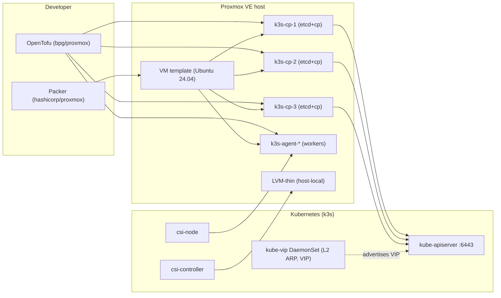

# Research: k3s-on-Proxmox with OpenTofu, Packer, kube-vip and Proxmox CSI

## Research Session 1 -- 2026-07-04

**Topic**: Build a production-shaped HA Kubernetes (k3s) cluster on a single Proxmox host using OpenTofu for VMs, Packer for image baking, kube-vip for control-plane HA and Service LoadBalancer, and the sergelogvinov Proxmox CSI Plugin for persistent storage.

**Type**: `integration` (with `best-practices` flavor)

**Objective**: `implementation-details` -- produce a working end-to-end blueprint the developer can lift into the spec/plan tasks.

### Starting Context

- The CSI plugin is already vendored at `vendored/proxmox-csi-plugin` (chart `0.5.9`, appVersion `v0.19.1`, released 2026-06-25). Its `docs/install.md` contains a literal bpg/proxmox OpenTofu snippet for the role/user/token/ACL.
- A reference implementation exists at `vendored/Proxmox-Kubernetes-Engine` (PKE) -- the same author wired together k3s + kube-vip + Proxmox CSI + Cilium via Cluster API. Useful as architectural inspiration.
- **Constraint (k3s HA):** multi-server k3s must use embedded etcd or an external datastore; SQLite is single-node only. First server needs `--cluster-init --tls-san=<VIP>`. Additional servers need `--server` + matching `--tls-san`.
- **Constraint (kube-vip on k3s):** kube-vip is a DaemonSet dropped into `/var/lib/rancher/k3s/server/manifests/`. The cluster-wide `--tls-san` must equal the kube-vip VIP. Use `--disable servicelb` only if you also install the kube-vip cloud-controller.
- **Constraint (CSI plugin):** VMs must use `VirtIO SCSI single`; nodes must carry `topology.kubernetes.io/region=<cluster-name>` and `topology.kubernetes.io/zone=<pve-node-name>`.

### Findings

This is an integration concern spanning four subsystems. The recommended wiring -- the same shape PKE uses -- is summarized in C4 Level-2 form below.

#### 1. Packer (`hashicorp/proxmox` v1.2.3) -- image pipeline

```
+-----------------------------+        +--------------------------+
|  packer build (local/CI)    |  --->  |  Proxmox template VMID   |
+-----------------------------+        |  (Ubuntu 24.04, cloud-  |
       |                              |   init, qemu-guest-agent, |
       | proxmox-iso builder          |   no k3s, no SSH key)     |
       v                              |                          |
Ubuntu ISO --apt--> openssh, qemu-guest-agent, kernel modules
              --run--> disable swap, write /etc/modules-load.d/
              --poweroff--> convert to template
```

Decisions:
- Use `proxmox-iso` (not `proxmox-clone`) for the first template so the base OS is reproducible from a known ISO.
- Bake only the static bits (cloud-init, qemu-guest-agent, tuned sysctl, kernel modules). Do **not** bake `k3s` or join tokens -- those are per-node and come from cloud-init user-data at VM provision time.
- `cloud-init` is the bridge between OpenTofu and k3s: OpenTofu injects a per-VM cloud-config (k3s server/agent flags + `curl | sh` install), VM runs it on first boot, then becomes a cluster member.
- Alternative used by PKE itself: `kubernetes-sigs/image-builder` (Packer + Ansible, pre-baked). Recommended when the team already runs Ansible; otherwise vanilla Packer + a shell provisioner is sufficient.

#### 2. OpenTofu (`bpg/proxmox` v0.111.1) -- VMs, network, secrets, RBAC

The CSI plugin docs already give us the exact OpenTofu resource set for the Proxmox RBAC side:

```hcl
provider "proxmox" {
  endpoint   = var.pve_endpoint      # https://pve.example:8006/
  api_token  = var.pve_api_token     # terraform@pve!tf=<uuid>
  insecure   = false
  ssh { agent = true username = "terraform" }
}

resource "proxmox_virtual_environment_role" "csi" {
  role_id    = "Kubernetes-CSI"
  privileges = [
    "VM.Audit", "VM.Config.Disk",
    "Datastore.Allocate", "Datastore.AllocateSpace", "Datastore.Audit",
  ]
}

resource "proxmox_virtual_environment_user" "csi" {
  user_id = "kubernetes-csi@pve"
  acl { path = "/" propagate = true role_id = proxmox_virtual_environment_role.csi.role_id }
}

resource "proxmox_virtual_environment_user_token" "csi" {
  user_id    = proxmox_virtual_environment_user.csi.user_id
  token_name = "csi"
}

resource "proxmox_virtual_environment_vm" "control_plane" {
  for_each  = var.control_plane_nodes
  name      = "k3s-cp-${each.key}"
  node_name = var.pve_node
  clone { vm_id = var.template_vmid full = true }
  cpu    { cores = each.value.cpus }
  memory { dedicated = each.value.memory }
  initialization {
    user_data_file_id = proxmox_virtual_environment_file.cloud_init_cp[each.key].id
  }
}
```

OpenTofu also owns:
- A `proxmox_virtual_environment_file` per node (`/var/lib/rancher/k3s/server/manifests/kube-vip.yaml`, k3s install + config, optional RBAC).
- A `tls_private_key` and `local_file` for the SSH key the runner uses post-bootstrap to verify cluster state.
- A `helm_release` of `vendored/proxmox-csi-plugin/charts/proxmox-csi-plugin` (or a Kubernetes provider apply of the static manifest).

#### 3. k3s HA + kube-vip

```
                    +-----------------------------+
   --tls-san=VIP -> |  kube-vip DaemonSet (L2 ARP)| <- VIP e.g. 10.0.0.40
                    +-----------------------------+
                                  |
                +-----------------+-----------------+-----------------+
                |                 |                 |                 |
            server1           server2           server3          agent1+
            (etcd+mgr)        (etcd+mgr)        (etcd+mgr)       (worker)
                \                --server          --server         /
                 ---- shared /var/lib/rancher/k3s/server/manifests/
                                 kube-vip-rbac.yaml + kube-vip.yaml
```

First control plane:

```bash
# Drop kube-vip DaemonSet manifest into the auto-deploy dir
ctr image pull ghcr.io/kube-vip/kube-vip:$KVVERSION
ctr run --rm --net-host ghcr.io/kube-vip/kube-vip:$KVVERSION vip \
  /kube-vip manifest daemonset \
    --interface $IFACE \
    --address $VIP \
    --controlplane --services --arp --leaderElection \
  > /var/lib/rancher/k3s/server/manifests/kube-vip.yaml
curl https://kube-vip.io/manifests/rbac.yaml \
  > /var/lib/rancher/k3s/server/manifests/kube-vip-rbac.yaml

curl -sfL https://get.k3s.io | K3S_TOKEN=SECRET sh -s - server \
    --cluster-init --tls-san=$VIP --write-kubeconfig-mode=644
```

Subsequent control planes:

```bash
curl -sfL https://get.k3s.io | K3S_TOKEN=SECRET sh -s - server \
    --server https://$VIP:6443 --tls-san=$VIP
```

Agent nodes:

```bash
curl -sfL https://get.k3s.io | K3S_TOKEN=SECRET sh -s - agent \
    --server https://$VIP:6443
```

After the API is reachable, switch the kubeconfig server URL to the VIP (k3s writes the first server's IP by default).

#### 4. Proxmox CSI Plugin (Helm install, post-cluster-up)

```bash
kubectl create ns csi-proxmox
kubectl label ns csi-proxmox pod-security.kubernetes.io/enforce=privileged

kubectl -n csi-proxmox create secret generic proxmox-csi-plugin --from-file=config.yaml
# config.yaml has clusters[].url, .token_id, .token_secret, .region
helm upgrade --install proxmox-csi-plugin \
  vendored/proxmox-csi-plugin/charts/proxmox-csi-plugin \
  -n csi-proxmox -f values.yaml
```

Storage class example:

```yaml
apiVersion: storage.k8s.io/v1
kind: StorageClass
metadata:
  name: proxmox-lvm-thin
provisioner: csi.proxmox.sinextra.dev
volumeBindingMode: WaitForFirstConsumer
parameters:
  region: Region1
  zone: pve-1
  storage: lvm-thin
  fsType: ext4
  reclaimPolicy: delete
allowVolumeExpansion: true
```

### Architecture Overview



### Configuration Steps (ordered)

1. **One-time on the PVE host**
   ```bash
   pveum user add terraform@pve
   pveum role add Terraform -privs "VM.Audit VM.PowerMgmt VM.Allocate VM.Clone VM.Config.Disk VM.Config.Network VM.Config.Cloudinit VM.GuestAgent.Audit Datastore.Allocate Datastore.AllocateSpace SDN.Use Pool.Allocate"
   pveum aclmod / -user terraform@pve -role Terraform
   pveum user token add terraform@pve provider --privsep=0
   ```

2. **Packer builds the template** -- VMID `9000` marked as template; qemu-guest-agent installed; cloud-init-ready.

3. **OpenTofu init + apply**
   ```bash
   tofu init
   tofu plan -var-file=env/dev.tfvars
   tofu apply -var-file=env/dev.tfvars
   ```
   Creates the CSI role/user/token, the per-node cloud-init snippets, the VMs cloned from the template, and the post-cluster kubeconfig fetch.

4. **First control plane boots and k3s self-installs** with `--cluster-init --tls-san=$VIP`; cloud-init also drops `kube-vip.yaml` + `kube-vip-rbac.yaml` into the auto-deploy manifests dir so the DaemonSet self-deploys.

5. **Other control planes join** once the kubeconfig is reachable. OpenTofu triggers this via a null_resource + SSH.

6. **Agent nodes join** via the agent cloud-init snippet.

7. **OpenTofu switches kubeconfig to the VIP** and applies the CSI Helm release.

8. **Apply node topology labels** (or run the Proxmox Cloud Controller Manager so labels are automatic):
   ```bash
   kubectl label nodes -l node-role.kubernetes.io/control-plane= \
     topology.kubernetes.io/region=Region1 topology.kubernetes.io/zone=pve-1
   ```

9. **Smoke test PVC** with `vendored/proxmox-csi-plugin/docs/deploy/test-pod-ephemeral.yaml`.

### Error Handling at Boundaries

| Boundary | Failure mode | Detection | Mitigation |
|----------|--------------|-----------|------------|
| Packer -> Proxmox | ISO upload fails / token rejected | packer log + non-zero exit | Use API token; bake the storage pool to `local-lvm` |
| OpenTofu -> Proxmox | API token invalid, `pvesm` permission denied | `tofu apply` error | Validate token scope via `pvesh get /access/users` |
| k3s install -> `get.k3s.io` unreachable | Network/DNS to GitHub blocked | journalctl `k3s.service` | Pre-stage the k3s binary in cloud-init or via a local HTTP mirror |
| kube-vip -> VIP not announced | ARP not seen on the VLAN | `kubectl logs -n kube-system -l name=kube-vip` | Verify `--interface` matches the actual NIC name; ARP works on the default Proxmox bridge |
| k3s `--tls-san` mismatch | `x509: certificate is valid for <internal-ip>, not <VIP>` | kubectl error | Re-init cluster or rotate certs per `docs.k3s.io` certificate rotation guide |
| CSI PV creation | `Permission check failed (user != root@pam)` | CSI controller logs | Some Proxmox API ops are root-only; either use `root@pam` token or grant elevated role |
| PVC stuck Pending | zone has no Proxmox node | `kubectl describe pvc` | Match `topology.kubernetes.io/zone` on nodes |

### Best-Practices / Anti-patterns

**Do**
- Pin component versions: bpg/proxmox `~> 0.111`, hashicorp/proxmox `~> 1.2`, kube-vip `v0.7+` (latest `v1.2.1`), k3s `v1.34.x`, CSI chart `0.5.9`/app `v0.19.1`.
- Use Proxmox API tokens (`terraform@pve!provider=<uuid>`); never commit tokens to git.
- Drop kube-vip + RBAC into `/var/lib/rancher/k3s/server/manifests/` for auto-deploy; don't hand-apply after cluster creation.
- Make `--tls-san` an immutable `local.kube_vip_vip` and pass on every k3s install.
- Use `--disable servicelb` only if you intend to install the kube-vip cloud-controller.

**Don't**
- Don't bake a join token into the Packer image.
- Don't run the CSI controller on a worker without taints/tolerations; use the chart's `control-plane` nodeSelector.
- Don't mix `--cluster-init` with an existing datastore.
- Don't put the Proxmox API token in plain `.tfvars`; pass via `TF_VAR_pve_api_token`.

### Recommendation

Adopt the full PKE-style pipeline:

1. **Packer** builds an Ubuntu 24.04 template (cloud-init + qemu-guest-agent + tuned kernel modules for ip_vs).
2. **OpenTofu** (bpg/proxmox) declares the Proxmox RBAC, the VMs cloned from the template, and a Helm release of the vendored CSI chart.
3. **k3s** is installed by cloud-init per VM with `--cluster-init --tls-san=<VIP>` on the first server.
4. **kube-vip** auto-deploys as a DaemonSet and advertises the VIP via ARP.
5. **Proxmox CSI Plugin** (Helm chart `vendored/proxmox-csi-plugin/charts/proxmox-csi-plugin`) connects with the OpenTofu-provisioned API token, exposing local storage as StorageClass.

### Impact on Feature

- The follow-up `spec.md` should declare cluster topology (node count, CIDRs, image version, k3s version, kube-vip mode) as variables, not literals.
- The `plan.md` should be decomposed into: packer module, OpenTofu VM + cloud-init module, k3s bootstrap, kube-vip post-deploy, CSI Helm chart, smoke test.
- A separate work package should cover CI smoke tests (kubectl get nodes / get pvc pass against a fresh cluster), matching the CSI plugin's own `e2e-tests.md` pattern.
