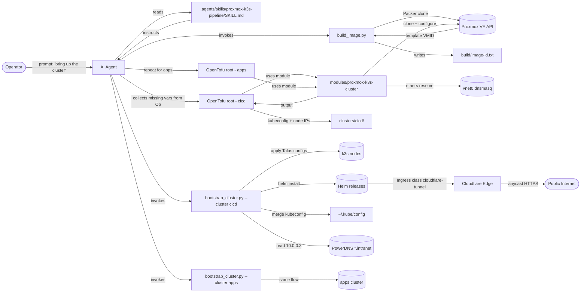
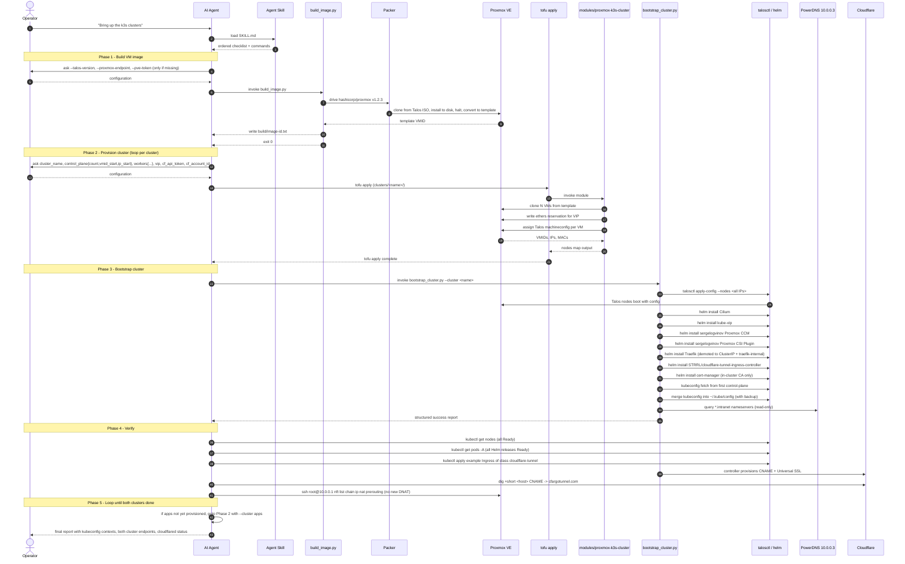

# Feature Specification: Proxmox k3s Cluster Module + Image Builder + Bootstrapper

**Feature Branch**: `001-build-a-kubernetes-k3s-cluster-on-proxmo`
**Created**: 2026-07-05
**Status**: Draft
**Source research**: [`research.md`](research.md), 5 sessions + Final Recommendation

---

## Context *(mandatory)*

### System Interactions

The system operates inside a single Proxmox VE 9.2.3 host named BigBertha (10.0.0.1, kernel 7.0.6-2-pve) and produces **two fully usable Kubernetes clusters** plus a reusable artifact pipeline. The pipeline has three deliverables:

1. **`modules/proxmox-k3s-cluster`** -- an OpenTofu module that, given inputs, creates a 3-control-plane + N-worker k3s cluster (Talos Linux OS, k3s embedded etcd, kube-vip ARP VIP, Cilium CNI, Proxmox CCM + CSI) inside vnet0.
2. **`tools/build_image.py`** -- a Python CLI that drives Packer (hashicorp/proxmox v1.2.3) to bake a Talos golden image into a Proxmox template VM, and writes the resulting template ID to `build/image-id.txt` for the tofu module to consume.
3. **`tools/bootstrap_cluster.py`** -- a Python CLI that, after the module creates the VMs, SSHes into them (Talos `talosctl`-or-SSH) and installs every session-locked Helm release (Cilium, kube-vip, sergelogvinov Proxmox CCM + CSI, Traefik demoted to internal, STRRL/cloudflare-tunnel-ingress-controller). It also fetches the kubeconfig and merges it into `~/.kube/config`.

Two instances of the cluster module are instantiated:

- `cicd` -- runs GitLab (CE) and any GitLab Runner hooks. This cluster is the focus of spec 001.
- `apps` -- target for GitLab CI/CD pipeline deployments from the cicd cluster. The cluster module provisions the apps cluster too, but workloads, GitOps controllers, and DNS record creation are **explicitly out of scope** for this spec.

External systems the cluster interacts with:

- **Proxmox VE API** (10.0.0.1:8006) -- VM lifecycle, role/user/token ACL.
- **vnet0 SDN simple zone** -- bridge + dnsmasq DHCP (range .50-.200) for nodes.
- **PowerDNS at 10.0.0.3** -- authoritative for `*.intranet`. **Reads** (resolving `*.intranet` hostnames from inside the cluster and from operator workstations) are **in scope**: the cluster and scripts shall use 10.0.0.3 as their primary nameserver for `*.intranet`. **Writes** (creating new A/CNAME records in the `intranet` zone that point at the cluster VIP, node IPs, or service hostnames) remain **out of scope** for spec 001 -- a downstream DNS spec will own that.
- **Cloudflare** -- the controller provisions DNS CNAMEs and Universal SSL via API token; this is the only public ingress path and is the central constraint of spec 001.
- **Packer build host** (the workstation running tofu/tofu apply, plus a build VM in PVE that Packer boots from ISO and converts to a template).
- **A human operator** who runs the three deliverables in order: build image, then `tofu apply` the cicd cluster, then `bootstrap_cluster.py` on it, then repeat for apps.
- **An AI agent** that consumes an Agent Skill at `.agents/skills/proxmox-k3s-pipeline/SKILL.md`. The skill teaches the agent the entire pipeline (build image, prompt the operator for missing configuration, run `tofu apply`, run `bootstrap_cluster.py`, verify, document) and is the canonical interface for invoking the deliverable. The operator talks to the agent; the agent invokes the scripts and the tofu module. The skill is what makes the deliverables reusable beyond this spec.

### Context Diagram

### Pipeline Sequence

The end-to-end pipeline that the Agent Skill teaches an agent to drive. The agent performs steps 1-5 in order; the operator is prompted only for missing configuration.

### Use Cases

- **UC1**: Operator + runs `tools/build_image.py --talos-version v1.10.0` + a Talos VM template (VMID 900) exists in PVE, and `build/image-id.txt` contains the template ID.
- **UC2**: Operator + runs `tofu -chdir=clusters/cicd apply` + one k3s control-plane VM and N worker VMs (default `N=1`, so 2 VMs total) exist on BigBertha, configured with Talos but **not yet running k3s**, and a kube-vip ARP VIP is reserved at 10.0.0.30. The cluster shape is intentionally minimal to save resources; workers are added later by bumping `worker_count` and re-running `tofu apply` (see US9). No HA on the control plane -- the whole cluster runs on a single BigBertha host, so a host failure kills the cluster regardless of VM count.
- **UC3**: Operator + runs `tools/bootstrap_cluster.py --cluster cicd` + k3s is running on all nodes, `kubectl get nodes` returns all nodes Ready, all six Helm releases (Cilium, kube-vip, Proxmox CCM, Proxmox CSI, demoted Traefik, Cloudflare Tunnel Controller) report Ready, and `~/.kube/config` now points at `https://10.0.0.30:6443`.
- **UC4**: App developer + writes `Ingress` with `ingressClassName: cloudflare-tunnel` + the controller creates a CNAME in Cloudflare, Universal SSL is provisioned, and `https://app.example.com/` resolves to the Pod without any host-side port change.
- **UC5**: Operator + repeats UC1-UC3 with `--cluster apps` + a second cluster exists (default shape: 1 control-plane + 1 worker), its VIP is `10.0.0.40`, its kubeconfig context switches by `kubectl config use-context apps`, and **no workloads, Argo CD, GitLab Runner registration, or PowerDNS record creation happens** -- those belong to a downstream spec.
- **UC6**: Operator + invokes the documented fallback path (`cf_publish_traefik_publicly=true` + one nft DNAT rule) + public HTTPS works **without Cloudflare** for the cluster, used only when Cloudflare is unreachable.
- **UC7**: Apps-cluster workload + resolves `gitlab.cicd-system.svc.cluster.local` + the request reaches the cicd-cluster gitlab Pod via ExternalName -> PowerDNS `gitlab.intranet` -> 10.0.0.30 -> kube-vip ARP -> cicd Cilium. Zero new controllers, zero host open ports, works the same for `registry`, `minio`, and any other cicd-hosted service the downstream GitLab spec exposes.

---

## Misfits *(mandatory)*

- **Misfit A** (Concurrency / State): Packer and `tofu apply` race against the same Proxmox API. Two operators running `build_image.py` simultaneously produce conflicting templates, or `tofu apply` clones from a template that is still being finalised.
- **Misfit B** (Security / Network exposure): The cluster module or bootstrap script accidentally opens an inbound TCP port on vmbr0 (e.g. by exposing Traefik as `LoadBalancer` instead of `ClusterIP`, or by adding a DNAT chain on the host). This violates the "no host open ports" invariant of spec 001.
- **Misfit C** (Data Integrity / Configuration drift): A second instantiation of the cluster module (apps cluster) uses the same VIP, the same VMIDs, the same node IPs, or the same Talos machine cert -- producing two clusters that race for the same control-plane endpoint.
- **Misfit D** (Observability / Silent failure): The cloudflared controller or the bootstrap script fails to apply a Helm release and silently leaves the cluster partially configured (e.g. CSI installed but CCM missing). The cluster looks "up" but PVCs do not bind.
- **Misfit E** (Configuration / DHCP collision): A Talos VM gets a DHCP lease that overlaps the kube-vip VIP (10.0.0.30) or another pre-allocated IP because the module forgot to call the dnsmasq host-reservation API or write the ethers entry before the VM boots.
- **Misfit F** (Reversibility / Vendor lock-in): After Cloudflare Tunnel is the only public ingress, an outage of Cloudflare renders the cluster publicly unreachable. There is no operator-runnable fallback path documented or tested.
- **Misfit G** (Security / Token exposure): The Cloudflare API token, Proxmox token secret, or SSH key material is written into tofu state, printed in apply output, or committed to git.
- **Misfit H** (Compatibility / Talos+k3s mismatch): The Packer image bakes a Talos version that does not have a k3s 1.34.x compatible shim, or the Cilium Helm chart version requires a kernel feature not present in PVE 9.2.3 / kernel 7.0.6-2-pve.

### Misfit Interaction Notes

- **A <-> D**: Race conditions in Packer/state (A) and silent partial bootstrap (D) compound because the operator cannot tell whether a failure was "image not ready" or "Helm install timed out". Both must surface structured error logs that name the failing step.
- **B <-> F**: Misfit B (no host open ports) is the design intent; Misfit F (Cloudflare outage) is the failure mode that breaks it. The fallback path is therefore the *only* sanctioned way to break Misfit B and must be gated on an explicit operator variable flip and an `nft` action.
- **C <-> E**: Both misfits are "two clusters overlap" problems. Mitigation must parameterise VIP, VMID range, IP range, and Talos machine cert prefix as **required inputs** that the module rejects if duplicated.
- **G <-> D**: If secrets leak (G) the operator may not notice until much later (D); secrets must be sourced from env/secret-store at runtime, never stored in `terraform.tfstate` plaintext.
- **H is independent** but blocks both A and D: a bad image silently fails every subsequent step.

---

## User Scenarios & Testing *(mandatory)*

### User Story 1 - Bake the Talos golden image (Priority: P1)

**As a** platform operator
**I want** to run `tools/build_image.py` once and get a usable Proxmox template ID
**So that** the cluster module can clone N VMs from a known-good image without Packer re-running on every apply.

**Why this priority**: P1 because the cluster module cannot work without a template to clone from. Blocks every downstream story.

**Independent Test**: Run `tools/build_image.py --talos-version v1.10.0` on a clean state. Verify `qm list` shows a template VM (VMID 900), `build/image-id.txt` contains `900`, and the template boots to Talos maintenance mode (`talosctl -n 10.0.0.201 version` returns a Talos build). Re-running the script with no flag changes is a no-op (idempotent).

**Acceptance Scenarios**:

1. **Given** the PVE API is reachable and `build/image-id.txt` does not exist, **When** the operator runs `build_image.py`, **Then** a template VMID 900 is created within 10 minutes, `build/image-id.txt` is written, and the process exits 0.
2. **Given** `build_image.py` has been run successfully, **When** the operator runs `build_image.py` again with the same `--talos-version`, **Then** the script detects the existing template, skips Packer, exits 0 in under 30 seconds, and prints "already up to date".
3. **Given** the PVE API is unreachable, **When** the operator runs `build_image.py`, **Then** the script exits non-zero with a structured error (`{"step":"pve_connect","error":"...","trace_id":"..."}`) within 5 seconds and writes nothing to `build/image-id.txt`.

---

### User Story 2 - Provision the cicd cluster, minimal shape (Priority: P1)

**As a** platform operator
**I want** to run `tofu -chdir=clusters/cicd apply` and get one control-plane VM and N workers (default 1) on BigBertha
**So that** the cluster boots with the smallest possible resource footprint, and I can add workers later by bumping `worker_count` and re-running `tofu apply` (US9).

**Why this priority**: P1 because the cluster cannot bootstrap without VMs existing. Depends on US1.

**Independent Test**: After `tofu apply`, run `qm list | grep -E '200|201'` and confirm two VMs exist (one server, one worker). Run `qm config 200 | grep ipconfig0` and confirm each VM has its assigned static IP. Run `qm config 200 | grep -- --cicd` and confirm the Talos machineconfig hostname is set. The cluster is **not yet running k3s** at this point -- that is US3's job. With `worker_count = 3`, three worker VMs exist after `tofu apply`.

**Acceptance Scenarios**:

1. **Given** `build/image-id.txt` exists and the cicd cluster config sets `control_plane = { count = 1, vmid_start = 200, ip_start = "10.0.0.201" }` and `workers = { count = 1, vmid_start = 201, ip_start = "10.0.0.202" }`, **When** the operator runs `tofu apply`, **Then** two VMs exist on BigBertha, the VIP 10.0.0.30 is reserved in dnsmasq ethers, the module outputs a `nodes` map with SSH-ready IPs, and `tofu apply` exits 0.
2. **Given** the cicd cluster is already running with 1 worker, **When** the operator edits `worker_count = 3` and runs `tofu apply`, **Then** two additional worker VMs are provisioned at the next free VMIDs (e.g. 202, 203) and IPs (e.g. 10.0.0.203, 10.0.0.204), each joined to the cluster via `k3s agent`, and `kubectl get nodes` shows three workers Ready within 5 minutes.
3. **Given** the operator runs `tofu apply` twice with no changes, **When** the second run starts, **Then** it detects no drift and reports "No changes" in under 30 seconds.
4. **Given** the operator provides a `vip` that is already reserved by another cluster (overlap with Misfit C), **When** the module plans the apply, **Then** tofu fails the plan with `Error: vip 10.0.0.30 already reserved by cluster "apps"` and writes no state.
5. **Given** the operator tries `control_plane.count = 2`, **When** the module plans the apply, **Then** tofu fails the plan with `Error: control_plane.count must be 1 or 3 (2-node etcd is invalid); this spec is single-host, single-control-plane by design` and writes no state.

---

### User Story 3 - Bootstrap k3s + locked Helm releases on the cicd cluster (Priority: P1)

**As a** platform operator
**I want** to run `tools/bootstrap_cluster.py --cluster cicd` and have k3s running with all six Helm releases Ready
**So that** I can `kubectl get nodes` against the cluster and provision GitLab.

**Why this priority**: P1 because it is the moment the cluster becomes usable. Depends on US1 + US2.

**Independent Test**: After bootstrap, `kubectl --context cicd get nodes` returns two Ready nodes (1 control-plane + 1 worker by default). `helm list -A` shows all six releases with status `deployed`. A `kubectl apply` of a 1-replica Deployment with a PVC succeeds end-to-end (PVC binds, Pod schedules, Pod becomes Ready). `~/.kube/config` contains a context named `cicd` pointing at `https://10.0.0.30:6443`.

**Acceptance Scenarios**:

1. **Given** US2 has succeeded and the Talos configs are written to `clusters/cicd/talos/`, **When** the operator runs `bootstrap_cluster.py --cluster cicd`, **Then** within 15 minutes: k3s is running on both nodes (1 control-plane + 1 worker by default), Cilium pod networking passes a `kubectl exec` reachability test between two Pods on different nodes, the kube-vip VIP is reachable from outside the cluster (`nc -zv 10.0.0.30 6443`), all six Helm releases are `deployed`, and the kubeconfig is merged.
2. **Given** Cilium install fails (Helm error), **When** the bootstrap script catches the error, **Then** the script aborts immediately, prints `{"step":"helm_install","release":"cilium","error":"..."}`, leaves the partial state for debugging, and exits non-zero.
3. **Given** the bootstrap succeeds, **When** the operator runs `bootstrap_cluster.py --cluster cicd` again, **Then** the script detects every release as already installed and exits 0 in under 60 seconds with "all releases up to date".

---

### User Story 4 - Public HTTPS via Cloudflare Tunnel with zero host open ports (Priority: P1)

**As an** application developer
**I want** to write a normal `Ingress` with `ingressClassName: cloudflare-tunnel` and have it serve HTTPS
**So that** I never need to file a ticket asking for a host port to be opened.

**Why this priority**: P1 because this is the central architectural promise of spec 001.

**Independent Test**: After bootstrap, run `kubectl apply -f examples/whoami-cloudflare.yaml` (a 1-Pod Deployment + Ingress of class `cloudflare-tunnel` pointing at `whoami.example.com`). Within 60 seconds, `dig +short whoami.example.com CNAME` returns `*.cfargotunnel.com`. `curl -v https://whoami.example.com/` returns 200 with the whoami response body.

**Acceptance Scenarios**:

1. **Given** the Cloudflare controller is `Ready`, **When** an Ingress of class `cloudflare-tunnel` is applied, **Then** within 60 seconds Cloudflare shows a CNAME for the host, Universal SSL is provisioned (no `NET::ERR_CERT_AUTHORITY_INVALID`), and the Pod receives the request.
2. **Given** the operator inspects the PVE firewall after a successful bootstrap, **When** they run `ssh root@10.0.0.1 -p 6022 'nft list chain ip nat prerouting'`, **Then** the only DNAT rules present are the pre-existing 22/6023-6027 SSH forwards; **no** new DNAT for ports 80/443 has been added by the module or bootstrap.
3. **Given** Cloudflare is unreachable for 5 minutes, **When** an app developer tries to reach `https://app.example.com/`, **Then** the request fails (expected), but in-cluster `https://my-app.traefik-internal.svc.cluster.local/` continues to work.

---

### User Story 5 - Provision a second cluster (apps) with no overlap (Priority: P2)

**As a** platform operator
**I want** to instantiate the cluster module a second time for the apps cluster
**So that** the cicd cluster has somewhere to deploy to via its pipelines.

**Why this priority**: P2 because it is required for end-to-end usefulness but is not on the critical path for the cicd cluster itself.

**Independent Test**: After `tofu apply` for apps, run `qm list | grep -E '210|211'` and confirm two VMs exist (VMIDs 210-211, distinct from cicd's 200-201). Run `dig +short apps-kubeapi.intranet` and confirm it returns `10.0.0.40` (the apps VIP, distinct from cicd's 10.0.0.30). Run `kubectl config use-context apps` and confirm `kubectl get nodes` returns two Ready nodes (1 control-plane + 1 worker).

**Acceptance Scenarios**:

1. **Given** the apps cluster config sets `vip = "10.0.0.40"`, `vmid_start = 210`, `ip_start = "10.0.0.211"`, **When** the operator runs `tofu apply` for apps, **Then** two VMs exist on BigBertha at distinct VMIDs and IPs from the cicd cluster, the VIP 10.0.0.40 is reserved in dnsmasq, and `~/.kube/config` gains a new `apps` context.
2. **Given** both clusters are running, **When** the operator inspects the Proxmox host, **Then** there are exactly four Talos VMs by default (two per cluster), two distinct VIPs reserved, and zero overlap in ethers entries or VMIDs.
3. **Given** the apps cluster exists, **When** the operator tries to install workloads via the bootstrap script (out of scope), **Then** the bootstrap script exits non-zero with `Error: --install-workloads is not supported in this version; see downstream spec` -- the apps cluster is left as infra-only.

---

### User Story 6 - Documented fallback when Cloudflare is down (Priority: P3)

**As a** platform operator
**I want** a single documented procedure to restore public HTTPS without Cloudflare
**So that** a Cloudflare outage does not become a multi-hour outage.

**Why this priority**: P3 because it is a fallback, not the happy path. But it must exist and be tested.

**Independent Test**: With Cloudflare reachable, follow the fallback runbook (`docs/runbooks/cloudflare-fallback.md`). Verify the procedure: (a) flips `cf_publish_traefik_publicly=true`, (b) re-renders Traefik HelmChartConfig to expose hostPorts, (c) adds two nft DNAT rules for TCP 80/443 to 10.0.0.30, (d) updates Cloudflare DNS to an A record pointing at 151.80.34.63, (e) cert-manager solves an ACME challenge. Verify that `https://app.example.com/` continues to serve and that the rollback (reverse all four steps) restores the cloudflare-tunnel path.

**Acceptance Scenarios**:

1. **Given** the cluster is healthy, **When** the operator follows the fallback runbook, **Then** public HTTPS works through the Traefik path, `curl -vI https://app.example.com/` returns 200, and the cert is issued by Let's Encrypt (not Cloudflare Universal SSL).
2. **Given** the fallback is active, **When** the operator runs the rollback steps, **Then** within 10 minutes the cloudflare-tunnel path is restored, the nft DNAT rules are removed, and `nft list chain ip nat prerouting` shows the original state.

---

### User Story 7 - Drive the whole pipeline through an Agent Skill (Priority: P1)

**As a** platform operator
**I want** to type a single prompt to an AI agent ("bring up both clusters") and have it walk me through the entire pipeline
**So that** the deliverables (image builder, tofu module, bootstrap script) are reusable by any agent that loads the skill, and the operator does not have to remember command sequences.

**Why this priority**: P1 because the skill is the canonical interface for the deliverables. Without it, the three pieces are isolated scripts that an operator has to chain manually; with it, the operator talks to the agent, and the agent owns the orchestration.

**Independent Test**: In a clean room, an agent loads `.agents/skills/proxmox-k3s-pipeline/SKILL.md` and follows it to (a) build the Talos image, (b) prompt the operator for missing cluster configuration, (c) run `tofu apply` for both clusters, (d) run `bootstrap_cluster.py` for both clusters, (e) verify the success criteria. The agent never invents a step that is not in the skill, never skips a step, and never asks the operator a question the skill has already covered.

**Acceptance Scenarios**:

1. **Given** the agent has loaded the skill, **When** the operator types "bring up both clusters", **Then** the agent executes the five phases in the Pipeline Sequence diagram in order, prompts the operator only for configuration the skill lists as operator-supplied, and emits a final structured report listing both clusters' kubeconfig contexts, VIPs, and verification results.
2. **Given** the operator has not provided a `--pve-token` or `--cf-api-token`, **When** the skill reaches Phase 1 / Phase 2, **Then** the agent prompts the operator with `Please provide PVE_TOKEN (input will not be echoed):` and reads the value from stdin or an env var, never from a committed file.
3. **Given** the skill is loaded but the operator types "just build the image", **Then** the agent stops after Phase 1, prints the resulting template VMID, and does **not** proceed to Phase 2 without an explicit operator confirmation.
4. **Given** the skill is loaded and any step fails, **When** the failure surfaces, **Then** the agent emits a structured error referencing the failing phase number, the failing step name, and a one-line resolution hint, and does **not** retry the failure automatically (operator decides).

---

### User Story 8 - Cross-cluster Service consumption via ExternalName (Priority: P2)

**As an** apps-cluster workload (e.g. a CI/CD pipeline running on the apps cluster that needs gitlab.intranet)
**I want** to resolve cicd-cluster service hostnames as if they were local Services in the apps cluster
**So that** the apps cluster can pull git, push to the registry, and download artifacts from the cicd cluster without flattening the cluster boundary or adding new controllers.

**Why this priority**: P2 because it is needed before the apps cluster is useful (apps Pods that need cicd services), but does not block the cicd cluster itself from being up and usable in-cluster.

**Independent Test**: From the apps cluster, after WP08 has applied the ExternalName Services, run `kubectl --context apps exec -n some-workload some-pod -- curl -sf http://gitlab.cicd-system.svc.cluster.local/-/health` and confirm a 200 from gitlab. Run `kubectl --context apps exec -n some-workload some-pod -- nslookup gitlab.intranet 10.0.0.3` and confirm it returns the cicd VIP (10.0.0.30). Run `kubectl --context apps get svc -n cicd-system` and confirm three ExternalName Services exist (`gitlab`, `registry`, `minio`).

**Acceptance Scenarios**:

1. **Given** both clusters are bootstrapped, **When** WP08 applies the ExternalName Services in the apps cluster (`gitlab`, `registry`, `minio` in namespace `cicd-system`), **Then** `kubectl --context apps get svc -n cicd-system` shows three ExternalName Services pointing at `*.intranet` hostnames, and an apps Pod can reach `http://gitlab.cicd-system.svc.cluster.local` end-to-end.
2. **Given** the apps cluster's CoreDNS has 10.0.0.3 in its upstream nameservers, **When** an apps Pod queries `gitlab.intranet`, **Then** resolution flows apps-CoreDNS -> PowerDNS 10.0.0.3 -> A 10.0.0.30, and the apps Pod receives that A record.
3. **Given** an apps Pod makes an HTTPS request to `https://gitlab.cicd-system.svc.cluster.local`, **When** the packet arrives at the cicd cluster, **Then** kube-vip ARP responds on vnet0 and the cicd Cilium routes the packet to the gitlab Pod; total latency from apps Pod to cicd Pod is under 5 ms (single-bridge L2 hop).
4. **Given** the operator wants to remove the dependency on cicd, **When** they run `kubectl --context apps delete namespace cicd-system`, **Then** the ExternalName Services are gone and apps workloads stop depending on cicd.
5. **Given** PowerDNS is down, **When** an apps Pod queries a `*.intranet` hostname, **Then** apps-CoreDNS falls back to its secondary upstream; if that also fails, the Pod errors with a DNS-resolution failure (not a silent hang).

---

### User Story 9 - Scale workers on demand (Priority: P2)

**As a** platform operator
**I want** to bump `worker_count` from 1 to N and run `tofu apply` to add workers without disrupting running workloads
**So that** resource use scales with workload demand, and a cluster starts at the smallest footprint and grows.

**Why this priority**: P2 because the minimal shape (1 control-plane + 1 worker) is usable for the first end-to-end test, but realistic workloads need more workers.

**Independent Test**: Start with `worker_count = 1` (the default). Apply a workload that schedules Pods. Bump `worker_count = 3`. Run `tofu apply`. Wait 5 minutes. Run `kubectl get nodes` and confirm 4 nodes total (1 control-plane + 3 workers). All previously-running Pods remain Ready throughout.

**Acceptance Scenarios**:

1. **Given** the cicd cluster is bootstrapped with 1 worker, **When** the operator sets `worker_count = 3` in `clusters/cicd/terraform.tfvars` and runs `tofu apply`, **Then** two additional worker VMs are cloned at the next free VMIDs and IPs, each gets `talosctl apply-config` + `k3s agent` joining the existing cluster, and `kubectl get nodes` reports all four nodes Ready within 5 minutes.
2. **Given** a workload has Pods scheduled on the existing worker, **When** the new workers come online, **Then** the existing Pods are **not** evicted or rescheduled; the new workers receive only newly-scheduled Pods.
3. **Given** the operator reduces `worker_count` from 3 back to 1, **When** they run `tofu apply`, **Then** the two surplus workers are cordoned, drained, and removed from PVE; surviving Pods are rescheduled onto the remaining worker before deletion completes.
4. **Given** `worker_count = 0`, **When** the operator runs `tofu apply`, **Then** only the control-plane VM exists; the cluster has no worker nodes and `kubectl get nodes` shows 1 Ready (control-plane) + 0 workers.

---

## Requirements *(mandatory)*

### Functional Requirements

- **FR-001** [WHEN]: WHEN the operator invokes `tools/build_image.py` with a `--talos-version` flag, the script shall drive Packer to clone a Talos VM from the official Talos ISO, convert it to a template, and write the resulting VMID to `build/image-id.txt` in the project root.
- **FR-002** [IF/THEN]: IF `build/image-id.txt` already contains a VMID for the requested `--talos-version`, THEN the script shall skip Packer, print "already up to date", and exit 0 in under 30 seconds.
- **FR-003** [IF/THEN]: IF the PVE API is unreachable at script start, THEN the script shall exit non-zero with a structured error JSON `{"step":"pve_connect","error":"<reason>","trace_id":"<uuid>"}` within 5 seconds and write nothing.
- **FR-004** [WHEN]: WHEN the operator runs `tofu apply` against a root module that calls `modules/proxmox-k3s-cluster`, the module shall clone one VM per control-plane node and one VM per worker node from the template at `var.image_id`, with VMIDs in the requested range starting at `var.vmid_start`.
- **FR-005** [UBIQUITOUS]: The module shall reserve the cluster VIP in the vnet0 dnsmasq ethers file before any VM in the cluster is started, so DHCP never hands out that IP.
- **FR-006** [IF/THEN]: IF the requested `var.vip` is already reserved by another cluster instance in PVE state, THEN `tofu plan` shall fail with `Error: vip <addr> already reserved by cluster "<name>"` and write no state.
- **FR-007** [IF/THEN]: IF the requested `var.vmid_start..vmid_start+total_nodes-1` overlaps any existing VMID in PVE, THEN `tofu plan` shall fail with `Error: vmid range overlap at <vmid>` and write no state.
- **FR-008** [WHEN]: WHEN `tools/bootstrap_cluster.py --cluster <name>` runs against a successfully applied cluster, the script shall apply the Talos machineconfig to each node via `talosctl apply-config`, then bootstrap k3s with `k3s server --cluster-init --tls-san=<vip>` on the first control-plane and `k3s server --server https://<vip>:6443` on the rest, and `k3s agent` on workers.
- **FR-009** [WHEN]: WHEN k3s is reachable on `https://<vip>:6443`, the bootstrap script shall install Helm releases in this exact order: Cilium (kube-proxy replacement, Gateway API enabled, IPAM `clusterPoolIPv4PodCIDRList` and `ipv4NativeRoutingCIDR` set from module variables), kube-vip (ARP mode, leader election, interface bound to vnet0), sergelogvinov Proxmox CCM, sergelogvinov Proxmox CSI Plugin (StorageClass `proxmox-lvm-thin`, region/zone from module variables), Traefik (demoted to `ClusterIP`, IngressClass `traefik-internal`), STRRL/cloudflare-tunnel-ingress-controller v0.0.23.
- **FR-010** [IF/THEN]: IF any Helm install in FR-009 fails, THEN the bootstrap script shall abort at that step, print a structured error JSON naming the failing release and the helm error, leave partial state for debugging, and exit non-zero.
- **FR-011** [WHEN]: WHEN all Helm releases are Ready, the bootstrap script shall fetch the kubeconfig from the first control-plane node and merge it into `~/.kube/config` under context name `<cluster>`.
- **FR-012** [WHEN]: WHEN the bootstrap script writes kubeconfig to `~/.kube/config`, the script shall back up the existing file to `~/.kube/config.bak.<unix-ts>` first.
- **FR-013** [UBIQUITOUS]: The cluster module and bootstrap script shall never add an inbound DNAT rule, an iptables ACCEPT, or any nft rule on the PVE host's `nft` table. The only host-side network side effect is the dnsmasq host reservation.
- **FR-014** [WHILE]: WHILE `var.cf_publish_traefik_publicly == false` (the default), Traefik's HelmChartConfig shall set `service.type=ClusterIP`, `ports.web.expose=false`, `ports.websecure.expose=false`, and `ingressClass.name=traefik-internal`.
- **FR-015** [WHEN]: WHEN an `Ingress` of class `cloudflare-tunnel` is applied to the cluster, the STRRL controller shall create a CNAME in Cloudflare pointing at the Tunnel, push an ingress rule into the Tunnel targeting the in-cluster Service, and Cloudflare Universal SSL shall provision a cert for the host.
- **FR-016** [WHERE]: WHERE the apps cluster config sets `vip = "10.0.0.40"` and `vmid_start = 210`, the module shall use those values for the apps cluster, distinct from the cicd cluster's 10.0.0.30 and 200, and reject any input that would overlap.
- **FR-017** [IF/THEN]: IF the operator passes `--install-workloads` to `bootstrap_cluster.py` for the apps cluster, THEN the script shall exit non-zero with `Error: --install-workloads is not supported in this version; see downstream spec` and write nothing to the apps cluster.
- **FR-018** [WHEN]: WHEN `tofu destroy` runs on a cluster root module, the module shall remove the cluster's VMs from PVE, remove the cluster's VIP reservation from the dnsmasq ethers file, and remove the cluster's context from `~/.kube/config`.
- **FR-019** [UBIQUITOUS]: All secrets (`pve_token_secret`, `cf_api_token`, Talos machine secrets, SSH keys) shall be read from environment variables or an external secret store and shall never appear in tofu state in plaintext, in apply output, or in any committed file.
- **FR-020** [WHEN]: WHEN the operator invokes `build_image.py` or `bootstrap_cluster.py`, the script shall emit hierarchical trace IDs (operation, session, step) to both console and a JSON log file at `~/.spec-bridge-skill-tool/<session_id>/audit.log`.
- **FR-021** [UBIQUITOUS]: The cluster module shall output a `nodes` map (keyed by role: `control_plane` and `workers`, each entry: `name`, `vmid`, `ip`, `mac`, `talos_hostname`) for the bootstrap script to consume.
- **FR-022** [WHERE]: WHERE two root modules both call `modules/proxmox-k3s-cluster`, each shall declare a unique `cluster_name`, and the module shall prefix all VM hostnames, Talos machine certs, and dnsmasq ethers labels with that `cluster_name`.
- **FR-023** [IF/THEN]: IF a Packer build fails partway (e.g. cloud-init timeout), THEN `build_image.py` shall delete the half-baked VM from PVE, exit non-zero with a structured error, and leave `build/image-id.txt` unchanged from its previous value (or absent).
- **FR-024** [UBIQUITOUS]: The repository shall contain an Agent Skill at `.agents/skills/proxmox-k3s-pipeline/SKILL.md` whose frontmatter `description` matches the `agentskills.io` open standard and whose body is a complete, ordered checklist of every command the agent must run for the five Pipeline Sequence phases (build image, prompt for config, tofu apply, bootstrap, verify, loop for apps cluster).
- **FR-025** [WHEN]: WHEN an agent loads the skill, the skill's Step 1 shall instruct the agent to load `.agents/skills/context7-auto-research/SKILL.md` and run `context7-auto-research` for every external library it is about to use (bpg/proxmox, hashicorp/proxmox, STRRL/cloudflare-tunnel-ingress-controller, helm, talosctl, kubernetes) before invoking any of them.
- **FR-026** [WHEN]: WHEN the skill reaches a phase that requires operator input, the skill shall instruct the agent to prompt the operator with the exact variable name, the purpose of the variable, and whether the input is sensitive (secrets shall never be echoed).
- **FR-027** [IF/THEN]: IF any phase in the Pipeline Sequence fails, THEN the skill shall instruct the agent to halt, emit a structured error referencing the failing phase number and step name, and wait for an explicit operator decision before retrying.
- **FR-028** [UBIQUITOUS]: The cluster (k3s CoreDNS) and the operator workstation (`/etc/resolv.conf`) shall use `10.0.0.3` as the primary nameserver so `*.intranet` hostnames resolve via PowerDNS authoritative answers.
- **FR-029** [IF/THEN]: IF a `*.intranet` hostname fails to resolve via 10.0.0.3 (record missing in PowerDNS), THEN the cluster and operator shall fall back to the upstream resolver configured for the dnsmasq instance -- the bootstrap script shall not modify PowerDNS state to compensate.
- **FR-030** [IF/THEN]: IF the operator's cluster config sets `control_plane.count = 2`, THEN the module's plan shall fail with `Error: control_plane.count must be 1 or 3 (2-node etcd is invalid); this spec is single-host, single-control-plane by design` and write no state. (`count = 1` is the spec default; `count = 3` is permitted for users who want etcd HA on the same single host.)
- **FR-031** [UBIQUITOUS]: The module's default `control_plane.count` shall be `1` and the default `worker_count` shall be `1`. A cluster created without overriding either value shall produce exactly two VMs (1 control-plane + 1 worker), each sized at the smallest profile that boots Talos + k3s + the locked Helm releases (control-plane: 4 vCPU / 8 GiB RAM / 32 GiB disk; worker: 4 vCPU / 8 GiB RAM / 32 GiB disk).
- **FR-032** [WHEN]: WHEN the operator edits `worker_count` in `clusters/<name>/terraform.tfvars` and runs `tofu apply`, the module shall compute the delta between the desired count and the existing count, provision that many new VMs at the next free VMIDs and IPs in the cluster's range, and `bootstrap_cluster.py` shall join each new worker to the existing cluster via `k3s agent` against the existing VIP, with no manual operator step.
- **FR-033** [WHEN]: WHEN the operator decreases `worker_count`, the module shall cordon, drain, and `qm destroy` the surplus VMs in order of highest VMID first, and the bootstrap script shall ensure all non-DaemonSet Pods on those VMs are rescheduled onto the remaining workers before deletion completes (PDB-aware eviction; min 60-second grace period).
- **FR-034** [WHERE]: WHERE the apps cluster exists, the apps cluster's CoreDNS upstream nameservers shall include `10.0.0.3` so `*.intranet` lookups (e.g. `gitlab.intranet`) resolve to the cicd cluster's VIPs.
- **FR-035** [UBIQUITOUS]: The repository shall ship a Kubernetes manifest at `clusters/apps/manifests/cicd-system/externalname.yaml` declaring ExternalName Services (`gitlab`, `registry`, `minio`, and any other cicd-hosted service) in namespace `cicd-system`, each `spec.type=ExternalName` with `spec.externalName=<service>.intranet`, applied to the apps cluster by `bootstrap_cluster.py --cluster apps` during WP08.
- **FR-036** [IF/THEN]: IF an apps-cluster Pod queries `gitlab.cicd-system.svc.cluster.local` and the cicd cluster is unreachable, THEN the apps-CoreDNS returns NXDOMAIN after the upstream timeout and the Pod receives a DNS error within 5 seconds (no silent hang).
- **FR-037** [IF/THEN]: IF the operator runs `kubectl --context apps delete namespace cicd-system`, THEN all four ExternalName Services are removed and apps workloads stop depending on the cicd cluster, with no orphan resources.

### Non-Functional Requirements

- **NFR-001** (Performance): `tofu apply` for one cluster (default 1 control + 1 worker) shall complete in under 20 minutes on a workstation with a 1 Gbit/s link to BigBertha, exclusive of the Packer image build (which has its own budget of 10 minutes).
- **NFR-002** (Performance): `bootstrap_cluster.py` shall bring a cluster to "all Helm releases Ready" in under 15 minutes from a freshly applied set of Talos VMs.
- **NFR-003** (Reversibility): Every action taken by the module or bootstrap script shall be reversible by `tofu destroy` for infra or by an explicit rollback procedure documented in `docs/runbooks/` for the bootstrap step. No orphan state (leftover VMs, dnsmasq entries, kubeconfig contexts) shall remain after a successful destroy.
- **NFR-004** (Idempotency): Re-running `tofu apply` with no input changes shall be a no-op ("No changes") in under 30 seconds. Re-running `bootstrap_cluster.py` shall be a no-op in under 60 seconds if every release is already deployed.
- **NFR-005** (Observability): Every script and the tofu module shall emit structured logs (dual human-readable console + JSON file) with trace IDs as specified in FR-020. An error message shall include the failing step name, the trace ID, the resolution guidance, and a `jq` filter to find related log lines.
- **NFR-006** (Testability): The module's logic that does not require PVE shall be unit-testable with a mocked `proxmox` provider; the scripts (`build_image.py`, `bootstrap_cluster.py`) shall be unit-testable with mocked PVE/Helm/talosctl subprocess calls. Coverage target: 80 percent of branches in non-I/O glue code.
- **NFR-007** (Security): The Cloudflare API token shall hold only `Zone:Zone:Read`, `Zone:DNS:Edit`, and `Account:Cloudflare Tunnel:Edit` permissions -- never `*:Edit` or `Zone:Zone Settings:Edit`. The Proxmox token shall hold only the privileges required by the bpg/proxmox provider plus the documented ACL for the CSI plugin's `docs/install.md` snippet.
- **NFR-008** (Compatibility): The Packer image, k3s version, Cilium version, and Cloudflare controller version shall be declared as module variables and validated at plan time against a known-compatible matrix stored in `modules/proxmox-k3s-cluster/versions.yaml`. A mismatch (e.g. Cilium 1.16 + kernel 6.x) shall fail the plan.
- **NFR-009** (Documentation): `docs/runbooks/cloudflare-fallback.md` shall exist and document the four-step procedure from US6 in copy-pasteable form, with the exact `nft add rule` commands and the tofu variable flip.
- **NFR-010** (Skill conformance): `.agents/skills/proxmox-k3s-pipeline/SKILL.md` shall conform to the `agentskills.io` open standard (YAML frontmatter with `name` and `description`, markdown body, no extraneous subfolders). The skill shall be loadable by both Claude Code and Cursor without modification.
- **NFR-011** (Skill idempotency): The skill's instructions shall be idempotent -- an agent that follows the skill from a clean state and an agent that follows it after a partial successful run shall converge to the same end state (a fully bootstrapped cluster) without leaving orphan resources.
- **NFR-012** (Skill teachability): The skill's body shall explicitly teach the agent the version pins for every external library (bpg/proxmox, hashicorp/proxmox, STRRL/cloudflare-tunnel-ingress-controller, helm, talosctl, k3s, Cilium) and the rationale for each pin, so an agent does not have to re-derive versions from training data.
- **NFR-013** (Resource efficiency): The default cluster shape (1 control-plane + 1 worker) shall fit within 16 vCPU and 24 GiB RAM total on BigBertha, leaving at least 4 vCPU and 8 GiB RAM headroom for the host's existing workloads (PDNS, cloudflared LXC, Jellyfin, Dokploy, etc.). Scaling up to 3 workers shall not exceed 28 vCPU and 48 GiB RAM.
- **NFR-014** (Scale-up latency): When `worker_count` is bumped and `tofu apply` runs, each additional worker shall be Ready (kubelet reporting Ready, `k3s agent` joined) within 5 minutes of the VM finishing boot.

---

## Key Entities

- **Cluster**: a logical k3s cluster identified by `cluster_name`. Owns: VIP, VMID range, IP range, Talos machine secrets, kubeconfig context, dnsmasq reservations. Has lifecycle states: `declared`, `applied`, `bootstrapped`, `decommissioned`.
- **TalosNode**: a single VM belonging to a Cluster. Has: `role` (`control_plane` | `worker`), `vmid`, `ip`, `mac`, `talos_hostname`, `machineconfig_path` (local file produced by the module).
- **ImageTemplate**: the Packer-produced Proxmox template, identified by `vm_id` and `talos_version`. One template can be cloned into many TalosNodes across many Clusters.
- **HelmRelease**: a single `helm install` operation. Has: `name`, `namespace`, `chart`, `version`, `values` (object), `cluster_name`. Lifecycle: `pending`, `deployed`, `failed`.
- **VipReservation**: a dnsmasq host reservation entry binding a MAC to an IP inside vnet0. Has: `ip`, `mac`, `hostname`, `cluster_name`. Owned by exactly one Cluster.
- **KubeconfigContext**: a `name` -> `https://<vip>:6443` entry in `~/.kube/config`. Owned by exactly one Cluster.

---

## Success Criteria *(mandatory)*

- **SC-001**: A clean-room operator with no prior state can run `build_image.py`, `tofu apply` for cicd, `bootstrap_cluster.py --cluster cicd`, `tofu apply` for apps, `bootstrap_cluster.py --cluster apps` from a documented checklist, and end with two `kubectl --context <name> get nodes` outputs that both show two Ready nodes (1 control-plane + 1 worker, the minimal default shape), in under 60 minutes total.
- **SC-002**: After SC-001, `kubectl apply` of a 1-Pod Deployment with a PVC succeeds on both clusters (PVC binds, Pod is Ready) within 2 minutes.
- **SC-003**: After SC-001, applying the example `Ingress` of class `cloudflare-tunnel` results in `dig +short <host> CNAME` returning `*.cfargotunnel.com` within 60 seconds and `curl -vI https://<host>/` returning 200 with a Cloudflare-issued cert.
- **SC-004**: After SC-001, `ssh root@10.0.0.1 -p 6022 'nft list chain ip nat prerouting'` shows **zero** new DNAT rules added by the module or scripts (compared to the pre-existing baseline of SSH forwards).
- **SC-005**: Re-running `tofu apply` for either cluster with no input changes is a no-op ("No changes") in under 30 seconds. Re-running `bootstrap_cluster.py` for either cluster is a no-op in under 60 seconds.
- **SC-006**: `tofu destroy` on either cluster removes all of the cluster's VMs from PVE (default 2; whatever count was applied), removes the cluster's VIP reservation from dnsmasq ethers, and removes the cluster's context from `~/.kube/config`, leaving the host in its pre-apply state.

---

## Assumptions

- The operator has network reachability from their workstation to BigBertha (10.0.0.1:8006 PVE API, 10.0.0.1:6022 SSH) and from BigBertha to `edge.cloudflare.com:7844` outbound.
- BigBertha has at least 200 GB free on `data1` lvmthin pool for the two clusters (each VM has a 250 GB disk by default; in practice only ~10 GB is used per VM).
- BigBertha's vnet0 dnsmasq DHCP range is configured for `.50-.200`. Cluster IPs are assigned from `.201+` and `.211+` respectively (cicd, apps), outside the DHCP range, so DHCP collisions are avoided by construction -- but the module still emits dnsmasq host reservations as a defence-in-depth.
- The Cloudflare account has at least one zone and the operator can create an API token with the FR-007 scopes.
- The operator's workstation has OpenTofu >= 1.6, Packer >= 1.10, Python >= 3.11, `kubectl`, `helm`, `talosctl`, and `ssh` installed and on `$PATH`.
- The existing LXC 103 `cloudflared` (10.0.0.51) is left running during this spec's implementation and is decommissioned only by a downstream spec (or after a future cluster-served hostname is verified end-to-end).

---

## Out of Scope

- GitLab installation on the cicd cluster (belongs to a downstream spec).
- GitLab Runner registration on the cicd or apps cluster.
- Argo CD or any GitOps controller installation on either cluster.
- Application workload templates or sample Deployments on the apps cluster.
- PowerDNS record **writes** for `*.intranet` hostnames pointing at either cluster's VIP, node IPs, or service hostnames. (Reads of `*.intranet` from inside the cluster and from operator workstations **are** in scope: 10.0.0.3 is the primary nameserver.)
- Cert-manager + ACME configuration for the public HTTPS path (the public path is Cloudflare Universal SSL only).
- Migration of workloads from existing VMs (104, 105, etc.) onto either cluster.
- Multi-host Proxmox (Ceph, replication). Single-host lvm-thin is the design.
- A second cluster module instance beyond the two (cicd, apps) -- additional clusters would need a separate spec.
- Decommissioning LXC 103 `cloudflared` -- kept as a documented fallback during cutover.

---

## Reference

- Research consolidated plan: [`research.md`](research.md) "Final Recommendation -- 2026-07-05"
- Component decisions traceable to research sessions 1-5
- Helm chart versions and OpenTofu variables: see research.md sections 4-6
- Fallback runbook to be authored: [`docs/runbooks/cloudflare-fallback.md`](../../../docs/runbooks/cloudflare-fallback.md) (to be created during implementation)