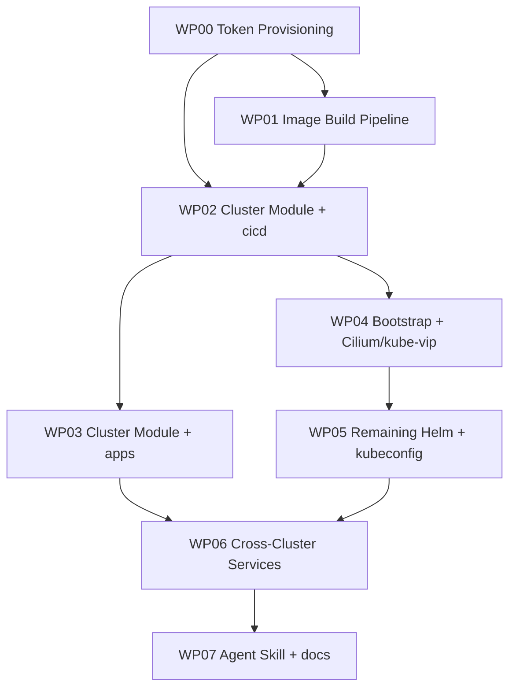

# Work Packages: 001 — Proxmox k3s Cluster Module + Image Builder + Bootstrapper

**Inputs**: `specs/001-build-a-kubernetes-k3s-cluster-on-proxmo/`
**Prerequisites**: plan.md ✅ | spec.md ✅
**Generated**: 2026-07-05

---

## Work Package WP00: Token Provisioning (Priority: P0)

**Goal**: Declaratively mint a least-privilege Cloudflare API token (3 permissions) and a Proxmox role/user/token with the privileges bpg/proxmox + the CSI plugin need. Idempotent. Outputs to `infra/tokens/output.json` (gitignored) for downstream WPs.

**Subsystem**: SS0 (Token Provisioning) — new cross-cutting infrastructure subsystem introduced in plan.md
**Abstract Components**: `infra/tokens/{main,variables,outputs}.tf`; Cloudflare scoped token resource; Proxmox role/user/token resources; output.json writer
**Misfits Addressed**: M7 (token exposure via scoped tokens), partially NFR-007 (least privilege)
**Independent Test**: `cd infra/tokens && tofu init && tofu apply -auto-approve` exits 0; `cat infra/tokens/output.json | jq -r '.cloudflare_scoped_token | length'` returns non-zero; the Cloudflare dashboard shows the new token with exactly three permissions; the Proxmox dashboard shows a new user `k3s-terraform@pam` with role `k3s-cluster`. Re-run is a no-op.
**Prompt**: `tasks/WP00-token-provisioning.md`

### Included Subtasks
- [ ] T000 **Version compatibility matrix (gate before any other subtask)**. Identify all external dependencies this WP touches (for WP00: `cloudflare/cloudflare`, `bpg/proxmox`, OpenTofu, `hashicorp/local`, Python). Run `context7-auto-research` for each; pin the **latest stable** version, or the **latest unstable** only if a feature gap justifies it (document the gap). Cross-check sibling-dependency compatibility. Emit `infra/tokens/versions.lock.yaml` with `dependencies[]`, `pinned_toolchain{}`, `cross_check{}`. Update the repo-root `versions.yaml` (master matrix from WP01) with anything new. Agent must NOT proceed to T001+ until this file exists and is reviewed.
- [ ] T001 Create `infra/tokens/{main,variables,outputs}.tf` and `terraform.tfvars.example`; add `infra/tokens/` to the `.gitignore` so `output.json` and `.terraform/` are excluded
- [ ] T002 Configure `cloudflare/cloudflare` >=4.x provider sourced from `TF_VAR_cloudflare_admin_api_token` env (admin token read once, never stored long-term)
- [ ] T003 Implement `cloudflare_api_token` resource with exactly three permissions: `zone:read` (zone-scoped), `dns:edit` (zone-scoped), `account:cloudflare-tunnel:edit` (account-scoped) — matches NFR-007
- [ ] T004 Configure `bpg/proxmox` >=0.111.1 provider sourced from `TF_VAR_pve_ssh_password` env for the one-shot user creation, then from the new token for subsequent runs
- [ ] T005 Implement `proxmox_virtual_environment_role` "k3s-cluster" with the documented privilege set (VM.Allocate, VM.Config.*, VM.Console, VM.PowerMgmt, VM.Snapshot, Datastore.AllocateSpace, Datastore.Audit, SDN.Use)
- [ ] T006 Implement `proxmox_virtual_environment_user` "k3s-terraform@pam" attached to the k3s-cluster role, plus `proxmox_virtual_environment_token` "k3s-terraform-token"
- [ ] T007 Wire outputs to `infra/tokens/output.json` via `local_file` resource with `sensitive = true`; expose via `terraform_data` trigger so downstream WPs can read it
- [ ] T008 Add mocked-provider unit tests asserting the Cloudflare scope array contains exactly the three permissions and the Proxmox role's privilege list matches the documented minimum
- [ ] T009 Run `tofu validate` and `tofu plan -refresh-only` (no apply needed in CI); document `tofu apply` procedure in the WP prompt
- [ ] T010 Update `docs/runbooks/` with a "rotate-tokens.md" entry that documents the rotation procedure (delete the old Proxmox user + token, re-apply WP00; Cloudflare scoped token has a configurable TTL)

### TDD Targets (from Misfits)
- [ ] Test: Cloudflare scoped token resource produces a `permissions` array of length 3 with the exact identifiers
- [ ] Test: Proxmox role resource produces a `privileges` array containing each of the documented privilege strings
- [ ] Test: `tofu apply` on a clean state exits 0; re-apply is a no-op; `tofu destroy` removes the user + token but leaves the role

### Dependencies
- None (first WP)

---

## Work Package WP01: Image Build Pipeline (Priority: P0)

**Goal**: Packer HCL2 template + Python CLI (`tools/build_image.py`) that bakes a Talos Linux VM into a Proxmox template, with idempotency check, version validation, and structured error logging. Reads nothing; writes `build/image-id.txt`.

**Subsystem**: SS1 (Image Build Pipeline)
**Abstract Components**: `tools/build_image.py`, `tools/lib/{pve_client,log,secret_loader}.py`, `tools/tests/`, `versions.yaml`, Packer HCL2 template, `build/image-id.txt` (gitignored)
**Misfits Addressed**: M1 (Packer race via lock + idempotency), M8 (Talos+k3s compatibility via `versions.yaml` matrix), partially M4 (structured errors)
**Independent Test**: `python tools/build_image.py --talos-version v1.10.0` produces template VMID 900; `cat build/image-id.txt` returns `900`; re-running is a no-op in <30 s; mocking Packer failure produces structured error JSON; mismatched Talos version exits non-zero.
**Prompt**: `tasks/WP01-image-build.md`

### Included Subtasks
- [ ] T000 **Version compatibility matrix (gate before any other subtask)**. Identify all external dependencies this WP touches (for WP01: Packer, `hashicorp/proxmox` Packer plugin, Talos ISO source, Python, `qm`/`pvesh`). Run `context7-auto-research` for each; pin latest stable. Cross-check Packer ↔ plugin ↔ PVE 9.2.3 ↔ kernel 7.0.6-2-pve compatibility. Update the repo-root `versions.yaml` with anything new and link `infra/tokens/versions.lock.yaml` if WP00 added constraints. Agent must NOT proceed to T001+ until the matrix is in `versions.yaml` and reviewed.
- [ ] T001 Create `versions.yaml` compatibility matrix (Talos versions × PVE kernel × k3s × Cilium); include at least one known-good combo (Talos 1.10.x + PVE 7.x kernel + k3s 1.34.x + Cilium 1.16.x)
- [ ] T002 Run `context7-auto-research` for `hashicorp/proxmox` v1.2.3 + `proxmox-clone` builder; verify `proxmox_url`, `username`, `token`, `node`, `vm_template_name`, `iso_url`, `boot_command`, `ip_wait_timeout` are the correct field names
- [ ] T003 Author Packer HCL2 template at `tools/packer/talos.pkr.hcl` driving `proxmox-clone` builder from the official Talos ISO
- [ ] T004 Author `tools/build_image.py` CLI: arg parsing (`--talos-version`, `--pve-endpoint`, `--pve-token-id`, `--pve-token-secret`, `--verbose`, `--dry-run`); idempotency check against `build/image-id.txt`
- [ ] T005 Implement `tools/lib/pve_client.py` (thin wrapper around `pvesh`/`qm`); `tools/lib/log.py` (dual human + JSON logger); `tools/lib/secret_loader.py` (env-only secret reader)
- [ ] T006 Implement version-matrix validation at script start; on mismatch emit structured error JSON and exit non-zero
- [ ] T007 On Packer mid-build failure: catch, delete half-baked VM via `qm stop && qm destroy`, leave `build/image-id.txt` unchanged, emit structured error JSON, exit non-zero
- [ ] T008 Author pytest fixtures with mocked `subprocess.run` calls; assert idempotency, error shapes, and version-matrix behaviour; aim for ≥80% coverage of non-I/O branches
- [ ] T009 Author `Makefile` targets `build-image` and `clean-image` that invoke the script
- [ ] T010 Run `pytest tools/tests/`, `mypy --strict tools/`, `ruff check tools/`; document `make build-image` in the WP prompt's "How to run" section

### TDD Targets (from Misfits)
- [ ] Test: idempotent re-run with same `--talos-version` skips Packer and exits 0 in <30 s
- [ ] Test: `--talos-version` not in `versions.yaml` exits non-zero with structured error
- [ ] Test: Packer mid-build failure cleans up the half-baked VM and leaves `build/image-id.txt` unchanged
- [ ] Test: secrets never appear in any log line (mock + assert)

### Dependencies
- WP00 (consumes Cloudflare admin token's pre-flight validation? actually no — WP01 does NOT need WP00 outputs. Corrected: WP01 depends on nothing. WP00 is the gating WP for WP02+, not WP01.)

---

## Work Package WP02: Cluster Module + First Instance (Priority: P0)

**Goal**: The reusable OpenTofu module `modules/proxmox-k3s-cluster` plus the first root instance at `clusters/cicd/`. Proves cluster identity uniqueness, DHCP safety, no host open ports, and the module output contract.

**Subsystem**: SS2 (Cluster Provisioning Module)
**Abstract Components**: `modules/proxmox-k3s-cluster/{main,variables,outputs,versions,dnsmasq,talos,cloudflare-tunnel}.tf`, `traefik-chartconfig.yaml.tftpl`, `clusters/cicd/{main,variables}.tf`, `clusters/cicd/terraform.tfvars.example`
**Misfits Addressed**: M2 (no host open ports), M3 (cluster identity uniqueness), M5 (DHCP safety)
**Independent Test**: `cd clusters/cicd && tofu init && tofu apply -auto-approve` exits 0; `qm list` shows 2 VMs (VMID 200 + 201); `ssh root@10.0.0.1 'pvesh get /cluster/sdn/vnets'` shows the ethers reservation for 10.0.0.30; `cat clusters/cicd/output.json` shows the nodes map; re-run is a no-op.
**Prompt**: `tasks/WP02-cluster-module-cicd.md`

### Inclu0 **Version compatibility matrix (gate before any other subtask)**. Identify all external dependencies this WP touches (for WP02: OpenTofu, `bpg/proxmox`, `hashicorp/helm`, `hashicorp/local`, Cilium chart version, kube-vip chart, STRRL controller chart, Traefik version). Run `context7-auto-research`; pin latest stable. Cross-check OpenTofu ↔ providers ↔ Proxmox VE 9.2.3 API. Emit `modules/proxmox-k3s-cluster/versions.lock.yaml`. Agent must NOT proceed to T001+ until reviewed.
- [ ] T00ded Subtasks
- [ ] T001 Run `context7-auto-research` for `bpg/proxmox` v0.111.1: `proxmox_virtual_environment_vm`, `proxmox_virtual_environment_cluster_sdn`, `proxmox_virtual_environment_hosts` resource schemas; verify exact attribute names
- [ ] T002 Author `modules/proxmox-k3s-cluster/variables.tf` with the documented input surface (`cluster_name`, `vip`, `vmid_start`, `ip_start`, `image_id`, `control_plane`, `workers`, `pod_cidr`, `svc_cidr`, `cf_*` sensitive variables, `cf_publish_traefik_publicly` default false)
- [ ] T003 Author `modules/proxmox-k3s-cluster/main.tf` with input validation: `control_plane.count` in {1,3} (FR-030), `vip` not overlapping dnsmasq DHCP range, `vmid_start..vmid_start+total-1` not overlapping existing VMs
- [ ] T004 Implement `dnsmasq.tf`: write ethers reservation entry for the cluster VIP via `proxmox_virtual_environment_hosts` resource (idempotent)
- [ ] T005 Implement `talos.tf`: render `clusters/<name>/talos/<hostname>.yaml` per VM from a template using module inputs
- [ ] T006 Author `traefik-chartconfig.yaml.tftpl`: render HelmChartConfig with `service.type=ClusterIP`, `ingressClass.name=traefik-internal`, `cf_publish_traefik_publicly`-gated hostPorts
- [ ] T007 Author `cloudflare-tunnel.tf`: Helm release for `STRRL/cloudflare-tunnel-ingress-controller` v0.0.23 with `cloudflare.apiToken`, `cloudflare.accountId`, `cloudflare.tunnelName` from module variables
- [ ] T008 Author `modules/proxmox-k3s-cluster/outputs.tf` exposing the nodes map; wire to `clusters/<name>/output.json` via `local_file` resource
- [ ] T009 Author `clusters/cicd/{main,variables}.tf` + `terraform.tfvars.example` calling the module with cicd-specific values (vip=10.0.0.30, vmid_start=200, ip_start=10.0.0.201, control_plane.count=1, workers.count=1, image_id from `infra/tokens/output.json` or `build/image-id.txt`)
- [ ] T010 Run `tofu validate` and `tofu plan` (apply gated on PVE access); author mocked-provider tests for input validation (count=2 → error, overlapping vmid → error, etc.); document the apply procedure in the WP prompt

### TDD Targets (from Misfits)
- [ ] Test: `control_plane.count = 2` fails plan with the documented error message
- [ ] Test: overlapping vmid fails plan
- [ ] Test: overlapping vip fails plan (covered in WP03 but stub the assertion here)
- [ ] Test: rendered HelmChartConfig contains `service.type=ClusterIP` when `cf_publish_traefik_publicly=false`

### Dependencies
- WP01 (for `build/image-id.txt`); WP00 (for `infra/tokens/output.json` containing `cf_api_token`, `proxmox_token_id`, `proxmox_token_secret`)

---

## Work Package WP03: Second Cluster Instance (apps) (Priority: P1)

**Goal**: `clusters/apps/{main,variables}.tf` + `terraform.tfvars.example` calling the same module with distinct inputs. Proves the module is reusable and that two instances coexist without overlap.

**Subsystem**: SS2 (Cluster Provisioning Module)
**Abstract Components**: `clusters/apps/{main,variables}.tf`, `clusters/apps/terraform.tfvars.example`
**Misfits Addressed**: M3 (identity uniqueness across instances, proven)
**Independent Test**: `cd clusters/apps && tofu init && tofu apply -auto-approve` exits 0; `qm list | grep -E '210|211'` shows 2 VMs (VMID 210 + 211); the VIP reservation 10.0.0.40 is in ethers; `cat clusters/apps/output.json` shows two nodes with distinct VMIDs from cicd's 200/201.
**Prompt**: `tasks/WP03-cluster-module-apps.md`

### Inclu0 **Version compatibility matrix (gate before any other subtask)**. Same dependency set as WP02 (this WP reuses the same module). Run `context7-auto-research` to confirm nothing newer is available; verify Cilium chart version WP02 targeted is compatible with apps pod CIDR (`10.44.0.0/16`) and svc CIDR (`10.45.0.0/16`). Emit `clusters/apps/versions.lock.yaml` pointing to WP02's lock file plus apps-specific CIDR check. Agent must NOT proceed to T001+ until reviewed.
- [ ] T00ded Subtasks
- [ ] T001 Author `clusters/apps/{main,variables}.tf` calling `modules/proxmox-k3s-cluster` with apps-specific values: `cluster_name="apps"`, `vip="10.0.0.40"`, `vmid_start=210`, `ip_start="10.0.0.211"`, distinct pod_cidr (10.44.0.0/16) and svc_cidr (10.45.0.0/16)
- [ ] T002 Author `clusters/apps/terraform.tfvars.example` documenting all variables; pull `image_id`, `cf_api_token`, `proxmox_*` from `infra/tokens/output.json` via `local_file` data source or a small read script
- [ ] T003 Author a guard test that fails plan if any apps VMID overlaps a cicd VMID (200-204 range) or any apps IP overlaps a cicd IP (10.0.0.201-205 range)
- [ ] T004 Run `tofu validate` and `tofu plan` against a PVE-accessible environment; document the apply procedure
- [ ] T005 Author a doc note `docs/cluster-instances.md` explaining how to add a third cluster (bump VMID range, IP range, pod CIDR, svc CIDR; never reuse across instances)

### TDD Targets (from Misfits)
- [ ] Test: running `tofu plan` for apps while cicd is applied produces no warnings about VMID/IP overlap
- [ ] Test: artificially introducing an overlap (e.g. setting `vmid_start=200` for apps) fails plan with a clear error

### Dependencies
- WP02 (for the module)

---

## Work Package WP04: Bootstrap Script + First Two Helm Releases (Priority: P0)

**Goal**: `tools/bootstrap_cluster.py` reads `clusters/<name>/output.json` + the Talos configs, applies machineconfig via `talosctl`, installs k3s, then installs Cilium + kube-vip. Aborts on any failure with structured error JSON.

**Subsystem**: SS3 (Bootstrap Orchestration + Agent Skill)
**Abstract Components**: `tools/bootstrap_cluster.py`, `tools/lib/{pve_client,talos_client,helm_client,kubeconfig_merger,secret_loader,log}.py`, `tools/tests/`
**Misfits Addressed**: M4 (silent Helm failure → structured abort), partially M7 (secret hygiene)
**Independent Test**: After WP02, `python tools/bootstrap_cluster.py --cluster cicd` brings up k3s on both nodes and reports `cilium` + `kube-vip` as `deployed`; `kubectl --context cicd get nodes` returns 2 Ready; `helm list -A` shows those two releases.
**Prompt**: `tasks/WP04-bootstrap-cilium-kubevip.md`
0 **Version compatibility matrix (gate before any other subtask)**. Identify all external dependencies (for WP04: `talosctl`, k3s v1.34.x, Cilium 1.16.x, kube-vip 1.2.1, Python ≥3.11, `helm`, `kubectl`). Run `context7-auto-research`; pin latest stable (Talos 1.11.x alpha only if it ships a required feature). Cross-check Talos ↔ k3s shim, Cilium ↔ PVE kernel 7.0.6-2-pve eBPF features, k3s-bundled Traefik v3.x ↔ IngressClass config, kube-vip ↔ Cilium coexistence. Emit `tools/versions.lock.yaml`. Agent must NOT proceed to T001+ until reviewed.
- [ ] T00
### Included Subtasks
- [ ] T001 Run `context7-auto-research` for `talosctl apply-config`, `k3s server --cluster-init --tls-san`, `k3s agent --server https://<vip>:6443`; verify exact flag set for Talos 1.10.x and k3s 1.34.x
- [ ] T002 Author `tools/lib/talos_client.py` wrapping `talosctl apply-config`, `talosctl health`, `talosctl reset`; author `tools/lib/helm_client.py` wrapping `helm install`/`upgrade` with timeout + structured error capture
- [ ] T003 Author `tools/lib/kubeconfig_merger.py`: read `~/.kube/config`, back up to `~/.kube/config.bak.<unix-ts>`, merge a new context under `<cluster>` name, write atomically
- [ ] T004 Author `tools/bootstrap_cluster.py` CLI: arg parsing (`--cluster <name>`, `--phase all|talos|k3s|helm|kubeconfig`, `--verbose`, `--dry-run`); the `--phase k3s` step runs `k3s server --cluster-init --tls-san=<vip>` on the first CP, then `k3s server --server https://<vip>:6443 --tls-san=<vip>` on subsequent CP nodes (none here for WP04), then `k3s agent --server https://<vip>:6443` on each worker
- [ ] T005 Implement the Cilium Helm release with values: `kubeProxyReplacement=true`, `gatewayAPI.enabled=true`, `ipv4NativeRoutingCIDR=10.0.0.0/8`, `ipam.operator.clusterPoolIPv4PodCIDRList=<pod_cidr>`, `hubble.enabled=false` (deferred to a downstream spec); references pod_cidr from output.json
- [ ] T006 Implement the kube-vip Helm release in ARP mode, leader election enabled, interface bound to vnet0 inside each VM
- [ ] T007 Add a `--phase helm` step that installs Cilium + kube-vip in that order; on any failure abort immediately with structured error JSON naming the failing release and the helm error, leave partial state for debugging, exit non-zero
- [ ] T008 Author pytest fixtures with mocked `subprocess.run` calls; assert: correct Talos apply order, correct k3s flags on first server vs. workers, Helm release sequence, structured error shape on failure, kubeconfig backup + merge, secrets never logged
- [ ] T009 Run `pytest tools/tests/`, `mypy --strict tools/`, `ruff check tools/`; document the run procedure in the WP prompt

### TDD Targets (from Misfits)
- [ ] Test: Cilium install with mocked helm failure aborts at that step and does NOT proceed to kube-vip
- [ ] Test: kubeconfig merge backs up the existing file before writing
- [ ] Test: secret values never appear in any log line (mock + assert)
- [ ] Test: structured error JSON includes the failing step name, the error message, a trace ID, a `jq` filter for finding related log lines

### Dependencies
- WP02 (for output.json + Talos configs); WP00 (for k3s bootstrap script to read `proxmox_token_id`/`proxmox_token_secret` from output.json if it needs to ssh to PVE for any reason; otherwise not strictly required)

---

## Work Package WP05: Remaining Helm Releases + kubeconfig Merge (Priority: P0)

**Goal**: Extend `bootstrap_cluster.py` to install sergelogvinov Proxmox CCM, Proxmox CSI Plugin, the demoted Traefik, the STRRL/cloudflare-tunnel-ingress-controller, and cert-manager (in-cluster CA only). Final kubeconfig merge. PVE firewall assertion (no DNAT added).

**Subsystem**: SS3 (Bootstrap Orchestration + Agent Skill)
**Abstract Components**: additions to `tools/bootstrap_cluster.py`; `clusters/<name>/manifests/` for any pre-rendered Helm values
**Misfits Addressed**: M2 (no host open ports, verified), M6 (Cloudflare fallback path), partially NFR-007 (Cloudflare scoped token used)
**Independent Test**: After WP04, run WP05 against cicd; `helm list -A` shows all six releases `deployed`; `ssh root@10.0.0.1 'nft list chain ip nat prerouting'` shows zero new DNAT rules; an Ingress of class `cloudflare-tunnel` resolves via Cloudflare within 60 s.
**Prompt**: `tasks/WP05-remaining-helm-releases.md`
0 **Version compatibility matrix (gate before any other subtask)**. Identify all external dependencies (for WP05: Proxmox CCM v0.14.0, Proxmox CSI v0.19.1/chart 0.5.9, STRRL controller v0.0.23, cert-manager v1.16.x). Run `context7-auto-research`; pin latest stable. Cross-check Proxmox CCM ↔ PVE 9.2.3 API, CSI ↔ lvm-thin on `data1`, STRRL controller ↔ Cloudflare API version pinned in scoped token, cert-manager ↔ k8s 1.34. Append to `tools/versions.lock.yaml`. Agent must NOT proceed to T001+ until reviewed.
- [ ] T00
### Included Subtasks
- [ ] T001 Run `context7-auto-research` for `sergelogvinov/proxmox-cloud-controller-manager` v0.14.0 and `sergelogvinov/proxmox-csi-plugin` v0.19.1 (chart 0.5.9); verify exact values schema
- [ ] T002 Run `context7-auto-research` for `STRRL/cloudflare-tunnel-ingress-controller` v0.0.23: confirm `cloudflare.apiToken`, `cloudflare.accountId`, `cloudflare.tunnelName`, `ingressClass.name`, `ingressClass.controller` are the correct Helm values keys; confirm `tunnelName` adoption vs. create-new behaviour when an existing tunnel with that name exists in Cloudflare
- [ ] T003 Extend `bootstrap_cluster.py --phase helm` to install Proxmox CCM with topology labels (`topology.kubernetes.io/region=bigbertha`, `topology.kubernetes.io/zone=BigBertha`); reference `proxmox_token_id`/`proxmox_token_secret` from `infra/tokens/output.json`
- [ ] T004 Install Proxmox CSI Plugin with StorageClass `proxmox-lvm-thin` targeting `data1` lvmthin; verify a 1-replica Deployment with a PVC succeeds end-to-end (smoke test)
- [ ] T005 Install Traefik with the demoted HelmChartConfig rendered in WP02 (`service.type=ClusterIP`, `ingressClass.name=traefik-internal`); assert no hostPorts are exposed
- [ ] T006 Install STRRL/cloudflare-tunnel-ingress-controller v0.0.23 with the scoped Cloudflare token; create IngressClass `cloudflare-tunnel`
- [ ] T007 Install cert-manager v1.16.x with an internal CA ClusterIssuer only (no ACME for the public path)
- [ ] T008 Add a `verify-no-host-ports` post-step that asserts `ssh root@10.0.0.1 -p 6022 'nft list chain ip nat prerouting'` does NOT include new DNAT rules (compare against a baseline captured during WP04)
- [ ] T009 Final kubeconfig merge step: fetch kubeconfig from the first CP node (`talosctl kubeconfig`), merge into `~/.kube/config` under context name `<cluster>`, back up first
- [ ] T010 Author tests + doc updates; run pytest + mypy + ruff

### TDD Targets (from Misfits)
- [ ] Test: Traefik HelmChartConfig rendering contains `service.type=ClusterIP` and `ingressClass.name=traefik-internal`
- [ ] Test: cert-manager installed with only the in-cluster CA ClusterIssuer; no ACME solvers configured for the public path
- [ ] Test: the `verify-no-host-ports` post-step fails (returns non-zero) when a new DNAT rule is detected

### Dependencies
- WP04 (for the bootstrap script + Cilium + kube-vip)

---

## Work Package WP06: Cross-Cluster Services + Apps Bootstrap (Priority: P1)

**Goal**: Author `clusters/apps/manifests/cicd-system/externalname.yaml` declaring the four ExternalName Services (`gitlab`, `registry`, `minio`, kustomization). Extend `bootstrap_cluster.py` to apply this manifest when invoked with `--cluster apps`. Verify apps → cicd reachability.

**Subsystem**: SS3 + SS2 (cross-cluster wiring)
**Abstract Components**: `clusters/apps/manifests/cicd-system/externalname.yaml`, `clusters/apps/manifests/cicd-system/kustomization.yaml`; `tools/bootstrap_cluster.py --cluster apps` extension
**Misfits Addressed**: none new; confirms M3 (apps cluster does not collide with cicd)
**Independent Test**: After WP05 (cicd fully bootstrapped) and WP03 (apps module applied): run `python tools/bootstrap_cluster.py --cluster apps`; `kubectl --context apps get svc -n cicd-system` shows four ExternalName Services; an apps Pod can reach `http://gitlab.cicd-system.svc.cluster.local` end-to-end within 5 s.
**Prompt*0 **Version compatibility matrix (gate before any other subtask)**. Identify all external dependencies (for WP06: ExternalName Service API, CoreDNS from k3s 1.34.x, kustomize, kubectl). Run `context7-auto-research`; pin latest stable. Cross-check ExternalName ↔ CoreDNS, kustomize manifest schema ↔ kustomize version, apps CoreDNS upstream ↔ host `/etc/resolv.conf` ↔ PowerDNS. Emit `clusters/apps/manifests/versions.lock.yaml`. Agent must NOT proceed to T001+ until reviewed.
- [ ] T00*: `tasks/WP06-cross-cluster-services.md`

### Included Subtasks
- [ ] T001 Author `clusters/apps/manifests/cicd-system/externalname.yaml` declaring four Services (`gitlab`, `registry`, `minio`, optionally `minio-console`); each `spec.type=ExternalName`, `spec.externalName=<service>.intranet`, ports matching the cicd cluster's Service definitions
- [ ] T002 Author `clusters/apps/manifests/cicd-system/kustomization.yaml` with namespace + the four resources
- [ ] T003 Extend `bootstrap_cluster.py` with a `--phase externalname` step (or auto-run when `--cluster apps`) that `kubectl apply -k clusters/apps/manifests/cicd-system/`
- [ ] T004 Add a verification step: `kubectl --context apps exec -n default <test-pod> -- curl -sf http://gitlab.cicd-system.svc.cluster.local/-/health` (gated on cicd's gitlab being installed, which is a downstream spec; for now use a simple in-cluster test like a `whoami` Deployment on cicd)
- [ ] T005 Verify apps CoreDNS upstream includes 10.0.0.3 (`kubectl --context apps get configmap -n kube-system coredns -o yaml`); patch if needed
- [ ] T006 Add a `verify-apps-to-cicd` smoke test that the cross-cluster Service resolves in <5 s and the request returns 200/302 from the cicd cluster
- [ ] T007 Document the cross-cluster wiring in `docs/architecture.md` (link from spec.md, plan.md, research.md)

### TDD Targets (from Misfits)
- [ ] Test: applying the ExternalName manifest produces four Services of type ExternalName
- [ ] Test: an apps Pod can resolve `gitlab.cicd-system.svc.cluster.local` and reach the cicd cluster
- [ ] Test: deleting the namespace removes the ExternalName Services cleanly

### Dependencies
- WP05 (cicd fully bootstrapped, including Cloudflare controller); WP03 (apps module applied)

---

## Work Package WP07: Agent Skill + Runbooks + Final Verification (Priority: P0)

**Goal**: Author `.agents/skills/proxmox-k3s-pipeline/SKILL.md` that drives an agent through the whole pipeline (Phase 1-5). Author `docs/runbooks/{cloudflare-fallback,scale-workers,decommission-cluster}.md`. Author `docs/architecture.md`. Run final SC-001 through SC-006 verifications.

**Subsystem**: SS3 (Agent Skill is the user-facing interface)
**Abstract Components**: `.agents/skills/proxmox-k3s-pipeline/SKILL.md`, three runbooks, `docs/architecture.md`
**Misfits Addressed**: M7 (codified via skill), SC-001 through SC-006 verified
**Indepen0 **Version compatibility matrix (gate before any other subtask)**. Identify all external dependencies (for WP07: `agentskills.io` open standard, Agent Skill consumers Claude Code + Cursor, `context7-auto-research` skill as FR-025 prerequisite). Run `context7-auto-research`; pin latest stable. Cross-check SKILL.md frontmatter schema ↔ both consumers' parsers; 5-phase pipeline instructions ↔ actual CLI tools from WP00-WP06. Emit `.agents/skills/proxmox-k3s-pipeline/versions.lock.yaml`. Agent must NOT proceed to T001+ until reviewed.
- [ ] T00dent Test**: An agent loads the skill, follows it end-to-end on a clean room, and produces a final report matching SC-001 (60 min, 2 clusters, both with 2 Ready nodes, ingress works, no host open ports). The fallback runbook executes and reverses cleanly. Scaling up via `worker_count = 3` brings three workers Ready in <5 min each.
**Prompt**: `tasks/WP07-agent-skill-and-docs.md`

### Included Subtasks
- [ ] T001 Author `.agents/skills/proxmox-k3s-pipeline/SKILL.md` per the `agentskills.io` open standard: YAML frontmatter (`name`, `description`), markdown body, no extraneous subfolders; body is the 5-phase pipeline checklist
- [ ] T002 Step 1 of the skill: instruct the agent to load `.agents/skills/context7-auto-research/SKILL.md` and run it for every external library before invoking it (bpg/proxmox, hashicorp/proxmox, STRRL controller, helm, talosctl, kubernetes)
- [ ] T003 Steps 2-5 of the skill: prompt the operator for missing configuration (cluster_name, control_plane.count, workers.count, vip, vmids, cf_api_token, cf_account_id); invoke the right script per phase; verify success; halt on failure with structured error
- [ ] T004 Author `docs/runbooks/cloudflare-fallback.md`: the four-step procedure (flip cf_publish_traefik_publicly=true, re-render Traefik HelmChartConfig, add nft DNAT rules for TCP 80/443 → 10.0.0.30, update Cloudflare DNS to A record); rollback steps
- [ ] T005 Author `docs/runbooks/scale-workers.md`: bump worker_count, run tofu apply, verify the new workers join in <5 min each; decrease procedure with PDB-aware eviction
- [ ] T006 Author `docs/runbooks/decommission-cluster.md`: tofu destroy procedure; cluster shutdown steps; kubeconfig cleanup
- [ ] T007 Author `docs/architecture.md`: links to spec.md, plan.md, decomposition.md, research.md; topology diagram; component map
- [ ] T008 Run final SC verifications: SC-001 (60-min end-to-end on a clean room if PVE is available, otherwise document the procedure); SC-002 (PVC + Deployment); SC-003 (Ingress of class cloudflare-tunnel resolves via Cloudflare); SC-004 (no new DNAT rules); SC-005 (re-run idempotency); SC-006 (tofu destroy cleanup)
- [ ] T009 Verify NFR-013 (resource budget ≤ 16 vCPU + 24 GiB for the default shape) and NFR-014 (each new worker Ready in <5 min) — measured at SC-001 time
- [ ] T010 Verify NFR-010 (skill conforms to `agentskills.io`), NFR-011 (skill is idempotent), NFR-012 (skill teaches version pins with rationale)

### TDD Targets (from Misfits)
- [ ] Test: SKILL.md has YAML frontmatter with `name` and `description`, both non-empty
- [ ] Test: SKILL.md mentions every external library with its version pin
- [ ] Test: fallback runbook documents the four steps in copy-pasteable form including exact `nft add rule` commands
- [ ] Test: scale-workers runbook documents both directions (scale up and scale down)

### Dependencies
- WP06 (apps cluster fully bootstrapped with cross-cluster Services)

---

## Misfit Coverage Matrix

| Misfit | Domain | Covered by WP(s) |
|--------|--------|------------------|
| M1 (Packer race) | Concurrency / State | WP01 |
| M2 (no host open ports) | Security / Network exposure | WP02, WP05 |
| M3 (cluster identity uniqueness) | Data Integrity / Configuration drift | WP02, WP03 |
| M4 (silent Helm failure) | Observability / Silent failure | WP04 |
| M5 (DHCP collision) | Configuration / DHCP collision | WP02 |
| M6 (Cloudflare outage) | Reversibility / Vendor lock-in | WP05, WP07 |
| M7 (token exposure) | Security / Token exposure | WP00, WP07 (codified) |
| M8 (Talos+k3s mismatch) | Compatibility | WP01 |

---

## Dependency & Execution Summary

- **Sequence**: WP00 → WP01 → WP02 → {WP03, WP04} → WP05 → WP06 → WP07
- **Parallel opportunities**: WP03 and WP04 can run in parallel after WP02 (apps cluster root module + bootstrap script for the first two releases)
- **MVP Scope**: WP00 → WP01 → WP02 → WP04 → WP05 → WP07 (one cluster end-to-end, then skill)

---

## Subtask Index (Reference)

| Subtask ID | Summary | Work Package | Priority | Parallel? |
|------------|---------|--------------|----------|-----------|
| T001-T010 | Token Provisioning | WP00 | P0 | No |
| T001-T010 | Image Build Pipeline | WP01 | P0 | No |
| T001-T010 | Cluster Module + cicd | WP02 | P0 | No |
| T001-T005 | Cluster Module + apps | WP03 | P1 | After WP02; can parallelise with WP04 |
| T001-T009 | Bootstrap + Cilium/kube-vip | WP04 | P0 | No |
| T001-T010 | Remaining Helm + kubeconfig | WP05 | P0 | No |
| T001-T007 | Cross-Cluster Services | WP06 | P1 | No |
| T001-T010 | Agent Skill + docs | WP07 | P0 | No |